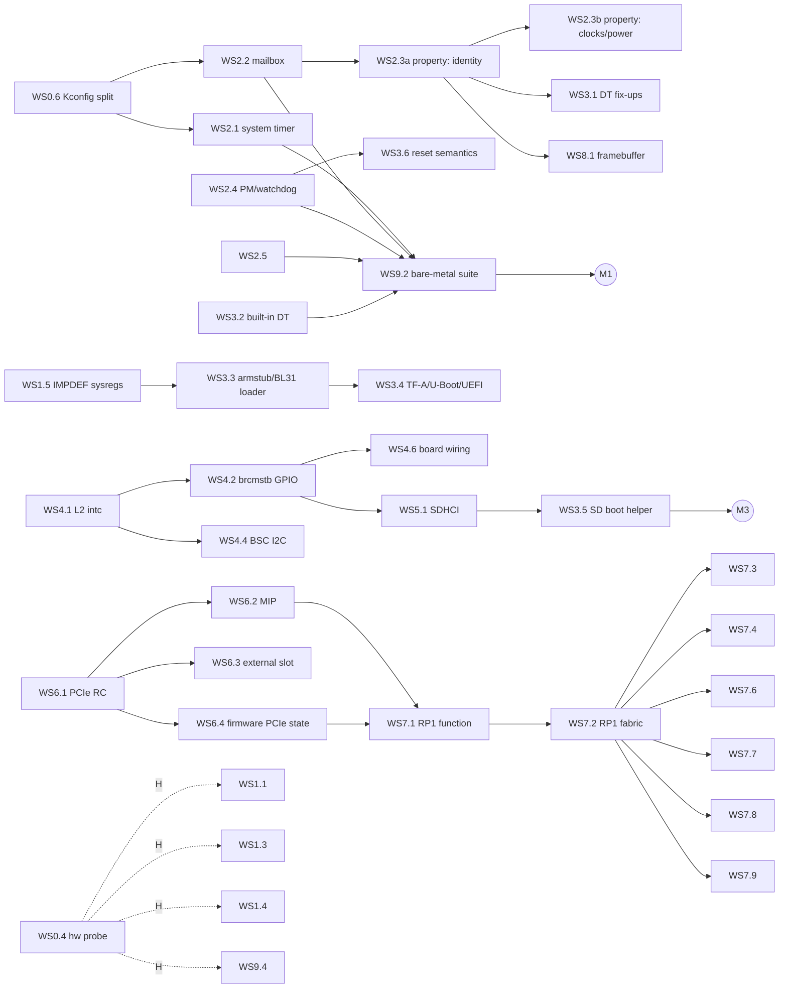

# Raspberry Pi 5 QEMU machine: implementation plan

This plan takes the `raspi5b` skeleton to a model that runs bare-metal
software, microkernels, TF-A/U-Boot and Raspberry Pi OS, and that can be
merged into upstream QEMU. Work is split into **workstreams** (WS) of
independently reviewable **units**, each small enough to be one upstream
commit (or a short series) with its own tests.

* [1. Principles](#1-principles)
* [2. Current state](#2-current-state)
* [3. Milestones](#3-milestones)
* [4. Dependency graph and execution order](#4-dependency-graph-and-execution-order)
* [5. Unit conventions](#5-unit-conventions)
* [6. Workstreams](#6-workstreams)
  WS0 Foundation · WS1 CPU and GIC · WS2 VideoCore services ·
  WS3 Boot flow · WS4 Interrupt fabric and GPIO · WS5 Storage ·
  WS6 PCIe · WS7 RP1 · WS8 Display · WS9 Verification and upstreaming
* [7. Decisions](#7-decisions)
* [8. Risks](#8-risks)
* [9. Open questions](#9-open-questions)

## 1. Principles

1. **Bare metal first.** Priorities follow what a microkernel needs, in
   order: CPUs, interrupts, timers, a console, inter-processor wake-up,
   reset/power, then storage and I/O. Linux-only features come later.
2. **Hardware is the specification.** There is no public BCM2712 datasheet,
   so each model cites its sources in this order: Raspberry Pi and Arm
   documentation, then the RP1 datasheet, then Linux/TF-A/U-Boot drivers
   (treated as executable specifications), then register dumps from a real
   Pi 5 (WS0.4). Values that come from drivers rather than documentation
   are marked `TODO(WSx.y)` in the code until the hardware track (section 3)
   confirms them.
3. **Fidelity tiers.** Every block of the memory map is always at one of:

   | Tier | Meaning |
   | --- | --- |
   | T0 | `unimplemented-device` placeholder: reads 0, logs with `-d unimp` |
   | T1 | register file: correct reset values, read-only/write-1-to-clear semantics, no behaviour |
   | T2 | functional: behaviour software depends on (interrupts, DMA, data paths) |
   | T3 | timing-aware: only where software observably depends on it |

   A block is promoted one tier at a time; T2 is the goal for everything
   an OS drives, T1 is sufficient for blocks that are only configured.
4. **Reuse before writing.** Existing QEMU models (PL011, GIC, BCM283x
   system timer/mailbox/property, SDHCI, DesignWare I²C, Cadence GEM, DWC3,
   serial-mm) are reused and, where needed, generalised upstream rather
   than forked.
5. **Upstream shape from day one.** QEMU coding style, QOM idioms,
   `vmstate`, `Resettable`, trace points and a qtest for every device;
   [DEVELOPMENT.md](DEVELOPMENT.md) has the details. Each unit's
   deliverable is written as it would be submitted.
6. **Every unit ends green:** `make build check checkpatch`, plus the
   acceptance test named in the unit.
7. **No hardware, no blocking.** A real Pi 5 improves fidelity but is
   never a prerequisite for progress: every unit can be completed from
   drivers and documentation, and hardware validation is a parallel track
   that raises confidence after the fact.

## 2. Current state

Delivered by the boilerplate (WS0.1–WS0.3):

| Area | State |
| --- | --- |
| Repository | pinned QEMU v11.1.1 submodule, overlay + patch series managed by `scripts/qemu-tree`, CI with ccache |
| SoC (`bcm2712`) | 1–4 Cortex-A76 (`MPIDR.Aff1` = core, CNTFRQ 54 MHz, optional EL3), GIC-400 with 288 SPIs, 5 priority bits and all timer/maintenance PPIs, UART10 (PL011), complete memory map with T0 placeholders and two catch-all windows |
| Board (`raspi5b`) | 1/2/4/8/16 GiB RAM, board revision code, PSCI over SMC with EL2 entry (default) or guest-owned EL3 (`secure=on`), DTB fix-ups for unmodelled devices, `/system/linux,revision` |
| Tests | qtest (UART IDs, GIC geometry, priority bits and security, RAM, placeholders), bare-metal smoke guest (EL, MPIDR, CNTFRQ, PSCI CPU_ON on all cores, SYSTEM_OFF, EL3 mode) |
| Linux | the stock Raspberry Pi OS kernel (6.18) with the firmware's `bcm2712-rpi-5-b.dtb` boots on 4 CPUs to the root-fs mount, without warnings |

Known provisional values, each marked in the code: 288 SPIs
(`TODO(WS1.3)`), the PMU interrupts taken from the vendor DT
(`TODO(WS1.4)`), `-bios` handling
(`TODO(WS3.3)`), and the board revision's `REVISION` field (WS9.8).

## 3. Milestones

Milestones are cut by user-visible capability. Each lists its units and a
concrete exit test; units inside a milestone can proceed in parallel where
the graph in section 4 allows. Milestone tests run in QEMU only; the
**hardware track H** re-runs them on a real Pi 5 whenever one is available
and turns provisional values into verified ones. H never gates a milestone.

| Milestone | Capability | Units | Exit test |
| --- | --- | --- | --- |
| **M0** Skeleton | machine boots bare-metal payloads | WS0.1–0.3 | done: `make check` |
| **M1** Bare-metal platform | everything a microkernel needs: timers, IPIs, mailbox/property, watchdog reset, RNG, a device tree | WS0.5, WS0.6, WS2.1, WS2.2, WS2.3a, WS2.4, WS2.5, WS3.2, WS3.6, WS9.2 | the bare-metal suite (WS9.2) passes on 1–4 cores with and without `-dtb`; PSCI `SYSTEM_RESET` and the watchdog reboot the guest three times |
| **M2** Firmware-faithful boot | real TF-A, U-Boot and UEFI run unmodified | WS1.5, WS3.1, WS3.3, WS3.4 | upstream TF-A `rpi5` BL31 (`secure=on`) → U-Boot → Linux to the root-fs mount; EDK2 to the UEFI shell |
| **M3** Linux on SD card | Raspberry Pi OS boots to a login prompt | WS2.3b–e, WS2.6, WS4.1–4.6, WS5.1, WS5.2, WS3.5 | unmodified Raspberry Pi OS Lite image boots from `-drive if=sd` with `scripts/rpi5-boot`; `reboot` and `poweroff` work |
| **M4** PCIe | PCIe root complexes and MSI | WS6.1–6.5 | NVMe root and virtio-net on the external PCIe1 port under Linux |
| **M5** RP1 | 40-pin header, Ethernet, USB | WS7.1–7.12 | Linux networking over RP1 Ethernet, USB keyboard and mass storage, GPIO/I²C/SPI/UART qtests; bare-metal RP1 UART0 at `0x1f_0003_0000` |
| **M6** Upstream | merged in QEMU | WS9.3, WS9.5–9.8 | series accepted by the Arm/Raspberry Pi maintainers |
| **H** Hardware parity | provisional values verified on silicon | WS0.4, WS1.1–1.4, WS1.6, WS9.4 | golden dumps checked in; `TODO(WS0.4)`/`TODO(WS1.x)` markers gone; UART transcripts of the bare-metal suite identical on QEMU and hardware |

Upstreaming (WS9.7) is incremental: M0+M1 form the first series, and each
later milestone is its own series once the previous one is merged.

## 4. Dependency graph and execution order

Critical paths:

* **to M1:** WS0.6 → WS2.2 → WS2.3a, in parallel with WS2.4 → WS3.6 and
  WS3.2; WS9.2 closes it;
* **to M3:** WS4.1 → WS4.2 → WS5.1 → WS3.5;
* **to M5:** WS6.1 → WS6.2/6.4 → WS7.1 → WS7.2, the longest and
  highest-risk chain in the plan (three new device families in a row).

Suggested order for the next twelve units, chosen so that each one is
immediately exercised by the next:

| # | Unit | Why now |
| --- | --- | --- |
| 1 | WS0.6 Kconfig split | unblocks reusing every BCM283x model; a self-contained upstream patch |
| 2 | WS2.1 system timer | first reused device; exercises the SPI wiring path |
| 3 | WS9.2a bare-metal framework | exception vectors and a GIC driver in the guest, needed by every later test |
| 4 | WS2.4 PM/watchdog | reset and power-off, which every test harness needs |
| 5 | WS3.6 reset semantics | makes the watchdog and PSCI `SYSTEM_RESET` trustworthy |
| 6 | WS2.2 mailbox | the address-translation design decision, made once |
| 7 | WS2.3a property identity tags | first consumer of the mailbox; lets the `firmware` DT node be enabled |
| 8 | WS2.5 RNG200 | small, standalone, upstreamable |
| 9 | WS3.2 built-in device tree | microkernels get a DT without `-dtb`; forces the memory map to be the single source of truth |
| 10 | WS9.2b full bare-metal suite | M1 exit test |
| 11 | WS0.5 series export | prepares the first upstream submission |
| 12 | WS4.1 L2 interrupt controllers | opens the M3 chain |

## 5. Unit conventions

**Size:** S (≤ 1 day), M (2–4 days), L (1–2 weeks). **Depends** lists
only non-obvious prerequisites; everything depends on WS0.1–0.3.

**Definition of done**, applied to every unit that adds or promotes a
device, in addition to the unit's own **Done when**:

1. Source in `overlay/hw/<subsystem>/`, header in
   `overlay/include/hw/<subsystem>/`, glue as a patch (Kconfig, meson,
   trace-events), documented in `overlay/docs/system/arm/raspi5b.rst`.
2. Register offsets and reset values cite their source (document, driver
   file and symbol, or golden dump).
3. `MemoryRegionOps` declare `.valid`/`.impl` access sizes; guest
   errors log with `LOG_GUEST_ERROR`, unimplemented features with
   `LOG_UNIMP`; no `abort()` on guest input.
4. `VMStateDescription`, `Resettable` (or legacy reset when matching an
   existing model), trace points for interrupts and state changes.
5. A qtest covering reset values, every register's access semantics and
   every interrupt path; a bare-metal test when the device is on the
   microkernel path; the corresponding compatible removed from
   `raspi5b_unmodelled_compatibles` when the Linux driver now probes.
6. `make build check checkpatch` green in CI.

## 6. Workstreams

### WS0: Foundation and infrastructure

#### WS0.1 Repository and overlay tooling (done)
Pinned submodule, `overlay/`, `patches/`, `scripts/qemu-tree`
(`apply`/`unapply`/`status`/`new`/`refresh`), Makefile, GPL-2.0-or-later.

#### WS0.2 SoC and board skeleton (done)
`bcm2712` SoC and `raspi5b` machine as described in section 2.

#### WS0.3 Continuous integration (done)
GitHub Actions: shellcheck, checkpatch, ccache-backed build, qtest and
smoke tests.
*Follow-up (S):* a weekly job that applies the overlay onto QEMU `master`
to surface upstream API churn before release bumps.

#### WS0.4 Hardware probe and golden data (M) — track H
A bare-metal payload (`tests/guest/hwprobe/`) that runs on a **real Pi 5**
(as `kernel_2712.img`, `arm_64bit=1`, `pciex4_reset=0`) and on QEMU, and
prints a machine-readable dump over UART10.

**Steps**
1. Reuse the WS9.2 framework (console, per-core stacks). Output format:
   one `name=0x...` line per value, sorted, so `diff` and `jq` both work.
2. CPU section, per core (secondaries started with PSCI `CPU_ON` on
   hardware, since BL31 is present): `MIDR`, `REVIDR`, `MPIDR`, every
   `ID_AA64*_EL1` (including `ID_AA64ISAR2`, `ID_AA64MMFR2/3`,
   `ID_AA64PFR1`, `ID_AA64ZFR0`, `ID_AA64SMFR0`), `CTR`, `CLIDR`, every
   `CCSIDR` selected through `CSSELR`, `DCZID`, `CNTFRQ`, `PMCR`,
   `PMCEID0/1`, and the IMPDEF `CPUACTLR_EL1`, `CPUACTLR2_EL1`,
   `CPUECTLR_EL1`, `CPUPWRCTLR_EL1` (readable at EL2? if they UNDEF,
   record that too). Note whether `CBAR_EL1` exists.
3. GIC-400 section: `GICD_TYPER`, `GICD_IIDR`, `GICC_IIDR`, the
   peripheral/component ID registers of both frames, `GICH_VTR`; the
   number of implemented priority bits found by writing `0xff` to an
   `IPRIORITYR` and reading back; reset values of `ISENABLER`,
   `IGROUPR`, `ITARGETSR`, `ICFGR` for all SPIs.
4. Peripheral section: for every block at T1 or above, every documented
   register. Only registers without read side effects (no FIFOs, no
   read-to-clear status), enforced by a per-device allow-list in the
   payload.
5. Firmware handoff section (also serves WS3.3): on hardware, record at
   entry `x0`–`x3`, `CurrentEL`, `SCTLR_EL2`, `HCR_EL2`, `SCR_EL3` if
   readable, `sp`, the load address of the payload itself, and the
   address and size of the DTB (`x0` on a Linux-style entry).
6. `tests/hw/golden/<board-rev>.txt` stores the hardware dump;
   `scripts/hwprobe-diff` runs QEMU with the payload and diffs against the
   golden file, honouring an allow-list of known differences with a
   reason each (for example "QEMU models no L3").

**Done when:** the hardware dump is checked in; `make check-hwprobe` runs
the diff in CI; every difference is either fixed by a WS1 unit or listed
in the allow-list with a reason.

#### WS0.5 Upstream series export (M)
`scripts/qemu-tree export <dir>` turns the overlay and patches into the
series a maintainer will review.

**Steps**
1. `series.map`: an ordered list of commits, each naming the overlay files
   and patches it contains plus its commit message file
   (`series/NN-subject.txt`). Example: `hw/arm: Add BCM2712 SoC` =
   `bcm2712.c` + `bcm2712.h` + the Kconfig/meson hunks that mention it.
2. Build a throw-away worktree at the pinned commit; for each map entry
   copy the files, `git apply` the listed patch hunks, `git commit` with
   the message; refuse to continue if any overlay file or patch is left
   unassigned.
3. `git rebase -x 'ninja -C build qemu-system-aarch64' pinned` to prove
   every commit builds (bisectability), then
   `git format-patch --cover-letter -v<N>` with the cover letter drawn
   from `series/cover.txt`.
4. `scripts/checkpatch.pl` on the result, with `--no-signoff` until the
   human author adds their `Signed-off-by:`.

**Done when:** the exported series applies to the pinned tag with
`git am`, builds at every commit, and passes checkpatch; the M0+M1 cover
letter exists.

#### WS0.6 Decouple BCM283x models from `CONFIG_RASPI` (S, upstream-first)
Today `bcm2835_systmr.c`, `bcm2835_mbox.c`, `bcm2835_property.c`,
`bcm2835_powermgt.c`, `bcm2835_rng.c`, `bcm2835_thermal.c`, `bcm2835_fb.c`,
`bcm2835_dma.c` and friends are only built under the board symbol
`CONFIG_RASPI` (`hw/*/meson.build`). Introduce per-device symbols
(`BCM2835_SYSTMR`, `BCM2835_MBOX`, `BCM2835_PROPERTY`, `BCM2835_FB`, ...)
selected by `RASPI`, and let `BCM2712` select only what it reuses.
**Done when:** the `raspi*` machines are unchanged (QEMU's own
`bcm2835-*` qtests pass), a build with `CONFIG_RASPI=n` still builds
`raspi5b`, and the patch is posted to qemu-devel; it is independent of
this machine.

### WS1: CPU and interrupt controller fidelity

#### WS1.1 Cortex-A76 identification audit (M) — track H
**Depends:** WS0.4.
Compare QEMU's `cortex-a76` ID registers with the hardware dump. Known
gaps: no L3 in `CLIDR`/`CCSIDR` (BCM2712 has a 2 MiB L3), `REVIDR`, and
whichever `ID_AA64*` fields the dump shows (the A76 in QEMU is defined from
the TRM; silicon r4p1 may differ in errata-related bits). Fix values that
are properties of the BCM2712 integration (cache geometry, `CNTFRQ`) in the
SoC via CPU properties, and values that are properties of the A76 itself
upstream in `target/arm/tcg/cpu64.c`.
**Done when:** the WS0.4 diff shows no unexplained CPU ID differences; a
bare-metal test walks `CLIDR`/`CCSIDR` and prints the cache geometry.

#### WS1.2 `MPIDR_EL1.MT` (S, optional) — track H
Real A76 cores report `MT = 1` with the core number in `Aff1`. QEMU cannot
express `MT` today. Evaluate an upstream CPU property; check that PSCI
affinity matching (`arm_cpu_by_mpidr`-style lookups) and GIC target logic
do not assume `MT = 0`.
**Done when:** `MPIDR` matches hardware bit for bit and PSCI/SMP tests pass.

#### WS1.3 GIC-400 geometry and identification (S) — track H
**Depends:** WS0.4.
Replace the assumed 288 SPIs with the hardware `GICD_TYPER.ITLinesNumber`.
Report GIC-400 identification (`GICD_IIDR = 0x0200143b`,
`GICC_IIDR = 0x0202143b`, and the component/peripheral ID registers)
instead of QEMU's generic values; this needs a small upstream extension of
`arm_gic` (an `iidr` property, defaulting to today's value).
**Done when:** qtest asserts the hardware values; `TODO(WS1.3)` is gone.

#### WS1.4 PMU overflow interrupt (S) — track H
**Depends:** WS0.4.
The model wires each core's PMU overflow to SPIs 16–19, following the
`arm-pmu` node in the Raspberry Pi firmware's `bcm2712-rpi-5-b.dtb` (the
upstream `bcm2712.dtsi` has no PMU node). Confirm on hardware: program a
counter to overflow and check that `GICD_ISPENDR` shows SPI 16 + core; if it
differs, fix the wiring and report it to the DT maintainers.
**Done when:** a bare-metal test takes a PMU overflow interrupt on every
core, in QEMU and on hardware; `TODO(WS1.4)` is gone.

#### WS1.5 IMPDEF system registers used by firmware (S)
TF-A's Cortex-A76 support (`lib/cpus/aarch64/cortex_a76.S`: errata
workarounds, the `cortex_a76_core_pwr_dwn` sequence) and U-Boot touch
`CPUACTLR_EL1`, `CPUACTLR2_EL1`, `CPUACTLR3_EL1`, `CPUECTLR_EL1`,
`CPUPWRCTLR_EL1`, `CPUCFR_EL1` and the `CPUPSELR/CPUPOR/CPUPMR/CPUPCR`
patch registers. Make sure each is defined (RAZ/WI or plain storage) so
none UNDEFs; use the WS0.4 reset values when available. Upstream in
`cpu64.c` as part of the A76 definition.
**Done when:** TF-A's `cortex_a76` reset and power-down paths run without
UNDEF under `secure=on`.

#### WS1.6 Secure-world interrupt behaviour (S) — track H
**Depends:** WS1.3.
With `secure=on`, check Group 0/1 behaviour, banked `GICC_*` registers,
FIQ routing of Group 0 and `GICD_CTLR` semantics against the GIC-400 TRM
with a bare-metal EL3 test that configures groups and drops to EL2.
**Done when:** the test passes in QEMU and, when hardware is available,
with a custom armstub.

### WS2: VideoCore-side platform services

These blocks are shared with earlier Raspberry Pi SoCs; the work is mostly
re-targeting existing QEMU models to BCM2712 addresses and differences.

#### WS2.1 System timer (S)
**Depends:** WS0.6.
Instantiate `bcm2835-sys-timer` at `0x10_7c00_3000` (the DT node covers
`0x1000`; the model is `0x20` bytes, so the rest stays a placeholder),
comparators 0–3 to SPIs 64–67. The DT declares `clock-frequency =
<1000000>`; the model already runs at 1 MHz from `QEMU_CLOCK_VIRTUAL`.
**Done when:** qtest for `CLO`/`CHI` monotonicity and a `C1` match
interrupt; the bare-metal suite takes a comparator interrupt through the
GIC and clears it via `CS`.

#### WS2.2 VideoCore mailbox and bus-address translation (M)
**Depends:** WS0.6.
Instantiate `bcm2835-mbox` at `0x10_7c01_3880` (SPI 33) with the property
channel behind it, and decide once how buffer addresses are interpreted.

**Background.** The BCM283x models give mailbox consumers a private
"GPU bus" `MemoryRegion` (`gpu_bus_mr` in `bcm2835_peripherals.c`) in
which RAM appears at the four cache aliases (`0x0`, `0x4000_0000`,
`0x8000_0000`, `0xc000_0000`); the property device reads and writes
requests through an `AddressSpace` on it. On BCM2712 the `soc` node's
`dma-ranges` map bus `0xc000_0000` → DRAM 0 for 1 GiB, so Linux's
`rpi-firmware` driver passes `0xc000_0000 | phys` for buffers in the
first gigabyte, and bare-metal code written for older Pis does the same,
while buffers above 1 GiB cannot be addressed by the VPU at all (Linux
allocates them from the CMA area below `0x4000_0000`, see `linux,cma` in
`bcm2712.dtsi`).

**Steps**
1. `BCM2712State` gains `vc_bus_mr` (size 4 GiB) with an alias of the
   first 1 GiB of RAM at `0xc000_0000` and, for tolerance of legacy code,
   at `0x0`; link it to the mailbox consumers as `dma-mr`, exactly like
   BCM283x. Requests naming any other address log `LOG_GUEST_ERROR` and
   get no response (matching real firmware, which hangs).
2. Wire `bcm2835-mbox` and `bcm2835-property`; `board-rev` comes from the
   machine, `command-line` from `-append` (the property interface returns
   the kernel command line, which the firmware normally composes).
3. qtest: write a `GET_BOARD_REVISION` request through channel 8 with a
   `0xc`-aliased address and with a plain address; both return the
   revision; an address above 1 GiB gets an error log and no response.
4. Re-enable the `raspberrypi,bcm2835-firmware` node in
   `raspi5b_unmodelled_compatibles`; the Linux driver probes.

**Done when:** the qtest passes; Linux prints
`raspberrypi-firmware soc:firmware: Attached to firmware from ...`.

#### WS2.3 Firmware property interface (L, split)
**Depends:** WS2.2.
`bcm2835-property` implements the tags the Pi 3/4 models need. Rather
than growing one `switch` further, split the tag handlers into a table
(`{tag, min_req_len, handler}`) upstream first, then add BCM2712 tags in
sub-units. Tag numbers are in Linux
`include/soc/bcm2835/raspberrypi-firmware.h`.

| Sub-unit | Tags | Consumer |
| --- | --- | --- |
| 2.3a (S) | `GET_FIRMWARE_REVISION/VARIANT/HASH`, `GET_BOARD_MODEL/REVISION/MAC_ADDRESS/SERIAL`, `GET_ARM_MEMORY`, `GET_VC_MEMORY`, `GET_COMMAND_LINE`, `GET_DMA_CHANNELS` | everyone; M1 |
| 2.3b (M) | `GET/SET_CLOCK_RATE`, `GET_MAX/MIN_CLOCK_RATE`, `GET/SET_CLOCK_STATE`, `GET/SET_POWER_STATE`, `GET/SET_DOMAIN_STATE`, `GET_TEMPERATURE`, `GET_MAX_TEMPERATURE`, `GET_THROTTLED`, `NOTIFY_REBOOT`, `GET/SET_REBOOT_FLAGS` | Linux `raspberrypi-clk`, `raspberrypi-power`, `firmware-reset`, `raspberrypi-cpufreq`, hwmon |
| 2.3c (S) | `FRAMEBUFFER_*` (allocate, physical/virtual size, depth, pitch) | WS8.1 |
| 2.3d (S) | `GET/SET_RTC_REG` (time, alarm, alarm enable, charger) | `rtc-rpi` on the Pi 5 |
| 2.3e (S) | `GET/SET_GPIO_STATE`, `GET/SET_GPIO_CONFIG` (firmware GPIO expander: activity LED, camera and display power) | `gpio-raspberrypi-exp`, `leds-gpio` |

Design points: clock rates are a table of `{id, rate, min, max, enabled}`
seeded from real firmware values (`vcgencmd measure_clock` on hardware or
the DT); domain and power states are plain bits; the RTC is backed by
`qemu_clock_get_ns(QEMU_CLOCK_HOST)` plus an offset so `SET` works; board
serial and MAC come from machine properties (`serial`, `mac`) with stable
defaults derived from the revision.
**Done when:** per-tag qtests; Linux's firmware, clock, reset, power and
RTC drivers probe with the upstream and downstream device trees; `hwclock`
reads and sets the time; `vcgencmd`-style queries from a bare-metal test
match the seeded table.

#### WS2.4 Power management and watchdog (M)
`brcm,bcm2712-pm` at `0x10_7d20_0000`, `0x604` bytes, driven by Linux's
`bcm2835_wdt.c` (watchdog and reboot) and `bcm2835-pm.c` (power domains,
`is_2712` path).

**Registers** (from the drivers): `PM_RSTC` `0x1c`, `PM_RSTS` `0x20`,
`PM_WDOG` `0x24`; every write must carry the password `0x5a` in bits
31:24 or is ignored. `PM_WDOG[19:0]` is the timeout in 1/65536 s ticks
(`SECS_TO_WDOG_TICKS(x) = x << 16`); `PM_RSTC[5:4]` = `WRCFG`, where
`0x20` (`FULL_RESET`) arms the watchdog and `0x10`+`0x20` written with
`PM_RSTC_RESET = 0x102` causes an immediate reset; `PM_RSTS` bits
`0,2,4,6,8,10` encode the boot partition and `HADWRH_SET = 0x40` records a
watchdog reset. Linux "halts" by writing partition 63 (`0x555` pattern)
and resetting, which the firmware interprets as power-off. Power-domain
registers (`PM_GRAFX`, `PM_IMAGE`, the ASB bridges) are T1 storage.

**Steps**
1. Check whether `bcm2835-powermgt` (which today only models `RSTC`,
   `RSTS`, `WDOG` and the reset) can be generalised with a "variant"
   property, or whether the 2712 register footprint warrants a new
   `bcm2712-pm` type reusing its watchdog core. Prefer generalising.
2. Watchdog: a `QEMUTimer` armed on `WRCFG = FULL_RESET`, expiry calls
   `watchdog_perform_action()` (so `-watchdog-action` works) and sets
   `HADWRH_SET` in `PM_RSTS`.
3. Reset vs. halt: partition 63 → `qemu_system_shutdown_request()`;
   anything else → `qemu_system_reset_request()`; `PM_RSTS` survives reset
   (it is what the guest reads to learn why it booted).
4. qtest: password rejection, tick arithmetic, `RSTS` after a watchdog
   reset (using QEMU's `-action watchdog=none` plus clock stepping).

**Done when:** qtest; the bare-metal suite arms the watchdog, lets it
expire and observes the boot counter incremented and `HADWRH_SET`; Linux
`reboot` and `poweroff` work through `bcm2835_wdt`.

#### WS2.5 RNG200 (S)
`brcm,bcm2711-rng200` at `0x10_7d20_8000`, from Linux `iproc-rng200.c`:
`RNG_CTRL` `0x00` (bit 0 `RBGEN` enable, mask `0x1fff`), `RNG_SOFT_RESET`
`0x04`, `RBG_SOFT_RESET` `0x08`, `RNG_INT_STATUS` `0x18` (bits for
`MASTER_FAIL_LOCKOUT`, `STARTUP_TRANSITIONS_MET`, `NIST_FAIL`,
`TOTAL_BITS_COUNT`, write-1-to-clear), `RNG_FIFO_DATA` `0x20`,
`RNG_FIFO_COUNT` `0x24` (`[7:0]` words available). Backed by
`qemu_guest_getrandom_nofail()`; a FIFO of 16 words that refills when
enabled. Also usable by `raspi4b`, which disables this node today, so
upstream it standalone under `hw/misc/`.
**Done when:** qtest (disabled → count 0, enabled → count > 0 and data
changes, soft reset clears); Linux `hwrng` reads random data; the
bare-metal suite draws 1 KiB.

#### WS2.6 AVS monitor / thermal (S)
The downstream DT's `avs-monitor@7d542000` (`brcm,bcm2711-avs-monitor`,
`syscon` + `simple-mfd`) provides the SoC temperature via
`brcm,bcm2711-thermal` reading the `AVS_RO_TEMP_STATUS` register
(`0x200`, `[9:0]` raw value, bit 10 valid). Model the register with a
settable property (`-global bcm2712-avs.temperature-mC=...`) and the
conversion the Linux driver expects (`temp_mC = 410040 - raw * 487`).
**Done when:** `thermal_zone0` reads the configured value.

### WS3: Boot flow and firmware compatibility

#### WS3.1 Device-tree fix-ups at parity with the firmware (M)
**Depends:** WS2.3a.
Reproduce what the VideoCore firmware adds or edits before jumping to the
kernel, so that Linux and downstream tools see the same tree as on
hardware. Sources: `/sys/firmware/fdt` from a real boot (WS0.4 can dump
it) and the `dt-blob`/firmware documentation.

**Steps**
1. `/chosen`: `bootargs` (firmware prepends its own arguments: `coherent_pool`,
   `snd_bcm2835.*`, `numa_policy`, `smsc95xx.macaddr`, `vc_mem.*`,
   `console=`), `kaslr-seed` and `rng-seed` (from
   `qemu_guest_getrandom`), `linux,initrd-start/end`, `bootloader`
   (`boot-mode`, `partition`, `pm_rsts`, `tryboot`, `version`), `power`
   (`max_current`, `power_reset`, `usb_max_current_enable`), `os_prefix`,
   `overlay_prefix`, `user-data`.
2. `/system`: `linux,revision` (done) and `linux,serial`.
3. `/memory@0` layout (the firmware splits at 1 GiB boundaries on 8 GiB
   boards), `/reserved-memory/linux,cma` size (the "firmware out-of-date"
   warning is Linux noticing the `#size-cells` mismatch in the upstream
   node), `/reserved-memory/nvram@0`, the `/axi/pcie@1000120000/rp1`
   `local-mac-address` and `/emmc2bus`/`dma-ranges` edits.
4. Per-device `status` handling: shrink `raspi5b_unmodelled_compatibles`
   as each device lands; nodes the firmware itself disables (for example
   `uarta` when Bluetooth is off) follow `config.txt`-equivalent machine
   properties.
5. A test that runs `-machine dumpdtb`, converts to DTS, and compares
   against a checked-in expectation with volatile properties normalised.

**Done when:** the fixed-up DT of a QEMU boot and a real boot differ only
in the documented list; no "firmware out-of-date" message.

#### WS3.2 Built-in device tree (M)
When no `-dtb` is given, generate a DT from the model (`get_dtb`) so that
bare-metal code and microkernels always receive a valid tree in `x0`.

**Steps**
1. Node names, unit addresses and compatibles follow `bcm2712.dtsi`;
   addresses come from `bcm2712_memmap` (the map is the single source of
   truth, the DT is derived from it, never hand-written twice).
2. Emit: root (`compatible = "raspberrypi,5-model-b", "brcm,bcm2712"`,
   `model`), `/cpus` with `enable-method = "psci"`, `/psci`, `/timer`,
   `/soc` with `ranges` and `dma-ranges`, the GIC, UART10 with
   `stdout-path`, the fixed clocks, and one node per device at T2 or
   above; nothing for T0/T1 blocks.
3. `arm_load_dtb()` adds `/memory`, `/chosen/bootargs` and PSCI details.
4. Validate with `dtc` and, in CI, with `dt-validate` from
   `dt-schema` against the kernel bindings (the bindings are fetched by
   the test, pinned to a Linux tag).

**Done when:** the generated tree validates; Linux boots on it to the
root-fs mount; the bare-metal suite reads the UART and GIC addresses from
it instead of hard-coding them.

#### WS3.3 Armstub/BL31 loading (`-bios`) (M)
**Depends:** WS1.5; the handoff record from WS0.4 step 5 when available.
Mirror the firmware's handoff for users who bring their own secure
firmware (TF-A, or a custom EL3 monitor).

**Background.** The VideoCore firmware loads `armstub8-2712.bin`, i.e.
TF-A BL31, at physical address `0x0` (the `atf@0` reserved region,
`0x0`–`0x80000`), the kernel at `0x8_0000` for a raw `Image` (or the
address given by `kernel_address`), the DTB below the kernel at the
address the firmware chooses, then releases all four cores at `0x0` in
EL3. BL31's `rpi5` platform (`plat/rpi/rpi5`) expects the kernel entry in
its `bl33` image descriptor and the DTB address in `x0` for the
non-secure world (`PLAT_RPI3_DT_BASE` / preloaded-DTB handling), and
parks secondary cores until PSCI `CPU_ON`.

**Steps**
1. Research (S, needs hardware or the TF-A sources): pin down
   `preloaded_bl33_base`, `dtb` and `rpi5` `PLAT_*` constants; record how
   the stub finds the kernel (fixed address vs. registers).
2. `-bios` path: load the image at `0x0`; `-kernel` at `0x8_0000` (or
   the ELF's own addresses); `-dtb` at `0x2_0000`-style firmware placement
   or the `kernel_address`-relative spot the research fixes; set
   `firmware_loaded`, disable QEMU PSCI, start all cores at `0x0` in EL3
   (requires `secure=on`; error out otherwise) with `x0` = DTB address.
3. Secondary cores: with firmware loaded they are not powered off; the
   armstub parks them itself (TF-A's `plat_secondary_cold_boot_setup`).
4. Functional test: upstream TF-A `PLAT=rpi5` built in CI (or a pinned
   binary asset) plus the bare-metal smoke guest as BL33.

**Done when:** `TODO(WS3.3)` is gone; TF-A `rpi5` BL31 boots the smoke
guest, which passes its PSCI tests against TF-A's PSCI instead of QEMU's.

#### WS3.4 TF-A, U-Boot and UEFI validation (M)
**Depends:** WS3.3; WS5.1 for storage-based boot.
Boot upstream TF-A (`PLAT=rpi5`), U-Boot (`rpi_arm64_defconfig`) and the
community EDK2 Pi 5 port; fix the model gaps they expose (expected: the
`bcm2712-pm` reset path, PL011 flow-control bits, GIC group handling
under EL3, `CNTFRQ` handling by U-Boot).
**Done when:** functional tests (WS9.3) boot each to its prompt.

#### WS3.5 SD-card boot helper (M)
**Depends:** WS5.1.
Rather than emulating the closed-source firmware, a host tool
(`scripts/rpi5-boot`) reproduces its boot-partition logic.

**Steps**
1. Read the FAT boot partition of an image (`pyfatfs` or `mtools`);
   evaluate the `config.txt` subset that matters: `[pi5]`/`[all]`
   sections, `kernel`, `os_prefix`, `device_tree`, `dtoverlay`,
   `dtparam`, `cmdline`, `arm_64bit`, `initramfs`, `pciex4_reset`,
   `enable_uart`, `uart_2ndstage`.
2. Compose the DTB with `fdtoverlay` from `overlays/*.dtbo` and
   `dtparam` fix-ups (as `dtmerge` does); emit the fixed-up DTB and the
   command line from `cmdline.txt` (rewriting `root=` for QEMU's block
   device when asked).
3. Print or exec the QEMU command line (`-drive if=sd,file=...`,
   `-kernel`, `-dtb`, `-initrd`, `-append`).

**Done when:** it boots an unmodified Raspberry Pi OS Lite image to the
login prompt with one command.

#### WS3.6 Reset and power semantics (S)
**Depends:** WS2.4.
System reset must reset every device (audit `Resettable` coverage of the
SoC's children), restore the boot handoff (`arm_load_kernel`'s reset hook
already re-enters the image), and keep RAM; PSCI `SYSTEM_RESET`, the
watchdog and the QEMU monitor `system_reset` all take the same path.
Power-off (`SYSTEM_OFF`, the PM halt pattern, `system_powerdown` once
WS4.6 lands) leaves QEMU with exit status 0.
**Done when:** the bare-metal suite resets three times via PSCI and once
via the watchdog and observes identical state each time except the boot
counter; Linux `reboot` loops three times.

### WS4: Broadcom interrupt fabric, GPIO and low-speed I/O

#### WS4.1 brcmstb L2 interrupt controllers (M)
Two register layouts (Linux `irq-brcmstb-l2.c` is the reference), one
QOM type `brcmstb-l2-intc` with a `variant` property:

| Variant | Compatible | Registers |
| --- | --- | --- |
| level | `brcm,bcm7271-l2-intc` | `STATUS` `0x0`, `MASK_STATUS` `0x4`, `MASK_SET` `0x8`, `MASK_CLEAR` `0xc` |
| edge | `brcm,l2-intc`, `brcm,bcm2711-l2-intc` | `STATUS` `0x0`, `SET` `0x4`, `CLEAR` `0x8`, `MASK_STATUS` `0xc`, `MASK_SET` `0x10`, `MASK_CLEAR` `0x14` |

Semantics: 32 inputs (qdev GPIOs); the output (one GIC SPI) is the OR of
`STATUS & ~MASK`; edge variant latches `STATUS` on rising input and
clears through `CLEAR` (and `SET` for software injection); level variant
mirrors the inputs. Reset: all masked.

Instances on BCM2712: main (`0x10_7d50_8400`, SPI 244, level), BSC
(`0x10_7d50_8380`, SPI 242, level), `0x10_7d51_7000` (SPI 247, level),
AON (`0x10_7d51_0600`, SPI 239, edge), display (`0x10_7c50_2000`, SPI 97,
edge), and the downstream `intc@7d503000` (SPI 250? verify in the
downstream DT; the Linux log shows "parent irq: 27").
**Done when:** qtest per variant (mask, clear, software set, level
follow); Linux registers all L2 controllers (already visible as
`irq_brcmstb_l2: registered L2 intc` lines).

#### WS4.2 brcmstb GPIO (M)
**Depends:** WS4.1.
`brcm,brcmstb-gpio` from Linux `gpio-brcmstb.c`: per bank of 32 lines,
eight 32-bit registers at a `0x20` stride: `ODEN` (open drain), `DATA`,
`IODIR` (1 = input), `EC` (edge/level select), `EI` (edge-insensitive,
i.e. both edges), `MASK` (interrupt enable), `LEVEL` (polarity), `STAT`
(pending, write-1-to-clear). Bank widths from `brcm,gpio-bank-widths`
(GIO: 32 + 22; GIO AON: 17 + 6); the interrupt output is the OR over
banks of `STAT & MASK`, into the main L2 controller (GIO) or unused
(GIO AON, which the DT deliberately leaves without `interrupt-controller`).
Lines are qdev GPIOs in both directions so the board can attach buttons,
card detect and LEDs.
**Done when:** qtest drives inputs, checks `DATA`, edge and level
interrupts and masking; Linux `gpioinfo` lists both controllers with the
right widths.

#### WS4.3 Pin control (S)
`bcm2712c0-pinctrl` (`0x10_7d50_4100`, `0x30`) and `-aon-pinctrl`
(`0x10_7d51_0700`, `0x20`) at T1: register storage with reset values
from WS0.4 (until then, zeros), so drivers that read back mux settings
see consistent values. Record the C1/D0 difference (WS9.8).
**Done when:** qtest reset values and read-back; Linux pinctrl debugfs is
consistent.

#### WS4.4 BSC I²C (S)
**Depends:** WS4.1.
`brcm,brcmstb-i2c` (`i2c-brcmstb.c`): `ddc0`/`ddc1` at `0x10_7d50_8200`
and `+0x80`, interrupts 1 and 2 of the BSC L2 controller. Model the
`BSC_*` register set (`CHIP_ADDRESS`, `DATA_IN/OUT`, `CNT_REG`, `CTL_REG`,
`IIC_ENABLE`, `CTLHI_REG`) with an attached EDID EEPROM (`i2c-ddc`).
**Done when:** qtest reads the EDID; Linux `i2cdetect` sees it.

#### WS4.5 UARTA (S)
`brcm,bcm7271-uart` is 16550-compatible with 32-bit registers: reuse
`serial-mm` (`regshift = 2`), SPI 276, `serial_hd(1)` per the serial map
in section 7.
**Done when:** Linux `ttyS0` loopback test; the Bluetooth node stays
disabled (no radio model).

#### WS4.6 Board wiring (S)
**Depends:** WS4.2.
Power button on GIO 20 (`gpio-keys`, active low) driven by the QEMU
`system_powerdown` event (via `qemu_register_powerdown_notifier`), SD
card-detect on GIO AON 5 from the SD bus's inserted state, activity/power
LEDs as trace points.
**Done when:** `system_powerdown` from the monitor shuts Linux down
cleanly; inserting a card at runtime (`device_add` / `blockdev-change`)
raises the card-detect interrupt.

### WS5: Storage

#### WS5.1 SD/eMMC host controllers (M)
**Depends:** WS4.2 for card detect.
`brcm,bcm2712-sdhci` (Linux `sdhci-brcmstb.c`, `match_priv_2712`) is a
standard SDHCI 3.0 host (`host`, `0x260`) plus a Broadcom `cfg` block
(`0x200`) at `+0x400`.

**Steps**
1. Reuse `TYPE_SYSBUS_SDHCI`; set `sd-spec-version = 3`, `capareg` and
   `maxcurr` from WS0.4 (until then, values that advertise SDR50/DDR50/
   SDR104, 4-bit, 3.3 V and 1.8 V, ADMA2, 64-bit DMA off; the DT's
   `sdhci-caps-mask` on SDIO2 hints which bits real silicon sets).
2. A small `bcm2712-sdio-cfg` register model: `SDIO_CFG_CTRL` `0x0`
   (bits 31/30 `SDCD_N_TEST_EN/LEV` override card detect — wire them into
   the SDHCI `inserted` state), `OP_DLY` `0x34`, `SD_PIN_SEL` `0x44`,
   `CQ_CAPABILITY` `0x4c`, `PHY_SW_MODE_0_RX_CTRL` `0x7c`,
   `MAX_50MHZ_MODE` `0x1ac`; the rest T1 storage.
3. SDIO1 (SPI 273) → `-drive if=sd,index=0` with
   `mc->auto_create_sdcard`; SDIO2 (SPI 274) instantiated without a card
   (the Wi-Fi module is not modelled). Card detect from GIO AON 5 (WS4.2)
   and the cfg override.
4. UHS: the Linux driver negotiates SDR104 and 1.8 V switching; make sure
   the SDHCI model's `VOLTAGE_SWITCH` and tuning paths do not wedge
   (QEMU's model handles `CMD19` tuning by returning success).

**Done when:** qtest identifies an SD card and reads a block; Linux mounts
an ext4 root from `-drive if=sd` and passes `fio --verify`; the
bare-metal suite reads the MBR through PIO.

#### WS5.2 System DMA (M, deferrable)
The downstream DT's 40-bit DMA controller (`0x10_0001_0000`,
`brcm,bcm2712-dma`) extends `bcm2835-dma` with 40-bit addresses and
larger transfers. Model it if a consumer needs it (SPI/UART DMA on the
VideoCore side, audio); otherwise keep at T0 and leave its node disabled.
**Done when:** Linux `dmatest` passes, or the deferral is recorded here.

#### WS5.3 Boot EEPROM SPI (S, optional)
The bootloader EEPROM behind `spi10` lets `rpi-eeprom-update` run. Only
worth it if users ask.

### WS6: PCIe

The BCM2712 has three Broadcom STB PCIe root complexes (not DesignWare),
so this is new code. The Linux `pcie-brcmstb.c` driver (`bcm2712_cfg`,
`pcie_offsets_bcm7712`) is the reference; the IP is the same as
BCM2711's with the BCM7712 register layout.

#### WS6.1 brcmstb root complex (L, split)

**Register map** (offsets within each `0x9310` window):

| Offset | Register | Used for |
| --- | --- | --- |
| `0x0000` | root port configuration space (`PCIE_ECAM_REG(where)`) | the RC's own type-1 header, capabilities at `0xac` |
| `0x043c` | `RC_CFG_PRIV1_ID_VAL3` | class code override (`0x060400`) |
| `0x04dc` | `RC_CFG_PRIV1_LINK_CAPABILITY` | max link width, ASPM L0s bit |
| `0x1100`–`0x1108` | `RC_DL_MDIO_ADDR/WR_DATA/RD_DATA` | PHY MDIO (2712 sets the 54 MHz refclk registers at boot) |
| `0x1804`, `0x184c` | `RC_PL_REG_PHY_CTL_1`, `PHY_CTL_15` | lane power-down, PM clock period |
| `0x4008` | `MISC_MISC_CTRL` | `SCB_ACCESS_EN`, `CFG_READ_UR_MODE`, burst size, `SCB0..2_SIZE` |
| `0x400c`+8n / `0x4010`+8n | `CPU_2_PCIE_MEM_WIN{n}_LO/HI` | outbound window PCI base |
| `0x402c`.. | `RC_BAR1..3_CONFIG_LO/HI`, `RC_BAR4` at `0x40d4` | inbound windows (size encoded in `[4:0]`) |
| `0x4044`–`0x404c` | `MSI_BAR_CONFIG_LO/HI`, `MSI_DATA_CONFIG` | RC-internal MSI target |
| `0x4064` | `MISC_PCIE_CTRL` | `PERSTB` (bit 2), `L23_REQUEST` |
| `0x4068` | `MISC_PCIE_STATUS` | `PHYLINKUP` (4), `DL_ACTIVE` (5), `LINK_IN_L23` (6), `PORT` (7, RC mode) |
| `0x406c` | `MISC_REVISION` | hardware revision |
| `0x4070`+4n, `0x4080`+8n, `0x4084`+8n | `MEM_WIN{n}_BASE_LIMIT`, `_BASE_HI`, `_LIMIT_HI` | outbound window CPU range in MiB units |
| `0x40ac`, `0x410c` | `UBUS_BAR1/4_CONFIG_REMAP` | inbound remap enable |
| `0x4304` | `HARD_DEBUG` | `SERDES_IDDQ`, CLKREQ/L1SS bits |
| `0x4400` | `INTR2_CPU_BASE` | INTx/status (`STATUS`, `CLR`, `MASK_SET`, `MASK_CLR`) |
| `0x4500` | `MSI_INTR2_BASE` | RC-internal MSI status/clear/mask |
| `0x8000` | `EXT_CFG_DATA` | 4 KiB config window for the selected device |
| `0x9000` | `EXT_CFG_INDEX` | ECAM-style `bus/devfn` selector |
| `0x9210` | `RGR1_SW_INIT_1` | bridge software reset |

| Sub-unit | Content |
| --- | --- |
| 6.1a (M) | QOM type `bcm2712-pcie` (sysbus, `PCIExpressHost` parent): register file with reset values, `RGR1_SW_INIT_1`/`PERSTB` reset sequencing (link goes down while either is asserted), the link state machine (`PHYLINKUP` and `DL_ACTIVE` set ~100 µs after `PERST#` release when a device is on the bus, `PORT` always set), `MISC_REVISION` from hardware |
| 6.1b (M) | root port config space (QEMU `pcie_root_port`-style type-1 device at bus 0 devfn 0) exposed at offset `0x0`; `EXT_CFG_INDEX/DATA` mapping onto `pci_data_read/write` for downstream devices; `CFG_READ_UR_MODE` (return `0xffffffff` vs. abort for missing devices) |
| 6.1c (M) | outbound windows: up to 4 `MemoryRegion` aliases into the PCI memory space, (re)mapped whenever `WIN_LO/HI`/`BASE_LIMIT`/`BASE_HI`/`LIMIT_HI` change; inbound: the DMA address space seen by devices translates PCI `0x10_0000_0000` (and the other `dma-ranges`) to DRAM through `RC_BAR*_CONFIG` |
| 6.1d (S) | INTA–D → SPIs (`interrupt-map`: 209–212, 219–222, 229–232), `INTR2` status/mask; the RC-internal MSI controller (`MSI_BAR_CONFIG` target `0xffff_fffc` / `0xf_ffff_fffc`, 32 vectors with data base `0x6540`, `MSI_INTR2` status → the "msi" SPI 214/224/234) for PCIe0, which has no MIP |

**Done when:** Linux enumerates empty PCIe0 and PCIe1 (`lspci` shows the
root ports with the right class and link state); a qtest exercises reset
sequencing, config access through `EXT_CFG_*`, window programming and
INTx delivery with an `edu` or `pci-testdev` device.

#### WS6.2 MIP MSI controllers (S)
**Depends:** WS6.1.
`brcm,bcm2712-mip` (Linux `irq-bcm2712-mip.c`): a doorbell page at PCI
address `0xff_ffff_f000` (advertised to devices as the MSI address) and a
control block (`0xc0`) with `INT_RAISE` `0x00`, `INT_CLEAR` `0x10`,
`INT_CFGL/H_HOST` `0x20/0x30`, `INT_MASKL/H_HOST` `0x40/0x50`,
`INT_MASKL/H_VPU` `0x60/0x70`, `INT_STATUSL/H_HOST` `0x80/0x90`,
`INT_STATUSL/H_VPU` `0xa0/0xb0`. An MSI write of data value `n` sets
status bit `n` and, unless masked for the host, raises SPI
`msi-base + n` as an edge; MIP0 owns `n` = 0–63 on SPIs 128–191, MIP1
`n` = 8–15 on SPIs 255–262. The doorbell is reached through each RC's
inbound `dma-ranges` entry for `0xff_ffff_f000` → `0x10_0013_x000`.
**Done when:** MSI and MSI-X interrupts from a test device on PCIe1 and
PCIe2 reach the GIC; Linux `/proc/interrupts` shows `MIP-MSI`.

#### WS6.3 External PCIe1 slot (S)
**Depends:** WS6.1, WS6.2.
Expose PCIe1's root bus with a stable id (`pcie1.0`) so users can attach
`-device nvme,bus=pcie1.0`, `virtio-net-pci`, etc.; document it.
**Done when:** functional test boots Linux with an NVMe root and
virtio-net on PCIe1.

#### WS6.4 Firmware-initialised PCIe2 (S)
**Depends:** WS6.1.
Real firmware leaves PCIe2 trained with RP1's BAR1 mapped at
`0x1f_0000_0000` when `pciex4_reset=0`; bare-metal software (and the
downstream kernel's RP1 firmware handoff) depends on it. A machine
property `pcie2-preinit` (default on) programs, at reset, the RC
registers (outbound window 0 = `0x1f_0000_0000` → PCI `0x0`, 4 GiB;
inbound `RC_BAR2` = PCI `0x10_0000_0000` → DRAM; `PERSTB` released,
link up) and RP1's BAR1/command register exactly as the firmware does,
using the WS0.4 register dump when available.
**Done when:** bare-metal access to RP1's `SYSINFO` at
`0x1f_0000_0000` returns the chip id without touching the RC; Linux still
re-initialises the RC correctly (it resets the bridge first).

#### WS6.5 PCIe0 (S)
PCIe0 is internal and unused on the Pi 5 Model B; keep it enumerable and
empty, matching hardware.

### WS7: RP1 south bridge

RP1 is modelled as a PCI endpoint whose BAR1 contains a private system
bus. Most of its blocks are licensed IP with existing QEMU models; the
RP1 peripherals datasheet documents the rest. `docs/hardware/rp1.md`
(WS7.2) becomes the reference as the model grows.

#### WS7.1 RP1 PCI function (M)
**Depends:** WS6.2, WS6.4.
Vendor/device `1de4:0001`, revision 2 (`PCI_DEVICE_REV_RP1_C0`), from the
Linux `rp1` driver (upstream `drivers/misc/rp1/rp1_pci.c`, downstream
`drivers/mfd/rp1.c`).

**Steps**
1. `TYPE_RP1` PCI device: BAR0 (`0x4000`, 32-bit? verify with `lspci`)
   and BAR1 (4 MiB, 64-bit, the peripheral window), MSI-X capability with
   61 vectors (`RP1_INT_END`), table and PBA in BAR0.
2. `SYSINFO` at BAR1 `0x0`: `CHIP_ID` (`0x0`) and `PLATFORM` (`0x4`,
   bit 0 = FPGA); values from hardware (`0x20001927`-style; verify).
3. `PCIE_APBS` at BAR1 `0x10_8000`: `MSIX_CFG(n)` at `0x8 + 4n` with bits
   `ENABLE` (0), `TEST` (1), `IACK` (2), `IACK_EN` (3); atomic `SET`
   (`+0x800`) and `CLR` (`+0xc00`) aliases; `INTSTATL/H` at
   `0x108/0x10c`. Semantics: a sub-device interrupt line `n` raises MSI-X
   vector `n` when `ENABLE` is set; with `IACK_EN` (level mode) the vector
   fires once and re-fires only after software writes `IACK` while the
   line is still high; without it (edge mode) each rising edge fires;
   `TEST` injects. `INTSTAT` mirrors the raw lines.
4. qtest with the device on `pcie1.0`: enable a vector, drive the
   `TEST` bit, observe the MSI-X interrupt through MIP; level re-fire
   after `IACK`.

**Done when:** qtest raises each vector both ways; Linux's `rp1` driver
probes and creates its IRQ domain.

#### WS7.2 RP1 internal fabric (M)
**Depends:** WS7.1.
The container everything in WS7.3–7.11 plugs into.

**Design**
* `MemoryRegion` `bar1` (4 MiB) with sub-devices added at their
  datasheet offsets; unmodelled blocks are T0 placeholders inside it, so
  `-d unimp` names them (`rp1.pwm0`, ...).
* Interrupt router: sub-device `qemu_irq` outputs → the 61 RP1 interrupt
  lines (numbering from `rp1-common.dtsi`: I²C0–6 = 7–13, GPIO banks =
  0–2, ETH = 6, UART0–5 = 25–30, SPI = 14–22, DWC3 = 31/36, CSI = 47/48,
  ...; take the full list from the datasheet) → `MSIX_CFG` logic (WS7.1).
* DMA: sub-devices that master the bus (GEM, DWC3, SDIO, DMA) get a
  `dma-mr` that is RP1's outbound view: RP1 address `0x10_0000_0000` +
  x → PCI `0x10_0000_0000` + x → (through the RC's inbound window) DRAM
  x, and `0xc0_4000_0000` → RP1's own peripherals (used by the DMA
  engine). Implemented as an `AddressSpace` over
  `pci_get_address_space()` with aliases.
* SET/CLR/XOR aliases (`+0x1000` XOR, `+0x2000` SET, `+0x3000` CLR for
  the GPIO blocks; `+0x800`/`+0xc00` for others) as a reusable
  `rp1_atomic_ops` helper wrapping a plain `MemoryRegionOps`.
* Reset domain: RP1 resets with the PCIe bridge (`PERST#`), not with the
  SoC alone, so its `Resettable` parent is the PCI bus.

**Done when:** the design is documented in `docs/hardware/rp1.md`; the
64 KiB shared SRAM at `0x40_0000` and `SYSINFO` work end to end from
bare metal at `0x1f_0000_0000` and from Linux through the `rp1` driver's
BAR mapping.

#### WS7.3 UART0–5 (S)
**Depends:** WS7.2.
PL011s at `0x30000 + n × 0x4000`. `arm,pl011-axi` differs from the
classic PL011 in access width handling (32-bit only) and has the DMA
request lines wired to the RP1 DMA engine; otherwise reuse `TYPE_PL011`.
Connected to `serial_hd(2..7)`; interrupts 25–30.
**Done when:** bare-metal (`0x1f_0003_0000`) and Linux (`ttyAMA0`)
loopback tests on UART0 (GPIO 14/15).

#### WS7.4 GPIO, pads and pin muxing (M)
**Depends:** WS7.2.
`raspberrypi,rp1-gpio` from Linux `pinctrl-rp1.c` and the RP1 datasheet;
three regions: `IO_BANK` at `0xd0000`, `SYS_RIO` at `0xe0000`, `PADS` at
`0xf0000`, each `0xc000` and each with the XOR/SET/CLR aliases at
`+0x1000/+0x2000/+0x3000`.

| Bank | GPIOs | `IO_BANK` base | `INTE`/`INTS` | `RIO` base | `PADS` base |
| --- | --- | --- | --- | --- | --- |
| 0 | 0–27 (the 40-pin header) | `0x0000` | `0x011c`/`0x0124` | `0x0000` | `0x0004` |
| 1 | 28–33 | `0x4000` | `0x411c`/`0x4124` | `0x4000` | `0x4004` |
| 2 | 34–53 | `0x8000` | `0x811c`/`0x8124` | `0x8000` | `0x8004` |

Per pin, `IO_BANK` holds `STATUS` (`+8n`: raw input/output levels and
event bits 20–27: falling/rising/low/high, raw and filtered) and `CTRL`
(`+8n+4`: `FUNCSEL[4:0]` where 5 = `gpio` (RIO) and `0x1f` = none,
`OUTOVER[13:12]`, `OEOVER[15:14]`, `INOVER[17:16]`, `IRQEN_*` bits 20–27,
`IRQRESET` 28, `IRQOVER[31:30]`); `PCIE_INTE/INTS` select which pins'
events raise the bank's interrupt line. `SYS_RIO` has `OUT` `0x0`, `OE`
`0x4`, `IN` `0x8` (bank-wide bitmaps). `PADS` has one word per pin
(`+4n`: slew, Schmitt, pull `[3:2]`, drive `[5:4]`, input enable 6,
output disable 7).

**Steps**
1. Register model with the three regions and the atomic aliases.
2. Pin state machine: output = `OUTOVER` applied to the function's
   output (RIO `OUT` for function 5, else the peripheral's line),
   output-enable likewise, input = `INOVER` applied to the external line;
   events computed on every change; interrupt = OR over enabled events
   of pins selected in `PCIE_INTE`.
3. Function routing: for functions other than `gpio`, the pin connects to
   the owning peripheral's qdev GPIO (UART0 TX/RX on 14/15, I²C0 on 0/1,
   SPI0 on 7–11, ...); start with a table for the header pins only.
4. A `rp1-gpio-header` test object (qtest-controllable through a
   QOM property per pin) to drive and read pins from tests.

**Done when:** qtest covers function select, RIO, pads, edge and level
interrupts and the atomic aliases; `gpioset`/`gpioget`/`gpiomon` work in
Linux; a bare-metal test toggles GPIO 14 and reads it back on GPIO 15
with the two shorted in the header object.

#### WS7.5 Clocks and resets (S)
**Depends:** WS7.2.
`raspberrypi,rp1-clocks` at `0x18000` (Linux `clk-rp1.c`): `PLL_SYS` at
`0x8000` (`CS`, `PWR`, `FBDIV_INT/FRAC`, `PRIM`, `SEC`), `PLL_AUDIO` at
`0xc000`, `PLL_VIDEO` at `0x10000`, per-clock `CTRL/DIV_INT/DIV_FRAC/SEL`
blocks (`CLK_SYS` `0x14`, `CLK_ETH` `0x64`, `CLK_ETH_TSU` `0x134`, video
clocks at `0x4000`, ...). T1+ semantics: PLL `CS.LOCK` asserts once `PWR`
enables the PLL; dividers and enables read back as written; the model
computes rates so a future timing-aware consumer (UART baud, I²S) can
query them.
**Done when:** Linux `clk_summary` shows the DT's `assigned-clock-rates`.

#### WS7.6 I²C0–6 (S)
**Depends:** WS7.2, WS7.4 for pin routing.
Reuse `designware-i2c` at `0x70000 + n × 0x4000`, interrupts 7–13; set
`IC_COMP_PARAM_1` (FIFO depths, speed modes) from hardware. The HAT ID
EEPROM on I²C0 (GPIO 0/1) as a board option (`-device
at24c-eeprom,bus=rp1-i2c0`).
**Done when:** qtest transfers to an attached EEPROM; Linux reads a HAT
EEPROM through `/proc/device-tree/hat`.

#### WS7.7 SPI0–8 (M, upstream-worthy)
**Depends:** WS7.2.
No DesignWare APB SSI model exists in QEMU. Write a generic
`dw-apb-ssi` under `hw/ssi/` (register set from the DW_apb_ssi databook:
`CTRLR0/1`, `SSIENR`, `SER`, `BAUDR`, `TXFTLR/RXFTLR`, `TXFLR/RXFLR`,
`SR`, `IMR/ISR/RISR`, `*ICR`, `DMACR`, `DR` at `0x60`, `DW_SPI_VERSION`
`0x5c`), transmit/receive FIFOs, interrupt conditions, chip selects as
qdev GPIOs, SSI bus for slaves. Instances at `0x4c000 + ...` (SPI8 first,
then SPI0–7 at `0x50000 + n × 0x4000`), interrupts 14–22.
**Done when:** qtest with an `m25p80` flash on the bus; Linux `spidev`
loopback with MOSI shorted to MISO in the header object; the model is
posted upstream on its own.

#### WS7.8 Ethernet (M)
**Depends:** WS7.2.
Reuse `cadence_gem` at `0x100000` (`raspberrypi,rp1-gem`, `cdns,macb`),
interrupt 6, with the RP1 GEM configuration (revision `0x00020118`-style
`DCFG` values from hardware, 64-bit DMA descriptors, 2 queues; verify
against `MACB` `DCFG1..10` dumps), the PHY at MDIO address 1 (`phy-addr`)
and `-nic` support; MAC from the machine's `mac` property.
**Done when:** Linux gets a DHCP lease over user networking and passes an
`iperf3` sanity run; the bare-metal suite sends a frame observed on a
`-nic socket` peer.

#### WS7.9 USB (M)
**Depends:** WS7.2.
Two `usb_dwc3` (xHCI) instances at `0x200000` and `0x300000` (`snps,dwc3`),
edge interrupts 31 and 36, DMA through RP1's outbound view.
**Done when:** `usb-kbd` and `usb-storage` on each controller work in
Linux; a functional test boots from USB mass storage.

#### WS7.10 RP1 DMA (M, deferrable)
`snps,axi-dma-1.01a` at `0x188000`: needed only for DMA-driven
SPI/UART/audio. Defer until a consumer needs it; keep T0.

#### WS7.11 Remaining RP1 blocks (S each)
ADC and temperature sensor at `0xc8000` (T2, settable value), PWM0/1 at
`0x98000/0x9c000` (T1), mailbox `0x8000`, SDIO0/1 at `0x180000/0x184000`
(`rp1-dwcmshc` via `TYPE_SYSBUS_SDHCI`), I²S0–2 (T1), CSI/DSI/DPI/VEC
(T0), PIO at `0x178000` (T0; a PIO state-machine model is a separate
project).

#### WS7.12 RP1 integration (S)
Board wiring (`serial_hd` map, MAC address, HAT EEPROM), upstream and
downstream DT validation, DT fix-ups removed from the unmodelled list,
`rp1.md` finalised.
**Done when:** M5 exit test.

### WS8: Display and multimedia (stretch)

#### WS8.1 Firmware framebuffer (S)
**Depends:** WS2.3c.
Allocate a framebuffer through the property interface and expose it with
a QEMU console (reuse `bcm2835-fb` with a 40-bit-capable base); Linux
uses it through `simplefb`, bare-metal code directly.
**Done when:** a bare-metal test draws a pattern checked by a
`screendump`.

#### WS8.2 HVS/HDMI (KMS), V3D, ISP, codecs
Out of scope unless there is concrete demand; the nodes stay disabled.

### WS9: Verification, quality and upstreaming

#### WS9.1 Per-device qtests (ongoing)
Covered by the definition of done in section 5.

#### WS9.2 Bare-metal test suite (M, then ongoing)
Grow `tests/guest/` into a small freestanding framework, then the suite
that is M1's exit test. Every test must be able to run on hardware as
`kernel_2712.img`, which rules out semihosting for anything but the
final exit code in QEMU.

**9.2a Framework (S).** `lib/`: console over PL011 (address from the DT
in `x0` when present, hard-coded fallback), `printf` subset, exception
vectors with a per-EL handler table, a GICv2 driver (distributor and CPU
interface init, enable/disable, priority, SGI, EOI), per-core stacks,
`TEST()`/`ASSERT()` macros with a `PASS:`/`FAIL:` transcript format that
the smoke runner parses, PSCI helpers, a spin-wait on the generic timer.

**9.2b Tests (M).** Timer interrupt on every core (EL1 physical and
virtual), SGIs between all core pairs, system timer comparator interrupt,
mailbox `GET_BOARD_REVISION` round-trip, PSCI `CPU_ON`/`CPU_OFF`/
`AFFINITY_INFO`/`SYSTEM_RESET` (with a boot counter in RAM),
watchdog reset, RNG draw, UART loopback (QEMU `-serial` socket peer),
`secure=on` EL3 → EL2 drop with Group 0/1 configuration, and the
hardware-probe dump (WS0.4) as one more test.

**Done when:** `make check-smoke` runs the suite on 1, 2 and 4 cores
with and without `-dtb`; the transcript format is documented in
`tests/guest/README.md`.

#### WS9.3 Functional tests (M)
`overlay/tests/functional/aarch64/test_raspi5b.py` using QEMU's
`Asset` cache: Linux (kernel + DTB + initramfs), SD image boot, TF-A/
U-Boot, NVMe and networking as the milestones land. Assets must be pinned
by hash and publicly hosted with stable URLs (the Raspberry Pi firmware
repository's release tags and the Raspberry Pi OS image archive qualify).

#### WS9.4 Differential validation (ongoing) — track H
**Depends:** WS0.4.
Run the bare-metal suite on hardware and QEMU and compare UART
transcripts; extend the golden dumps for every device promoted to T1 or
above; each difference becomes either a fix or an allow-list entry with a
reason.

#### WS9.5 Migration, snapshots and determinism (S)
`vmstate` for every device (checked by `scripts/analyze-migration.py`
round trips); a test that `savevm`/`loadvm`s mid-boot and continues; a
record/replay (`-icount shift=auto,rr=record`) run of the bare-metal
suite that replays bit-for-bit.

#### WS9.6 Fuzzing (S)
Add a `raspi5b` entry to QEMU's generic MMIO fuzzer configuration
(`tests/qtest/fuzz/generic_fuzz_configs.h`) covering our devices; fix
what it finds.

#### WS9.7 Upstream submission (ongoing)
Split into series per milestone (WS0.5), `MAINTAINERS` entries, human
`Signed-off-by`, docs in `docs/system/arm/raspi5b.rst`; respond to
review, rebase on `master`, repeat. Submit WS0.6, WS1.3/WS1.5
(upstream-side), WS2.5 and WS7.7 early: they are useful beyond this
machine and build reviewer familiarity.

#### WS9.8 BCM2712 stepping (S)
C1 (4/8 GiB launch boards) and D0 (later 2/16 GiB boards, revision
codes ending in `...171`) differ in pin control compatibles and removed
blocks (`bcm2712d0.dtsi` downstream). Add a `soc-stepping` property
(`c1` default) once the differences are catalogued, and derive the
revision code's `REVISION` field from it.

## 7. Decisions

| Decision | Rationale |
| --- | --- |
| Overlay + pinned submodule, not a QEMU fork | our changes stay small, reviewable and rebased per release; maps directly onto an upstream series |
| GPL-2.0-or-later throughout | required to link with QEMU and to upstream |
| Machine name `raspi5b`, SoC type `bcm2712` | follows `raspi4b`/`bcm2838` naming; the product is the "Raspberry Pi 5 Model B" (`raspberrypi,5-model-b`) |
| SoC derives from `TYPE_DEVICE`, not `BCM283X_BASE` | the BCM2712 map shares no base address or layout with BCM283x; the base class would carry the ARM-local interrupt controller and 32-bit peripheral window, which the BCM2712 lacks |
| Default `secure=off`: no EL3, EL2 entry, QEMU PSCI over SMC | exactly the contract the Pi 5 firmware gives an OS; `secure=on` for firmware work |
| GIC Security Extensions follow `secure` | without EL3 nothing could move interrupts to Group 1 |
| GIC-400: 5 priority bits | the GIC-400 TRM; software that assumes 8 bits (like QEMU's default) would see wrong priority masking on hardware |
| 288 SPIs | smallest multiple of 32 covering SPI 276; to be confirmed (WS1.3) |
| Default 2 GiB RAM | a real SKU that keeps test memory use modest |
| `-smp 1..4` | fewer cores are useful when debugging SMP bring-up; missing cores fail PSCI `CPU_ON` with `INVALID_PARAMETERS` |
| Unmodelled DT nodes are disabled, not deleted | keeps phandles valid |
| Hardware validation is a parallel track, never a gate | a Pi 5 may not be available; drivers and documentation suffice to make progress, hardware raises confidence later |
| Firmware behaviour is measured and reproduced, never emulated | the VideoCore firmware is closed; a host-side boot helper (WS3.5) and DT fix-ups (WS3.1) cover what an OS observes |
| TCG only | KVM on a Pi 5 host would need a different GIC and timer story; out of scope |

Serial port map (`-serial` order), fixed now so it never changes:
`serial_hd(0)` UART10 (debug header), `serial_hd(1)` UARTA (Bluetooth
UART), `serial_hd(2..7)` RP1 UART0–5.

## 8. Risks

| Risk | Impact | Mitigation |
| --- | --- | --- |
| No public BCM2712 register documentation | wrong reset values or semantics | driver-as-spec plus hardware dumps (WS0.4) and differential tests (WS9.4); every driver-derived value carries a `TODO` |
| PCIe RC and RP1 are large and interdependent | M4/M5 slip | firmware-initialised mode (WS6.4) unblocks bare-metal RP1 use early; RP1 sub-devices are mostly reused models; WS6.1 is split into four independently testable sub-units |
| Closed-source firmware behaviour (DT fix-ups, load addresses) | Linux or TF-A differences | measure on hardware (WS0.4 step 5), host-side boot helper (WS3.5) instead of emulating the firmware |
| Mailbox address aliasing done wrong | bare-metal code and Linux disagree on buffer addresses | one explicit bus `MemoryRegion` (WS2.2), tested with both address forms |
| QEMU API churn between releases | overlay stops building | weekly `master` CI job (WS0.3 follow-up), small patch set |
| Upstream review asks for restructuring | rework | follow existing Raspberry Pi and `fsl-imx8mp` patterns; submit generic pieces (WS0.6, WS2.5, WS7.7) early |
| Silicon stepping differences (C1/D0) | software written for one fails on the other | WS9.8 |

## 9. Open questions

1. **Hardware access:** is a Raspberry Pi 5 (with a debug-UART adapter)
   available for track H? Without one, every provisional value stays
   marked but nothing is blocked.
2. **Target software:** which microkernel(s) and firmware matter most
   (e.g. seL4, a custom verified kernel, TF-A, U-Boot, EDK2)? Their boot
   protocols decide the order of WS3.2 and WS3.3 and what WS9.2 tests
   first.
3. **Upstream cadence:** submit M0+M1 as soon as M1 is done, or hold
   until Linux boots from SD (M3)?
4. **Stepping:** model C1 only, or D0 from the start (WS9.8)?
5. **Display:** is the firmware framebuffer (WS8.1) enough, or is
   HDMI/KMS needed?
