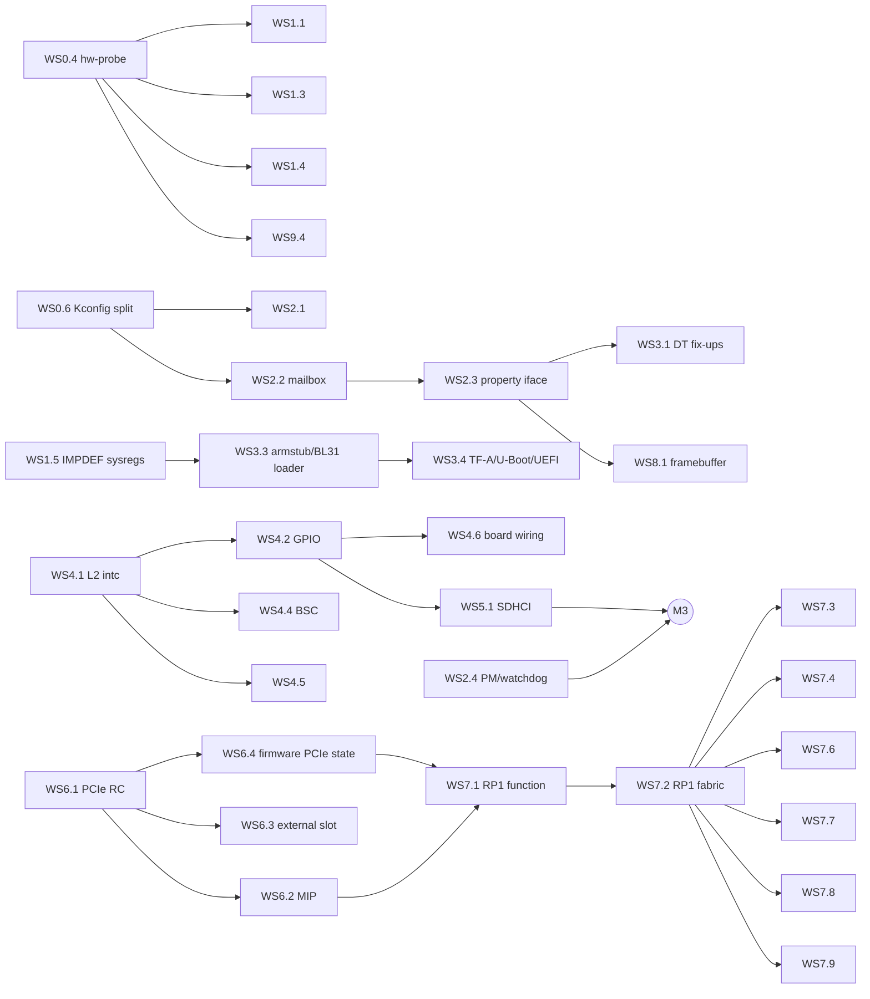

# Raspberry Pi 5 QEMU machine: implementation plan

This plan takes the `raspi5b` skeleton to a model that runs bare-metal
software, microkernels, TF-A/U-Boot and Raspberry Pi OS, and that can be
merged into upstream QEMU. Work is split into **workstreams** (WS) of
independently reviewable **units**, each small enough to be one upstream
commit (or a short series) with its own tests.

* [1. Principles](#1-principles)
* [2. Current state](#2-current-state)
* [3. Milestones](#3-milestones)
* [4. Dependency graph](#4-dependency-graph)
* [5. Workstreams](#5-workstreams)
  WS0 Foundation · WS1 CPU and GIC · WS2 VideoCore services ·
  WS3 Boot flow · WS4 Interrupt fabric and GPIO · WS5 Storage ·
  WS6 PCIe · WS7 RP1 · WS8 Display · WS9 Verification and upstreaming
* [6. Decisions](#6-decisions)
* [7. Risks](#7-risks)
* [8. Open questions](#8-open-questions)

## 1. Principles

1. **Bare metal first.** Priorities follow what a microkernel needs, in
   order: CPUs, interrupts, timers, a console, inter-processor wake-up,
   reset/power, then storage and I/O. Linux-only features come later.
2. **Hardware is the specification.** There is no public BCM2712 datasheet,
   so each model cites its sources in this order: Raspberry Pi and Arm
   documentation, then the RP1 datasheet, then Linux/TF-A/U-Boot drivers
   (treated as executable specifications), then register dumps from a real
   Pi 5 (WS0.4). Guesses are marked `TODO(WSx.y)` in the code.
3. **Fidelity tiers.** Every block of the memory map is always at one of:

   | Tier | Meaning |
   | --- | --- |
   | T0 | `unimplemented-device` placeholder: reads 0, logs with `-d unimp` |
   | T1 | register file: correct reset values, read-only/write-1-to-clear semantics, no behaviour |
   | T2 | functional: behaviour software depends on (interrupts, DMA, data paths) |
   | T3 | timing-aware: only where software observably depends on it |

   A block is promoted one tier at a time; T2 is the goal for everything
   an OS drives, T1 is sufficient for blocks that are only configured.
4. **Reuse before writing.** Existing QEMU models (PL011, GIC, BCM283x
   system timer/mailbox/property, SDHCI, DesignWare I²C, Cadence GEM, DWC3,
   serial-mm) are reused and, where needed, generalised upstream rather
   than forked.
5. **Upstream shape from day one.** QEMU coding style, QOM idioms,
   `vmstate`, `Resettable`, trace points and a qtest for every device;
   [DEVELOPMENT.md](DEVELOPMENT.md) has the details. Each unit's
   deliverable is written as it would be submitted.
6. **Every unit ends green:** `make build check checkpatch`, plus the
   acceptance test named in the unit.

## 2. Current state

Delivered by the boilerplate (WS0.1–WS0.3):

| Area | State |
| --- | --- |
| Repository | pinned QEMU v11.1.1 submodule, overlay + patch series managed by `scripts/qemu-tree`, CI |
| SoC (`bcm2712`) | 1–4 Cortex-A76 (`MPIDR.Aff1` = core, CNTFRQ 54 MHz, optional EL3), GIC-400 with 288 SPIs and all timer/maintenance PPIs, UART10 (PL011), complete memory map with T0 placeholders and two catch-all windows |
| Board (`raspi5b`) | 1/2/4/8/16 GiB RAM, board revision code, PSCI over SMC with EL2 entry (default) or guest-owned EL3 (`secure=on`), DTB fix-ups for unmodelled devices, `/system/linux,revision` |
| Tests | qtest (UART IDs, GIC geometry and security, RAM, placeholders), bare-metal smoke guest (EL, MPIDR, CNTFRQ, PSCI CPU_ON on all cores, SYSTEM_OFF, EL3 mode) |
| Linux | the stock Raspberry Pi OS kernel (6.18) with the firmware's `bcm2712-rpi-5-b.dtb` boots on 4 CPUs to the root-fs mount, without warnings |

## 3. Milestones

Milestones are cut by user-visible capability. Each lists its units and a
concrete exit test; units inside a milestone can proceed in parallel where
the graph in section 4 allows.

| Milestone | Capability | Units | Exit test |
| --- | --- | --- | --- |
| **M0** Skeleton | machine boots bare-metal payloads | WS0.1–0.3 | done: `make check` |
| **M1** Bare-metal platform | everything a microkernel needs, validated against hardware | WS0.4–0.6, WS1.1–1.5, WS2.1–2.5, WS3.2, WS9.1–9.2 | bare-metal suite (timers, IPIs, mailbox, watchdog reset, RNG) passes in QEMU **and** on a real Pi 5 with identical UART output |
| **M2** Firmware-faithful boot | real TF-A, U-Boot and UEFI run unmodified | WS1.6, WS3.1, WS3.3–3.6 | upstream TF-A `rpi5` BL31 (`secure=on`) → U-Boot → Linux; EDK2 to the UEFI shell |
| **M3** Linux on SD card | Raspberry Pi OS boots to a login prompt | WS2.6, WS4.1–4.6, WS5.1–5.2 | unmodified Raspberry Pi OS Lite image boots from `-drive if=sd`, `reboot` and `poweroff` work |
| **M4** PCIe | PCIe root complexes and MSI | WS6.1–6.5 | NVMe and virtio-net on the external PCIe1 port under Linux |
| **M5** RP1 | 40-pin header, Ethernet, USB | WS7.1–7.12 | Linux networking over RP1 Ethernet, USB keyboard and mass storage, GPIO/I²C/SPI/UART qtests; bare-metal RP1 UART at `0x1f_0003_0000` |
| **M6** Upstream | merged in QEMU | WS9.3–9.7 | series accepted by the Arm/Raspberry Pi maintainers |

Upstreaming (WS9.7) is incremental: M0+M1 form the first series, and each
later milestone is its own series once the previous one is merged.

## 4. Dependency graph

The critical path to Linux on real storage is WS0.6 → WS2.2/2.3 → WS4.1 →
WS4.2 → WS5.1. The critical path to the 40-pin header is WS6.1 → WS6.4 →
WS7.1 → WS7.2, which is the longest and highest-risk chain in the plan.

## 5. Workstreams

Unit format: **size** is S (≤ 1 day), M (2–4 days), L (1–2 weeks);
**Done when** is the acceptance test. Units list only non-obvious
dependencies; everything depends on WS0.1–0.3.

### WS0: Foundation and infrastructure

#### WS0.1 Repository and overlay tooling (done)
Pinned submodule, `overlay/`, `patches/`, `scripts/qemu-tree`
(`apply`/`unapply`/`status`/`new`/`refresh`), Makefile, GPL-2.0-or-later.

#### WS0.2 SoC and board skeleton (done)
`bcm2712` SoC and `raspi5b` machine as described in section 2.

#### WS0.3 Continuous integration (done)
GitHub Actions: shellcheck, checkpatch, build with ccache, qtest and smoke
tests.
*Follow-up (S):* a weekly job that rebases the overlay onto QEMU `master`
to surface upstream API churn before release bumps.

#### WS0.4 Hardware probe and golden data (M)
A bare-metal payload (`tests/guest/hwprobe/`) that runs on a **real Pi 5**
(as `kernel_2712.img`, with `pciex4_reset=0`) and on QEMU, and prints a
machine-readable dump over UART10:
* CPU: `MIDR`, `REVIDR`, `MPIDR`, all `ID_AA64*`, `CTR`, `CLIDR`, every
  `CCSIDR`, `DCZID`, `CNTFRQ`, `PMCR`, IMPDEF `CPUACTLR*`/`CPUECTLR`;
* GIC-400: `GICD_TYPER`, `GICD_IIDR`, `GICC_IIDR`, peripheral/component IDs,
  implemented priority bits, reset state of enables, groups and targets;
* every T1+ peripheral: reset values of all documented registers.

`tests/hw/golden/*.json` stores the hardware dumps; a tool diffs a QEMU run
against them. Must only read registers (no side-effecting reads such as
FIFOs or read-to-clear status).
**Done when:** the dump from hardware is checked in and the diff tool runs
in CI against QEMU, with known differences listed in an allow-list that
later units shrink.

#### WS0.5 Upstream series export (S)
`scripts/qemu-tree export <dir>`: builds a throw-away worktree at the pinned
commit, copies overlay files in, applies patches and commits them as the
logical series defined in a `series.map` (one commit per device: model +
glue + test), then runs `git format-patch --cover-letter`.
**Done when:** the exported series applies to the pinned tag with `git am`,
builds at every commit (`git rebase -x`), and passes checkpatch.

#### WS0.6 Decouple BCM283x models from `CONFIG_RASPI` (S, upstream-first)
Today `bcm2835_systmr.c`, `bcm2835_mbox.c`, `bcm2835_property.c`,
`bcm2835_powermgt.c`, `bcm2835_rng.c`, `bcm2835_thermal.c` and friends are
only built under the board symbol `CONFIG_RASPI`. Introduce per-device
symbols (`BCM2835_SYSTMR`, `BCM2835_MBOX`, ...) selected by `RASPI`, and let
`BCM2712` select just what it reuses.
**Done when:** `raspi*` machines are unchanged (`make check-qtest` of QEMU),
and a build with `CONFIG_RASPI=n` still builds `raspi5b`. Submit upstream
immediately; it is independent of this machine.

### WS1: CPU and interrupt controller fidelity

#### WS1.1 Cortex-A76 identification audit (M)
**Depends:** WS0.4.
Compare QEMU's `cortex-a76` ID registers with the hardware dump. Known gaps:
no L3 in `CLIDR`/`CCSIDR` (BCM2712 has a 2 MiB L3), `REVIDR`, and whichever
`ID_AA64*` fields the dump shows. Fix values that are properties of the
BCM2712 integration (cache geometry) in the SoC via CPU properties, and
values that are properties of the A76 itself upstream in
`target/arm/tcg/cpu64.c`.
**Done when:** the WS0.4 diff shows no unexplained CPU ID differences; a
bare-metal test checks the cache geometry the guest computes.

#### WS1.2 `MPIDR_EL1.MT` (S, optional)
Real A76 cores report `MT = 1` with the core number in `Aff1`. QEMU cannot
express `MT` today. Evaluate an upstream `mp-affinity`-independent CPU
property; check the PSCI affinity matching and GIC target logic do not
assume `MT = 0`.
**Done when:** `MPIDR` matches hardware bit for bit and PSCI/SMP tests pass.

#### WS1.3 GIC-400 geometry and identification (S)
**Depends:** WS0.4.
Replace the assumed 288 SPIs with the hardware `GICD_TYPER.ITLinesNumber`.
Report GIC-400 identification (`GICD_IIDR = 0x0200143b`,
`GICC_IIDR = 0x0202143b`, and the ID registers) rather than QEMU's generic
values; this needs a small upstream extension of `arm_gic` (an `iidr`
property, defaulting to today's value).
**Done when:** qtest asserts the hardware values; `TODO(WS1.3)` is gone.

#### WS1.4 PMU overflow interrupt (S)
**Depends:** WS0.4.
Neither device tree describes the A76 PMU interrupt. Find it on hardware
(overflow a counter, look for the pending PPI/SPI in the GIC), wire
`pmu-interrupt`, and document it for the DT maintainers.
**Done when:** a bare-metal test takes a PMU overflow interrupt; Linux perf
works when an `arm,cortex-a76-pmu` node is added.

#### WS1.5 IMPDEF system registers used by firmware (S)
TF-A's Cortex-A76 support (errata workarounds, power-down sequence) and
U-Boot touch `CPUACTLR_EL1`, `CPUACTLR2_EL1`, `CPUECTLR_EL1`,
`CPUPWRCTLR_EL1` and friends. Make sure each is defined (RAZ/WI or
storage), matching the reset values from WS0.4; upstream in `cpu64.c`.
**Done when:** TF-A's `cortex_a76` reset and power-down paths run without
UNDEF under `secure=on`.

#### WS1.6 Secure-world interrupt behaviour (S)
**Depends:** WS1.3.
With `secure=on`, check Group 0/1 behaviour, `GICD_CTLR.DS` absence, FIQ
routing and banked registers against the GIC-400 TRM with a bare-metal EL3
test that configures groups and drops to EL2.
**Done when:** the test passes in QEMU and on hardware (with a custom
armstub).

### WS2: VideoCore-side platform services

These blocks are shared with earlier Raspberry Pi SoCs; the work is mostly
re-targeting existing QEMU models to BCM2712 addresses and differences.

#### WS2.1 System timer (S)
**Depends:** WS0.6.
Instantiate `bcm2835-sys-timer` at `0x10_7c00_3000`, comparators 0–3 to SPIs
64–67. Confirm the 1 MHz rate and register layout against hardware.
**Done when:** qtest for counter and match interrupts; bare-metal test takes
a comparator interrupt through the GIC.

#### WS2.2 VideoCore mailbox (M)
**Depends:** WS0.6.
Instantiate `bcm2835-mbox` at `0x10_7c01_3880` (SPI 33). Resolve how the
firmware interprets buffer addresses on BCM2712: the `soc` node's
`dma-ranges` map bus `0xc000_0000` to DRAM 0 for 1 GiB, so Linux passes
bus addresses with the `0xc` alias, while bare-metal code may pass plain
physical addresses. Model the translation explicitly, as an address space
the mailbox and property devices use, not as ad-hoc masking.
**Done when:** qtest round-trips a property request both ways; the
`raspberrypi,bcm2835-firmware` node can be re-enabled.

#### WS2.3 Firmware property interface (L, split)
**Depends:** WS2.2.
Extend or wrap `bcm2835-property` for the tags Pi 5 software uses:

| Sub-unit | Tags | Consumer |
| --- | --- | --- |
| 2.3a (S) | firmware revision/variant, board model/revision/serial/MAC, ARM and VC memory, command line | everyone |
| 2.3b (M) | clock rate get/set/min/max, clock state, power/domain state, reset (`raspberrypi,firmware-clocks`, `-reset`, `bcm2835-power`), temperature, `GET_THROTTLED` | Linux clock tree, HVS, V3D |
| 2.3c (S) | framebuffer allocation (WS8.1) | bare-metal graphics, `simplefb` |
| 2.3d (S) | RTC tags (`raspberrypi,rpi-rtc`: time, alarm, charger) | Pi 5 on-board RTC |
| 2.3e (S) | GPIO expander tags (activity LED, camera/display power) | `raspberrypi,firmware-gpio` |

Board serial and MAC come from machine properties with stable defaults.
**Done when:** per-tag qtests; Linux's firmware, clock, reset, power and
RTC drivers probe with the upstream and downstream device trees; `hwclock`
works.

#### WS2.4 Power management and watchdog (M)
`brcm,bcm2712-pm` at `0x10_7d20_0000`: `PM_RSTC`/`PM_RSTS`/`PM_WDOG` with the
`0x5a` password, watchdog expiry and full reset (`qemu_system_reset_request`),
`PM_RSTS` partition bits for "halt" (used by the Linux driver to power
off), and the power-domain registers the driver touches. Check whether
`bcm2835-powermgt` can be generalised or a new model is cleaner.
**Done when:** qtest; bare-metal watchdog reset test (boot counter kept in
a RAM location that survives reset); Linux `reboot`/`poweroff` through the
watchdog driver.

#### WS2.5 RNG200 (S)
`brcm,bcm2711-rng200` at `0x10_7d20_8000`: FIFO count, data, soft reset and
interrupt status, backed by `qemu_guest_getrandom`. Also usable by
`raspi4b`, which disables this node today, so upstream it standalone.
**Done when:** qtest; Linux `hwrng` reads random data.

#### WS2.6 AVS monitor / thermal (S)
The downstream DT's `avs-monitor@7d542000` (`brcm,bcm2711-avs-monitor`)
provides the SoC temperature. Model the temperature register with a
settable property (`-global bcm2712-avs.temperature-mC=...`).
**Done when:** `thermal_zone0` reads the configured value.

### WS3: Boot flow and firmware compatibility

#### WS3.1 Device-tree fix-ups at parity with the firmware (M)
**Depends:** WS2.3a.
Reproduce what the VideoCore firmware adds or edits: `/chosen` (`bootargs`
merge rules, `kaslr-seed`, `rng-seed`, `linux,initrd-*`, the
`bootloader`/`boot-mode`/`partition` properties the downstream kernel
reads), `/system/linux,serial`, the `linux,cma` size (currently reported
as "firmware out-of-date" by Linux), `local-mac-address` for RP1 Ethernet,
and the memory node layout real firmware produces. Shrink
`raspi5b_unmodelled_compatibles` as each device lands.
**Done when:** the fixed-up DT of a QEMU boot and a real boot (from
`/sys/firmware/fdt`) differ only in documented ways; no "firmware
out-of-date" message.

#### WS3.2 Built-in device tree (M)
When no `-dtb` is given, generate a DT from the model (`get_dtb`): memory,
CPUs with PSCI, GIC, timer, UART10 and each device as it reaches T2, using
the SoC memory map as the single source of truth and the same node names
and compatibles as `bcm2712.dtsi`. Bare-metal code and microkernels then
always receive a valid DT in `x0`.
**Done when:** `-machine dumpdtb` output passes `dtc` and `dt-validate`
against the kernel bindings; Linux boots on it to the root-fs mount.

#### WS3.3 Armstub/BL31 loading (`-bios`) (M)
**Depends:** WS1.5.
Mirror the firmware's handoff for users who bring their own secure
firmware: load `-bios` at `0x0` (the `atf@0` region), load `-kernel` and
the DT where the firmware puts them, and start every core at `0x0` in EL3
(`secure=on`) with the register state TF-A's `rpi5` platform expects.
First a research sub-unit (S): record the firmware's load addresses and
register handoff on hardware (WS0.4 payload used as an armstub).
**Done when:** `TODO(WS3.3)` is gone; the upstream TF-A `rpi5` BL31 plus
the bare-metal smoke guest (as BL33) passes the PSCI tests with QEMU's PSCI
emulation disabled.

#### WS3.4 TF-A, U-Boot and UEFI validation (M)
**Depends:** WS3.3, WS5.1 for storage.
Boot upstream TF-A (`PLAT=rpi5`), U-Boot (`rpi_arm64_defconfig`) and the
community EDK2 Pi 5 port; fix model gaps they expose.
**Done when:** functional tests (WS9.3) boot each to its prompt.

#### WS3.5 SD-card boot helper (M)
Rather than emulating the closed-source firmware, a host tool
(`scripts/rpi5-boot`) reads the boot partition of a Raspberry Pi OS image,
evaluates the `config.txt` subset that matters (`kernel`, `device_tree`,
`dtoverlay`/`dtparam`, `cmdline`, `arm_64bit`, `pciex4_reset`), applies
overlays with `fdtoverlay`, and prints or executes the QEMU command line.
**Done when:** it boots an unmodified Raspberry Pi OS image to login with
one command (needs M3).

#### WS3.6 Reset and power semantics (S)
**Depends:** WS2.4.
System reset must reset every device (audit `Resettable` coverage), restore
the boot handoff, and keep RAM; PSCI `SYSTEM_RESET`, the watchdog and the
QEMU monitor `system_reset` all take the same path. Power-off leaves QEMU
with exit status 0.
**Done when:** a bare-metal test resets twice and observes identical
state; Linux `reboot` loops three times.

### WS4: Broadcom interrupt fabric, GPIO and low-speed I/O

#### WS4.1 brcmstb L2 interrupt controllers (M)
Two register layouts (the Linux `irq-brcmstb-l2` driver is the reference):
the level-triggered `brcm,bcm7271-l2-intc` (status `0x0`, mask
status/set/clear `0x4`/`0x8`/`0xc`) and the edge-triggered `brcm,l2-intc`
(status `0x0`, set `0x4`, clear `0x8`, mask status/set/clear
`0xc`/`0x10`/`0x14`). Instances: main (`0x10_7d50_8400`), BSC
(`0x10_7d50_8380`), AON (`0x10_7d51_0600`), display (`0x10_7c50_2000`),
`0x10_7d51_7000`, and the downstream `0x10_7d50_3000`. One QOM type with a
`variant` property; inputs are qdev GPIOs, the output feeds a GIC SPI.
**Done when:** qtest per variant (level/edge, mask, clear); Linux registers
all L2 controllers.

#### WS4.2 brcmstb GPIO (M)
**Depends:** WS4.1.
`brcm,brcmstb-gpio`: banks of 32 lines at a 0x20 stride
(`ODEN, DATA, IODIR, EC, EI, MASK, LEVEL, STAT`), bank widths from the DT
(GIO 32+22, GIO AON 17+6), interrupt output to the main L2 controller.
Lines are qdev GPIOs so the board can connect buttons and card detect.
**Done when:** qtest drives inputs and checks interrupts; Linux `gpioinfo`
lists both controllers.

#### WS4.3 Pin control (S)
`bcm2712c0-pinctrl` and `-aon-pinctrl` at T1: register storage with reset
values from WS0.4, so drivers that read back mux settings see real values.
Record the C1/D0 difference (WS9.8 covers stepping).
**Done when:** qtest reset values; Linux pinctrl debugfs is consistent.

#### WS4.4 BSC I²C (S)
**Depends:** WS4.1.
`brcm,brcmstb-i2c` (HDMI DDC buses) with an attached EDID EEPROM model.
**Done when:** qtest reads the EDID; Linux `i2cdetect` sees it.

#### WS4.5 UARTA (S)
`brcm,bcm7271-uart` is 16550-compatible with 32-bit registers: reuse
`serial-mm` (`regshift = 2`), SPI 276, `serial_hd(n)` per the serial map in
section 6.
**Done when:** Linux `ttyS0` loopback test; the Bluetooth node stays
disabled (no radio model).

#### WS4.6 Board wiring (S)
**Depends:** WS4.2.
Power button on GIO 20 (`gpio-keys`) driven by the QEMU `system_powerdown`
event, SD card-detect on GIO AON 5, activity/power LEDs as trace points.
**Done when:** `system_powerdown` from the monitor shuts Linux down cleanly.

### WS5: Storage

#### WS5.1 SD/eMMC host controllers (M)
**Depends:** WS4.2 for card detect.
`brcm,bcm2712-sdhci` = standard SDHCI (`host`, `0x260`) plus a Broadcom
`cfg` block at `+0x400`. Reuse `TYPE_SYSBUS_SDHCI` with capabilities and
spec version from WS0.4, add a small `cfg` register model, and connect
SDIO1 (SPI 273) to `-drive if=sd,index=0` (`auto_create_sdcard`). SDIO2
(SPI 274) is instantiated without a card.
**Done when:** qtest identifies an SD card; Linux mounts an ext4 root from
`-drive if=sd` and passes `fio` verification; UHS modes negotiated by the
driver do not wedge the model.

#### WS5.2 System DMA (M)
The downstream DT's 40-bit DMA controller (`0x10_0001_0000`,
`brcm,bcm2712-dma`) extends `bcm2835-dma` with 40-bit addresses. Model it
if WS5.1 or audio needs it; otherwise keep at T0 and disable its node.
**Done when:** dmatest passes, or the decision to defer is recorded here.

#### WS5.3 Boot EEPROM SPI (S, optional)
The bootloader EEPROM behind `spi10` lets `rpi-eeprom-update` run. Only
worth it if users ask.

### WS6: PCIe

The BCM2712 has three Broadcom STB PCIe root complexes (not DesignWare), so
this is new code. The Linux `pcie-brcmstb` driver is the reference.

#### WS6.1 brcmstb root complex (L, split)
| Sub-unit | Content |
| --- | --- |
| 6.1a (M) | register file, `PERST#`/bridge reset (via `brcmstb-reset` and rescal), link state machine (`MISC_PCIE_STATUS`: PHY link up, DL active, RC mode) |
| 6.1b (M) | root port config space and the indirect config window (`EXT_CFG_INDEX`/`EXT_CFG_DATA`) onto a QEMU `PCIBus` |
| 6.1c (M) | outbound windows (`MISC_CPU_2_PCIE_MEM_WIN*`) as `MemoryRegion` aliases into the PCI address space; inbound `RC_BAR1..3` translating PCI `0x10_0000_0000` to DRAM for device DMA |
| 6.1d (S) | INTx → GIC SPIs, and the RC's internal MSI controller where used |

**Done when:** Linux enumerates an empty PCIe1 and PCIe0, and a qtest
exercises config access and window programming.

#### WS6.2 MIP MSI controllers (S)
**Depends:** WS6.1.
`brcm,bcm2712-mip`: the doorbell page at PCI `0xff_ffff_f000` raising SPIs
128–191 (MIP0) or 247–254 (MIP1), with the raise/clear/mask registers.
**Done when:** MSI and MSI-X interrupts from a test device reach the GIC.

#### WS6.3 External PCIe1 slot (S)
**Depends:** WS6.1, WS6.2.
Expose PCIe1's bus by a stable id so users can attach `-device nvme`,
`virtio-net-pci`, etc.
**Done when:** functional test boots Linux with an NVMe root and virtio-net.

#### WS6.4 Firmware-initialised PCIe2 (S)
**Depends:** WS6.1.
Real firmware leaves PCIe2 trained with RP1's BAR mapped at
`0x1f_0000_0000` when `pciex4_reset=0`; bare-metal software depends on it.
A machine property (`pcie2-preinit`, default on) programs the RC and RP1
BARs at reset exactly as the firmware does (register values from WS0.4).
**Done when:** bare-metal access to RP1 at `0x1f_0000_0000` works without
touching the RC; Linux still re-initialises the RC correctly.

#### WS6.5 PCIe0 (S)
PCIe0 is internal and unused on the Pi 5 Model B; keep it enumerable and
empty, matching hardware.

### WS7: RP1 south bridge

RP1 is modelled as a PCI endpoint whose BAR contains a private system bus.
Most of its blocks are licensed IP with existing QEMU models.

#### WS7.1 RP1 PCI function (M)
**Depends:** WS6.2, WS6.4.
`1de4:0001`, BAR layout from the hardware (`lspci -vvv` on a Pi 5), 61
MSI-X vectors, and the `PCIE_APBS` block at BAR1 + `0x10_8000` with
`MSIX_CFG(n)` (`ENABLE`, `IACK`, `IACK_EN`) semantics: level interrupts
re-assert after `IACK` while the source is still high.
**Done when:** qtest raises each vector; Linux's `rp1` driver probes.

#### WS7.2 RP1 internal fabric (M)
A container `MemoryRegion` for BAR1 into which sub-devices map at their
offsets; an interrupt router from sub-device `qemu_irq` lines to MSI-X
vectors; RP1-side DMA through `pci_get_address_space()` using RP1's
`dma-ranges`; the SET/CLR/XOR register aliases RP1 blocks share, as a
reusable helper. Unmodelled blocks are T0 placeholders inside RP1.
**Done when:** the design is documented in `docs/hardware/rp1.md` and a
trivial sub-device (e.g. the SRAM) works end to end.

#### WS7.3 UART0–5 (S)
PL011s at `0x30000 + n × 0x4000` (check `arm,pl011-axi` access-width
quirks), connected to `serial_hd(2..7)`.
**Done when:** bare-metal and Linux loopback tests on UART0 (GPIO14/15).

#### WS7.4 GPIO, pads and pin muxing (M)
`raspberrypi,rp1-gpio`: `IO_BANK0..2` (status/control per pin, interrupt
registers), `SYS_RIO` (output, output-enable, input with atomic aliases),
`PADS`; 54 lines (28 on the header), interrupts per bank. Lines are qdev
GPIOs; a QMP/qtest-controllable "header" object lets tests drive pins.
**Done when:** qtest covers function select, RIO, pad settings and edge and
level interrupts; `gpioset`/`gpioget`/`gpiomon` work in Linux.

#### WS7.5 Clocks and resets (S)
`raspberrypi,rp1-clocks` at T1+: PLL lock bits that assert after enable,
divider and enable registers readable as written.
**Done when:** Linux `clk_summary` shows the rates in the DT's
`assigned-clock-rates`.

#### WS7.6 I²C0–6 (S)
Reuse `designware-i2c`; check `IC_COMP_PARAM_1`/version against hardware;
the HAT ID EEPROM on I²C0 as a board option.
**Done when:** qtest transfers to an attached EEPROM; Linux reads the HAT
EEPROM.

#### WS7.7 SPI0–8 (M, upstream-worthy)
No DesignWare APB SSI model exists in QEMU. Write a generic `dw-apb-ssi`
(SSI bus, FIFOs, interrupts, chip selects); it will also serve other SoCs.
**Done when:** qtest with an `m25p80` flash; Linux `spidev` loopback.

#### WS7.8 Ethernet (M)
Reuse `cadence_gem` at `0x100000` with the RP1 GEM configuration (DMA bus
width, queue count, `raspberrypi,rp1-gem` quirks) and the PHY at MDIO
address 1; `-nic` support.
**Done when:** Linux gets a DHCP lease over user networking and passes an
`iperf3` sanity run.

#### WS7.9 USB (M)
Two `usb_dwc3` (xHCI) instances at `0x200000` and `0x300000`, edge MSI-X
interrupts, DMA through RP1's inbound translation.
**Done when:** `usb-kbd` and `usb-storage` work in Linux.

#### WS7.10 RP1 DMA (M, deferrable)
`snps,axi-dma-1.01a`: needed only for DMA-driven SPI/UART/audio. Defer until
a consumer needs it.

#### WS7.11 Remaining RP1 blocks (S each)
ADC and temperature sensor (T2, settable value), PWM (T1), mailbox, SDIO
(`rp1-dwcmshc` via SDHCI), I²S, CSI/DSI/DPI/VEC (T0), PIO (T0; a PIO
state-machine model is a separate project).

#### WS7.12 RP1 integration (S)
Board wiring (`serial_hd` map, MAC address, HAT EEPROM), upstream and
downstream DT validation, DT fix-ups removed from the unmodelled list.
**Done when:** M5 exit test.

### WS8: Display and multimedia (stretch)

#### WS8.1 Firmware framebuffer (S)
**Depends:** WS2.3c.
Allocate a framebuffer through the property interface and expose it with a
QEMU console; Linux uses it through `simplefb`, bare-metal code directly.
**Done when:** bare-metal test draws a pattern checked by a screendump.

#### WS8.2 HVS/HDMI (KMS), V3D, ISP, codecs
Out of scope unless there is concrete demand; the nodes stay disabled.

### WS9: Verification, quality and upstreaming

#### WS9.1 Per-device qtests (ongoing)
Every model lands with a qtest covering reset values, each register's
access semantics and every interrupt path. Reset values come from WS0.4.

#### WS9.2 Bare-metal test suite (M, then ongoing)
Grow `tests/guest/` into a small freestanding framework (console, GIC
driver, exception vectors, per-core stacks, simple assertions) and add:
generic-timer interrupts on every core, SGIs between cores, system timer
and mailbox tests, PSCI `CPU_OFF`/`AFFINITY_INFO`/`SYSTEM_RESET`, watchdog
reset, RNG, and the `secure=on` EL3 → EL2 drop. Every test must also run on
hardware.
**Done when:** M1 exit test.

#### WS9.3 Functional tests (M)
`overlay/tests/functional/aarch64/test_raspi5b.py` using QEMU's asset
cache: Linux (kernel + DTB + initramfs), SD image boot, TF-A/U-Boot, NVMe
and networking as the milestones land. Assets must be pinned by hash and
publicly hosted with stable URLs.

#### WS9.4 Differential validation (ongoing)
**Depends:** WS0.4.
Run the bare-metal suite on hardware and QEMU and compare UART transcripts;
extend the golden dumps for every device promoted to T1 or above.

#### WS9.5 Migration, snapshots and determinism (S)
`vmstate` for every device; a test that `savevm`/`loadvm`s mid-boot and a
record/replay (`-icount`) run of the bare-metal suite that must be
bit-for-bit reproducible.

#### WS9.6 Fuzzing (S)
Add a `raspi5b` entry to QEMU's generic MMIO fuzzer configuration covering
our devices; fix what it finds.

#### WS9.7 Upstream submission (ongoing)
Split into series per milestone (WS0.5), `MAINTAINERS` entries, human
`Signed-off-by`, docs in `docs/system/arm/raspi5b.rst`; respond to review,
rebase on `master`, repeat. Submit WS0.6, WS1.3/WS1.5 (upstream-side), WS2.5
and WS7.7 early: they are useful beyond this machine.

#### WS9.8 BCM2712 stepping (S)
C1 (4/8 GiB launch boards) and D0 (later 2/16 GiB boards) differ in pin
control compatibles and removed blocks. Add a `soc-stepping` property
(`c1` default) once the differences are catalogued from hardware and the
DTs (`bcm2712d0.dtsi` downstream), and derive the revision code from it.

## 6. Decisions

| Decision | Rationale |
| --- | --- |
| Overlay + pinned submodule, not a QEMU fork | our changes stay small, reviewable and rebased per release; maps directly onto an upstream series |
| GPL-2.0-or-later throughout | required to link with QEMU and to upstream |
| Machine name `raspi5b`, SoC type `bcm2712` | follows `raspi4b`/`bcm2838` naming; the product is the "Raspberry Pi 5 Model B" (`raspberrypi,5-model-b`) |
| SoC derives from `TYPE_DEVICE`, not `BCM283X_BASE` | the BCM2712 map shares no base address or layout with BCM283x; the base class would carry the ARM-local interrupt controller and 32-bit peripheral window, which the BCM2712 lacks |
| Default `secure=off`: no EL3, EL2 entry, QEMU PSCI over SMC | exactly the contract the Pi 5 firmware gives an OS; `secure=on` for firmware work |
| GIC Security Extensions follow `secure` | without EL3 nothing could move interrupts to Group 1 |
| 288 SPIs | smallest multiple of 32 covering SPI 276; to be confirmed (WS1.3) |
| Default 2 GiB RAM | a real SKU that keeps test memory use modest |
| `-smp 1..4` | fewer cores are useful when debugging SMP bring-up; missing cores fail PSCI `CPU_ON` with `INVALID_PARAMETERS` |
| Unmodelled DT nodes are disabled, not deleted | keeps phandles valid |
| TCG only | KVM on a Pi 5 host would need a different GIC and timer story; out of scope |

Serial port map (`-serial` order), fixed now so it never changes:
`serial_hd(0)` UART10 (debug header), `serial_hd(1)` UARTA (Bluetooth UART),
`serial_hd(2..7)` RP1 UART0–5.

## 7. Risks

| Risk | Impact | Mitigation |
| --- | --- | --- |
| No public BCM2712 register documentation | wrong reset values or semantics | driver-as-spec plus hardware dumps (WS0.4) and differential tests (WS9.4) |
| PCIe RC and RP1 are large and interdependent | M4/M5 slip | firmware-initialised mode (WS6.4) unblocks bare-metal RP1 use early; RP1 sub-devices are mostly reused models |
| Closed-source firmware behaviour (DT fix-ups, load addresses) | Linux or TF-A differences | measure on hardware (WS3.3 research), host-side boot helper (WS3.5) instead of emulating the firmware |
| QEMU API churn between releases | overlay stops building | weekly `master` CI job (WS0.3 follow-up), small patch set |
| Upstream review asks for restructuring | rework | follow existing Raspberry Pi and `fsl-imx8mp` patterns; submit generic pieces (WS0.6, WS2.5, WS7.7) early to build reviewer familiarity |
| Silicon stepping differences (C1/D0) | software written for one fails on the other | WS9.8 |

## 8. Open questions

1. **Hardware access:** is a Raspberry Pi 5 (with a debug-UART adapter)
   available for WS0.4 and WS9.4? Without one, fidelity rests on drivers
   and documentation alone and several `TODO`s stay open.
2. **Target software:** which microkernel(s) and firmware matter most
   (e.g. seL4, a custom verified kernel, TF-A, U-Boot, EDK2)? Their boot
   protocols decide the order of WS3.2 and WS3.3.
3. **Upstream intent and cadence:** submit M0+M1 as soon as M1 is done, or
   hold until Linux boots from SD (M3)?
4. **Stepping:** model C1 only, or D0 from the start (WS9.8)?
5. **Display:** is the firmware framebuffer (WS8.1) enough, or is HDMI/KMS
   needed?
