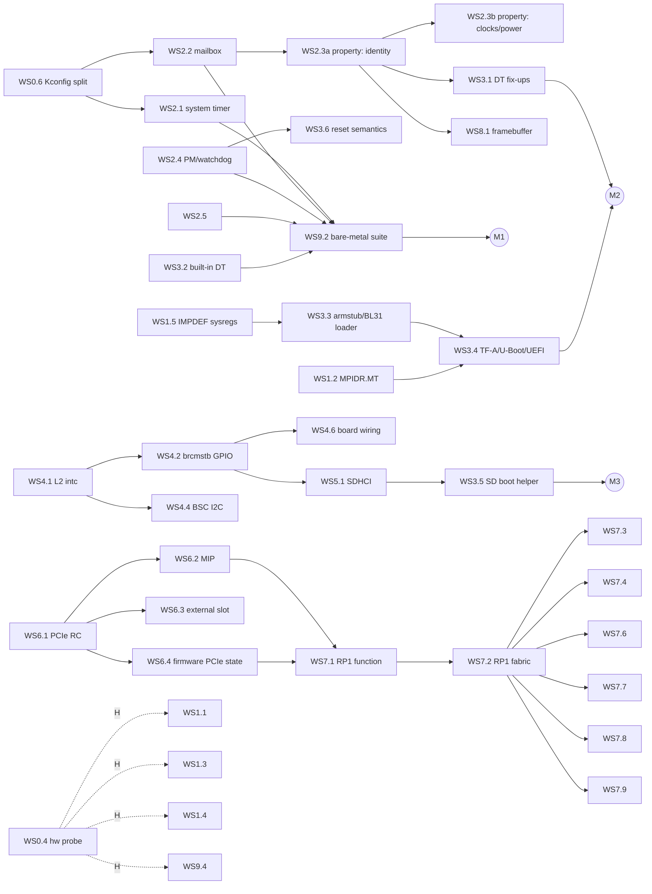

# Raspberry Pi 5 QEMU machine: implementation plan

This plan takes the `raspi5b` skeleton to a model that runs bare-metal
software, microkernels, TF-A/U-Boot and Raspberry Pi OS, and that can be
merged into upstream QEMU. Work is split into **workstreams** (WS) of
independently reviewable **units**, each small enough to be one upstream
commit (or a short series) with its own tests.

* [1. Principles](#1-principles)
* [2. Current state](#2-current-state)
* [3. Milestones](#3-milestones)
* [4. Dependency graph and execution order](#4-dependency-graph-and-execution-order)
* [5. Unit conventions](#5-unit-conventions)
* [6. Workstreams](#6-workstreams)
  WS0 Foundation · WS1 CPU and GIC · WS2 VideoCore services ·
  WS3 Boot flow · WS4 Interrupt fabric and GPIO · WS5 Storage ·
  WS6 PCIe · WS7 RP1 · WS8 Display · WS9 Verification and upstreaming
* [7. Decisions](#7-decisions)
* [8. Risks](#8-risks)
* [9. Open questions](#9-open-questions)

## 1. Principles

1. **Bare metal first.** Priorities follow what a microkernel needs, in
   order: CPUs, interrupts, timers, a console, inter-processor wake-up,
   reset/power, then storage and I/O. Linux-only features come later.
2. **Hardware is the specification.** There is no public BCM2712 datasheet,
   so each model cites its sources in this order: Raspberry Pi and Arm
   documentation, then the RP1 datasheet, then Linux/TF-A/U-Boot drivers
   (treated as executable specifications), then register dumps from a real
   Pi 5 (WS0.4). Values that come from drivers rather than documentation
   are marked `TODO(WSx.y)` in the code until the hardware track (section 3)
   confirms them.
3. **Fidelity tiers.** Every block of the memory map is always at one of:

   | Tier | Meaning |
   | --- | --- |
   | T0 | `unimplemented-device` placeholder: reads 0, logs with `-d unimp` |
   | T1 | register file: correct reset values, read-only/write-1-to-clear semantics, no behaviour |
   | T2 | functional: behaviour software depends on (interrupts, DMA, data paths) |
   | T3 | timing-aware: only where software observably depends on it |

   A block is promoted one tier at a time; T2 is the goal for everything
   an OS drives, T1 is sufficient for blocks that are only configured.
4. **Reuse before writing.** Existing QEMU models (PL011, GIC, BCM283x
   system timer/mailbox/property, SDHCI, DesignWare I²C, Cadence GEM, DWC3,
   serial-mm) are reused and, where needed, generalised upstream rather
   than forked.
5. **Upstream shape from day one.** QEMU coding style, QOM idioms,
   `vmstate`, `Resettable`, trace points and a qtest for every device;
   [DEVELOPMENT.md](DEVELOPMENT.md) has the details. Each unit's
   deliverable is written as it would be submitted.
6. **Every unit ends green:** `make build check checkpatch`, plus the
   acceptance test named in the unit.
7. **No hardware, no blocking.** A real Pi 5 improves fidelity but is
   never a prerequisite for progress: every unit can be completed from
   drivers and documentation, and hardware validation is a parallel track
   that raises confidence after the fact.

## 2. Current state

Delivered so far: M1 (WS0.1–WS0.3, WS0.5, WS0.6, WS2.1, WS2.2, WS2.3a, WS2.4, WS2.5, WS3.2, WS3.6, WS9.2), M2 (WS1.2, WS1.5, WS3.1, WS3.3, WS3.4) and M3 (WS2.3b–WS2.3e, WS2.6, WS3.5, WS4.1–WS4.6 and WS5.1, with WS5.2 deferred), and of M4 so far WS2.3f and WS6.1–WS6.4:

| Area | State |
| --- | --- |
| Repository | pinned QEMU v11.1.1 submodule, overlay + patch series (patches may share files, like an upstream series) managed by `scripts/qemu-tree`, which also exports the upstream series (WS0.5: a commit per patch and a cover letter, checked with `git am`, checkpatch and a build of every commit), CI with ccache |
| Kconfig (WS0.6) | every BCM283x device model has its own symbol, so `bcm2712` can select just the models it reuses; a `raspi5b`-only build is tested (`make check-minimal`) |
| SoC (`bcm2712`) | 1–4 Cortex-A76 (`MPIDR.Aff1` = core with `MPIDR.MT` set (WS1.2), CNTFRQ 54 MHz, optional EL3, the IMPDEF registers firmware writes (WS1.5), warm reset through `RMR_EL3` (WS3.3)), GIC-400 with 288 SPIs, 5 priority bits and all timer/maintenance PPIs, UART10 (PL011), UARTA (a 16550 with 32-byte FIFOs, WS4.5), system timer (WS2.1), watchdog and reset status (WS2.4), RNG200 (WS2.5), the AVS monitor's temperature sensor (WS2.6), the seven brcmstb level 2 interrupt controllers (WS4.1), the two brcmstb GPIO blocks (WS4.2) and their pin controllers (WS4.3), the HDMI ports' two DDC I²C controllers (WS4.4), the two SD hosts with SDMA and ADMA2 (WS5.1), the three PCIe root complexes with their root ports, windows, INTx and RC-internal MSI, and the reset controller and PHY calibration block (WS6.1), the two MIPs that turn PCIe MSIs into SPIs (WS6.2), PCIe2 optionally started as the firmware leaves it with `pciex4_reset=0` (WS6.4), VideoCore mailbox with the BCM283x property and framebuffer channels (WS2.2), every identity tag answered (WS2.3a) and the Pi 5 firmware's own answers: its clocks, power domains and devices, temperature limit and reboot flags (WS2.3b), its framebuffer, kept within the VideoCore's 4 MiB (WS2.3c), its real-time clock (WS2.3d), the temperature the AVS monitor reads (WS2.6) and `vcgencmd`'s text commands (WS2.3f), complete memory map with T0 placeholders and two catch-all windows |
| Board (`raspi5b`) | 1/2/4/8/16 GiB RAM, board revision code, serial number (`serial=`), PSCI over SMC with EL2 entry (default) or guest-owned EL3 (`secure=on`), firmware such as TF-A's BL31 loaded with `-bios` and handed the kernel, initrd and device tree as the Pi's firmware does (WS3.3), system reset and power-off through PSCI, the watchdog and the monitor (WS3.6), with what a reset leaves for the next boot read, and set for the first, through `reset-status`, `reboot-flags` and `boot-count`, and the partition the files come from given by `boot-partition` (WS3.5), a built-in device tree when no `-dtb` is given (WS3.2; `builtin-dtb=off` passes none), the power button on GIO 20, which `system_powerdown` presses, and the ACT LED on GIO AON 9 (WS4.6), a monitor's EDID on HDMI0's DDC bus (WS4.4), the SD card slot on SDIO1, filled by `-drive if=sd` and changed at run time, with its card-detect switch on GIO AON 5 (WS5.1), PCIe1's connector for QEMU's PCI Express devices (WS6.3) and `pcie2-preinit` (WS6.4), and in whichever tree the guest gets the firmware's changes, made anew for each boot (WS3.1): model, serial number, the command line it builds, `/chosen` with the boot's reset status, partition, count and tryboot, a 5 A supply and seeds, the CMA size, the bootloader configuration, the Ethernet address, unmodelled devices disabled |
| Boot helper (WS3.5) | `scripts/rpi5-boot` boots an SD card image as a Pi 5's firmware boots it: the boot partition (MBR, GPT, `autoboot.txt`), `config.txt` with its filters and includes, the kernel, device tree, initramfs and command line it names, its overlays and parameters applied as the firmware applies them (the blob is `dtmerge`'s, byte for byte), `serial0` turned into `ttyAMA10`, and the card read again at each reboot |
| Tests | qtest (UART IDs, GIC geometry, priority bits and security, RAM, placeholders, system timer, watchdog, mailbox, identity tags, the firmware's clocks, power states, reboot flags, framebuffer (with the display, by `screendump`), real-time clock and `vcgencmd`'s commands, RNG, the AVS monitor's temperature, L2 interrupt controllers, GPIO, pin control, the DDC I²C controllers and the EDID, UARTA, the power button and ACT LED, the reset state, the SD hosts with card detect, PIO, SDMA and ADMA2, the PCIe root complexes with `edu`, PCIe2's firmware state, the MIPs), the built-in tree validated against the Linux v6.18 bindings (`make check-dt`), the device-tree fix-ups (each one, the built-in tree against a checked-in dump, the values of each boot across resets and migration, and as a reset left them for the first boot), bare-metal smoke guest (EL, MPIDR, CNTFRQ, PSCI CPU_ON on all cores, SYSTEM_OFF, EL3 mode), and the bare-metal suite (WS9.2, 36 tests: GIC and the Secure/Non-secure group split, each core's MPIDR, every timer on every core, SGIs between all core pairs, SPI routing, PSCI, the system timer, the mailbox and identity tags, the firmware's clocks through its tags, a tryboot, the real-time clock and a framebuffer, the RNG, the temperature as Linux and the firmware read it, a software-raised interrupt through each edge-layout L2 controller, a GPIO output's own edge through GIO's, UART receive and loopback, the SD card's master boot record through PIO, a watchdog reset and four system resets checked against the boot state, an ID-register dump, the A76's IMPDEF registers; 1–4 cores, with the built-in tree, a `-dtb` one and none, EL2 and EL3), the `-bios` handoff (qtest), and real firmware (`make check-firmware`, all pinned: the smoke guest and the suite on TF-A's `rpi5` BL31, Linux on TF-A and through U-Boot, the EDK2 port to its shell, the same from an SD card (Linux's root file system, U-Boot by its `extlinux.conf`, EDK2's map of the card), Linux with its root file system on an NVMe drive and an `igb` network card exchanging frames with the test, both behind a switch on PCIe1, and the changes to the firmware's tree against a checked-in list), and `scripts/rpi5-boot` (its device-tree, overlay and `config.txt` code, partition tables, `--print`, QEMU's runs and the reboot loop, with what each reboot leaves; with the firmware, every overlay and parameter of the release against `dtmerge`, and a Raspberry Pi OS-style first boot) |
| Linux and firmware | the stock Raspberry Pi OS kernel (6.18) boots on 4 CPUs to the root-fs mount, without warnings ("firmware out-of-date" included), with KASLR, scaling the CPUs' clock through the firmware (cpufreq), switching power domains through it and reading and setting its real-time clock (`hwclock`), reading the SoC's temperature in `thermal_zone0` and shutting down at its critical trip, registering every L2 interrupt controller its tree enables, listing both GPIO blocks with their banks and applying pin states through both pin controllers, reading the EDID through the DDC I²C controller, with `ttyS0` on UARTA looping bytes back and exchanging them with the host, with `gpio-keys` reporting `system_powerdown` as `KEY_POWER` (and on the built-in tree the ACT LED following sysfs), mounting its ext4 root from an SD card and noticing cards inserted and removed at run time, or from an NVMe drive on PCIe1, and loading `igb` for a network card beside it, with the firmware's `bcm2712-rpi-5-b.dtb` and on the built-in tree (1, 2 and 8 GiB), directly, on TF-A's BL31 or through U-Boot on it (WS3.4); the EDK2 port draws its boot menu on the firmware's framebuffer and reaches the UEFI shell, whose `date` and `time` read and set the firmware's clock; `scripts/rpi5-boot` boots the kernel from a card laid out as Raspberry Pi OS's, with the OS's `config.txt`, overlays and `cmdline.txt`, through a first boot that rewrites the card and reboots (WS3.5); Raspberry Pi OS Lite boots from its card with `scripts/rpi5-boot` to its login prompt, and `reboot` and `poweroff` work (M3's exit test, by hand) |

Known provisional values, each marked in the code: 288 SPIs
(`TODO(WS1.3)`), the VideoCore memory size and DMA channel mask
(`TODO(WS0.4)`), the PMU interrupts taken from the vendor DT
(`TODO(WS1.4)`), what the L2 controllers' write-only registers read, the
reset values of the GPIO blocks, pin controllers and I²C controllers,
the SD hosts' capabilities and the reset values of their configuration
registers, the firmware's clock ranges, the real-time clock's
charger range and what the AVS monitor's other registers and bits read
(`TODO(WS0.4)`), and the board revision's `REVISION`
field (WS9.8).

## 3. Milestones

Milestones are cut by user-visible capability. Each lists its units and a
concrete exit test; units inside a milestone can proceed in parallel where
the graph in section 4 allows. Milestone tests run in QEMU only; the
**hardware track H** re-runs them on a real Pi 5 whenever one is available
and turns provisional values into verified ones. H never gates a milestone.

| Milestone | Capability | Units | Exit test |
| --- | --- | --- | --- |
| **M0** Skeleton | machine boots bare-metal payloads | WS0.1–0.3 | done: `make check` |
| **M1** Bare-metal platform | everything a microkernel needs: timers, IPIs, mailbox/property, watchdog reset, RNG, a device tree | WS0.5, WS0.6, WS2.1, WS2.2, WS2.3a, WS2.4, WS2.5, WS3.2, WS3.6, WS9.2 | done: the bare-metal suite (WS9.2) passes on 1–4 cores with and without `-dtb`; PSCI `SYSTEM_RESET` and the watchdog reboot the guest four times |
| **M2** Firmware-faithful boot | real TF-A, U-Boot and UEFI run unmodified | WS1.2, WS1.5, WS3.1, WS3.3, WS3.4 | done: upstream TF-A `rpi5` BL31 (`secure=on`) → U-Boot → Linux to the root-fs mount; EDK2 to the UEFI shell (`make check-firmware`) |
| **M3** Linux on SD card | Raspberry Pi OS boots to a login prompt | WS2.3b–e, WS2.6, WS4.1–4.6, WS5.1, WS5.2, WS3.5 | done: an unmodified Raspberry Pi OS Lite image (2026-09-15, trixie) boots from `-drive if=sd` with `scripts/rpi5-boot` to its login prompt; `reboot` and `poweroff` work (by hand: the image is not in CI) |
| **M4** PCIe | PCIe root complexes and MSI | WS2.3f, WS6.1–6.5 | NVMe root and virtio-net on the external PCIe1 port under Linux |
| **M5** RP1 | 40-pin header, Ethernet, USB | WS7.1–7.12 | Linux networking over RP1 Ethernet, USB keyboard and mass storage, GPIO/I²C/SPI/UART qtests; bare-metal RP1 UART0 at `0x1f_0003_0000` |
| **M6** Upstream | merged in QEMU | WS9.3, WS9.5–9.8 | series accepted by the Arm/Raspberry Pi maintainers |
| **H** Hardware parity | provisional values verified on silicon | WS0.4, WS1.1, WS1.3, WS1.4, WS1.6, WS9.4 | golden dumps checked in; `TODO(WS0.4)`/`TODO(WS1.x)` markers gone; UART transcripts of the bare-metal suite identical on QEMU and hardware |

Upstreaming (WS9.7) is incremental: M0+M1 form the first series, and each
later milestone is its own series once the previous one is merged.

## 4. Dependency graph and execution order

Critical paths:

* **to M1:** WS0.6 → WS2.2 → WS2.3a, in parallel with WS2.4 → WS3.6 and
  WS3.2; WS9.2 closes it;
* **to M3:** WS4.1 → WS4.2 → WS5.1 → WS3.5;
* **to M5:** WS6.1 → WS6.2/6.4 → WS7.1 → WS7.2, the longest and
  highest-risk chain in the plan (three new device families in a row).

Suggested order for the next twelve units, chosen so that each one is
immediately exercised by the next:

| # | Unit | Why now |
| --- | --- | --- |
| 1 | WS0.6 Kconfig split (done) | unblocks reusing every BCM283x model; a self-contained upstream patch |
| 2 | WS2.1 system timer (done) | first reused device; exercises the SPI wiring path |
| 3 | WS9.2a bare-metal framework (done) | exception vectors and a GIC driver in the guest, needed by every later test |
| 4 | WS2.4 PM/watchdog (done) | reset and power-off, which every test harness needs |
| 5 | WS3.6 reset semantics (done) | makes the watchdog and PSCI `SYSTEM_RESET` trustworthy |
| 6 | WS2.2 mailbox (done) | the address-translation design decision, made once |
| 7 | WS2.3a property identity tags (done) | first consumer of the mailbox; lets the `firmware` DT node be enabled |
| 8 | WS2.5 RNG200 (done) | small, standalone, upstreamable |
| 9 | WS3.2 built-in device tree (done) | microkernels get a DT without `-dtb`; forces the memory map to be the single source of truth |
| 10 | WS9.2b full bare-metal suite (done) | M1 exit test |
| 11 | WS0.5 series export (done) | prepares the first upstream submission |
| 12 | WS4.1 L2 interrupt controllers (done) | opens the M3 chain |

## 5. Unit conventions

**Size:** S (≤ 1 day), M (2–4 days), L (1–2 weeks). **Depends** lists
only non-obvious prerequisites; everything depends on WS0.1–0.3.

**Definition of done**, applied to every unit that adds or promotes a
device, in addition to the unit's own **Done when**:

1. Source in `overlay/hw/<subsystem>/`, header in
   `overlay/include/hw/<subsystem>/`, glue as a patch (Kconfig, meson,
   trace-events), documented in `overlay/docs/system/arm/raspi5b.rst`.
2. Register offsets and reset values cite their source (document, driver
   file and symbol, or golden dump).
3. `MemoryRegionOps` declare `.valid`/`.impl` access sizes; guest
   errors log with `LOG_GUEST_ERROR`, unimplemented features with
   `LOG_UNIMP`; no `abort()` on guest input.
4. `VMStateDescription`, `Resettable` (or legacy reset when matching an
   existing model), trace points for interrupts and state changes.
5. A qtest covering reset values, every register's access semantics and
   every interrupt path; a bare-metal test when the device is on the
   microkernel path; the corresponding compatible removed from
   `raspi5b_unmodelled_compatibles` when the Linux driver now probes.
6. `make build check checkpatch` green in CI.

## 6. Workstreams

### WS0: Foundation and infrastructure

#### WS0.1 Repository and overlay tooling (done)
Pinned submodule, `overlay/`, `patches/`, `scripts/qemu-tree`
(`apply`/`unapply`/`status`/`new`/`refresh`), Makefile, GPL-2.0-or-later.

#### WS0.2 SoC and board skeleton (done)
`bcm2712` SoC and `raspi5b` machine as described in section 2.

#### WS0.3 Continuous integration (done)
GitHub Actions: shellcheck, checkpatch, ccache-backed build, qtest and
smoke tests.
*Follow-up (S):* a weekly job that applies the overlay onto QEMU `master`
to surface upstream API churn before release bumps.

#### WS0.4 Hardware probe and golden data (M) — track H
A bare-metal payload (`tests/guest/hwprobe/`) that runs on a **real Pi 5**
(as `kernel_2712.img`, `arm_64bit=1`, `pciex4_reset=0`) and on QEMU, and
prints a machine-readable dump over UART10.

**Steps**
1. Reuse the WS9.2 framework (console, per-core stacks). Output format:
   one `name=0x...` line per value, sorted, so `diff` and `jq` both work.
2. CPU section, per core (secondaries started with PSCI `CPU_ON` on
   hardware, since BL31 is present): `MIDR`, `REVIDR`, `MPIDR`, every
   `ID_AA64*_EL1` (including `ID_AA64ISAR2`, `ID_AA64MMFR2/3`,
   `ID_AA64PFR1`, `ID_AA64ZFR0`, `ID_AA64SMFR0`), `CTR`, `CLIDR`, every
   `CCSIDR` selected through `CSSELR`, `DCZID`, `CNTFRQ`, `PMCR`,
   `PMCEID0/1`, and the IMPDEF `CPUACTLR_EL1`, `CPUACTLR2_EL1`,
   `CPUECTLR_EL1`, `CPUPWRCTLR_EL1` (readable at EL2? if they UNDEF,
   record that too). Note whether `CBAR_EL1` exists.
3. GIC-400 section: `GICD_TYPER`, `GICD_IIDR`, `GICC_IIDR`, the
   peripheral/component ID registers of both frames, `GICH_VTR`; the
   number of implemented priority bits found by writing `0xff` to an
   `IPRIORITYR` and reading back; reset values of `ISENABLER`,
   `IGROUPR`, `ITARGETSR`, `ICFGR` for all SPIs.
4. Peripheral section: for every block at T1 or above, every documented
   register. Only registers without read side effects (no FIFOs, no
   read-to-clear status), enforced by a per-device allow-list in the
   payload.
5. Firmware handoff section (also serves WS3.3): on hardware, record at
   entry `x0`–`x3`, `CurrentEL`, `SCTLR_EL2`, `HCR_EL2`, `SCR_EL3` if
   readable, `sp`, the load address of the payload itself, and the
   address and size of the DTB (`x0` on a Linux-style entry).
6. `tests/hw/golden/<board-rev>.txt` stores the hardware dump;
   `scripts/hwprobe-diff` runs QEMU with the payload and diffs against the
   golden file, honouring an allow-list of known differences with a
   reason each (for example "QEMU models no L3").

**Done when:** the hardware dump is checked in; `make check-hwprobe` runs
the diff in CI; every difference is either fixed by a WS1 unit or listed
in the allow-list with a reason.

#### WS0.5 Upstream series export (done)
*Delivered:* `scripts/qemu-tree export` (`make export-series`). Each
patch in `patches/` is one upstream commit, and `series/series.map`
names the overlay files that go with it, keyed by the patch's name
without its number so renumbering needs no edit; commit messages stay in
the patches, a single source instead of the planned `series/NN-*.txt`.
The export commits onto the pinned revision in a temporary worktree,
refuses an overlay file that is in no patch or in two, writes the
series with `git format-patch --cover-letter --base` and the cover
letter from `series/cover.txt`, checks that it applies with `git am`
and reproduces the tree, and runs checkpatch (`--no-signoff` unless
`--signoff` adds the user's own). `--build` builds every commit; CI
exports on every change and builds every commit in a separate job. To
make the series reviewable, the SoC patch became two (the SoC, then the
board), the qtest and documentation patches now carry their files'
descriptions, and `MAINTAINERS` gains the new files in the Raspberry
Pi entry; `refresh` can now add a file to a patch. The M0+M1 series is
15 commits. Posting it waits for the author's `Signed-off-by:` and a
choice of maintainer entry (WS9.7).

`scripts/qemu-tree export <dir>` turns the overlay and patches into the
series a maintainer will review.

**Steps**
1. `series.map`: an ordered list of commits, each naming the overlay files
   and patches it contains plus its commit message file
   (`series/NN-subject.txt`). Example: `hw/arm: Add BCM2712 SoC` =
   `bcm2712.c` + `bcm2712.h` + the Kconfig/meson hunks that mention it.
2. Build a throw-away worktree at the pinned commit; for each map entry
   copy the files, `git apply` the listed patch hunks, `git commit` with
   the message; refuse to continue if any overlay file or patch is left
   unassigned.
3. `git rebase -x 'ninja -C build qemu-system-aarch64' pinned` to prove
   every commit builds (bisectability), then
   `git format-patch --cover-letter -v<N>` with the cover letter drawn
   from `series/cover.txt`.
4. `scripts/checkpatch.pl` on the result, with `--no-signoff` until the
   human author adds their `Signed-off-by:`.

**Done when:** the exported series applies to the pinned tag with
`git am`, builds at every commit, and passes checkpatch; the M0+M1 cover
letter exists.

#### WS0.6 Decouple BCM283x models from `CONFIG_RASPI` (done; to be posted upstream)
*Delivered:* `patches/0001-hw-Add-a-Kconfig-symbol-for-each-BCM283x-device-model.patch`,
first in the series so that it can be posted on its own; `make check-minimal`
builds and tests a QEMU whose only board is `raspi5b` (`CONFIG_RASPI=n`).
Posting to qemu-devel waits for the human author's `Signed-off-by:` (WS9.7).
The raspi5b-only build also exposed an upstream link failure: QEMU 11.1
builds `target/arm/tcg/gicv5-cpuif.c` unconditionally but the GICv5
helpers it calls only with `CONFIG_ARM_GICV5`, and the TCG stub for
`define_gicv5_cpuif_regs()` asserts. `tests/configs/raspi5b-only.mak`
enables `ARM_GICV5` as a workaround; *follow-up (S):* post the fix
(build the file only with `ARM_GICV5`, make the stub a no-op for CPUs
without FEAT_GCIE) alongside this patch.

Before this unit `bcm2835_systmr.c`, `bcm2835_mbox.c`, `bcm2835_property.c`,
`bcm2835_powermgt.c`, `bcm2835_rng.c`, `bcm2835_thermal.c`, `bcm2835_fb.c`,
`bcm2835_dma.c` and friends were only built under the board symbol
`CONFIG_RASPI` (`hw/*/meson.build`). Introduce per-device symbols
(`BCM2835_SYSTMR`, `BCM2835_MBOX`, `BCM2835_PROPERTY`, `BCM2835_FB`, ...)
selected by `RASPI`, and let `BCM2712` select only what it reuses.
**Done when:** the `raspi*` machines are unchanged (QEMU's own
`bcm2835-*` qtests pass), a build with `CONFIG_RASPI=n` still builds
`raspi5b`, and the patch is posted to qemu-devel; it is independent of
this machine.

### WS1: CPU and interrupt controller fidelity

#### WS1.1 Cortex-A76 identification audit (M) — track H
**Depends:** WS0.4.
Compare QEMU's `cortex-a76` ID registers with the hardware dump. Known
gaps: no L3 in `CLIDR`/`CCSIDR` (BCM2712 has a 2 MiB L3), `REVIDR`, and
whichever `ID_AA64*` fields the dump shows (the A76 in QEMU is defined from
the TRM; silicon r4p1 may differ in errata-related bits). Fix values that
are properties of the BCM2712 integration (cache geometry, `CNTFRQ`) in the
SoC via CPU properties, and values that are properties of the A76 itself
upstream in `target/arm/tcg/cpu64.c`.
**Done when:** the WS0.4 diff shows no unexplained CPU ID differences; a
bare-metal test walks `CLIDR`/`CCSIDR` and prints the cache geometry.

#### WS1.2 `MPIDR_EL1.MT` (done)
*Delivered:* an upstream-first patch (`target/arm`) adds an `mpidr-mt`
CPU property that sets `MPIDR_EL1.MT`, and with it `VMPIDR_EL2`'s reset
value, and the SoC sets it: each core reports `0x81000000 | core << 8`,
the Cortex-A76 TRM's value (`MT = 1`, thread 0 in `Aff0`, the core in
`Aff1`). The unit moved from track H into M2 because TF-A's `rpi5` port
needs it: it shifts the affinity down a level when `MT` is set, and
without it numbers the second core 4, past the end of its four-core
tables, and refuses PSCI `CPU_ON` for it. `mp-affinity` still holds the
affinity alone, so QEMU's PSCI, which compares it with the affinity a
caller names, is unaffected, as is the GIC-400, which targets CPU
interfaces by number; Linux masks `MT` out (`MPIDR_HWID_BITMASK`). The
bare-metal test `smp/mpidr` checks the whole register on every core.

Real A76 cores report `MT = 1` with the core number in `Aff1`. QEMU cannot
express `MT` today. Evaluate an upstream CPU property; check that PSCI
affinity matching (`arm_cpu_by_mpidr`-style lookups) and GIC target logic
do not assume `MT = 0`.
**Done when:** `MPIDR` matches hardware bit for bit and PSCI/SMP tests pass.

#### WS1.3 GIC-400 geometry and identification (S) — track H
**Depends:** WS0.4.
Replace the assumed 288 SPIs with the hardware `GICD_TYPER.ITLinesNumber`.
Report GIC-400 identification (`GICD_IIDR = 0x0200143b`,
`GICC_IIDR = 0x0202143b`, and the component/peripheral ID registers)
instead of QEMU's generic values; this needs a small upstream extension of
`arm_gic` (an `iidr` property, defaulting to today's value).
**Done when:** qtest asserts the hardware values; `TODO(WS1.3)` is gone.

#### WS1.4 PMU overflow interrupt (S) — track H
**Depends:** WS0.4.
The model wires each core's PMU overflow to SPIs 16–19, following the
`arm-pmu` node in the Raspberry Pi firmware's `bcm2712-rpi-5-b.dtb` (the
upstream `bcm2712.dtsi` has no PMU node). Confirm on hardware: program a
counter to overflow and check that `GICD_ISPENDR` shows SPI 16 + core; if it
differs, fix the wiring and report it to the DT maintainers.
**Done when:** a bare-metal test takes a PMU overflow interrupt on every
core, in QEMU and on hardware; `TODO(WS1.4)` is gone.

#### WS1.5 IMPDEF system registers used by firmware (done)
*Delivered:* an upstream-first patch (`target/arm`) gives the
`cortex-a76` CPU the IMPLEMENTATION DEFINED registers QEMU already had
for the Neoverse N1, which derives from the A76 and has the same set at
the same encodings: `CPUACTLR{,2,3}_EL1`, `CPUECTLR_EL1`,
`CPUPWRCTLR_EL1`, `CPUCFR_EL1`, the `CPUPSELR/CPUPOR/CPUPMR/CPUPCR_EL3`
patch registers, `ATCR_ELx`/`AVTCR_EL2` and the RAS `ERXPFG*_EL1`
registers, as constants whose writes are ignored. Without them TF-A's
`rpi5` BL31 stops in its reset handler, at the patch registers of the
erratum 1946160 workaround. The bare-metal test `cpu/impdef-registers`
reads the ones TF-A writes, at EL2 and at EL3, and writes the values
back. A TF-A debug build also
reports the status of two DynamIQ Shared Unit errata, reading the DSU's
`CLUSTERIDR_EL1` and `CLUSTERCFR_EL1`; the DSU is not modelled (as for
the N1, `CPUCFR_EL1.SCU` reads 1, "no SCU"), and TF-A's A76 code, unlike
its N1 code, does not check that bit first, so the supported TF-A builds
are release builds, like the one the Pi firmware carries.

TF-A's Cortex-A76 support (`lib/cpus/aarch64/cortex_a76.S`: errata
workarounds, the `cortex_a76_core_pwr_dwn` sequence) and U-Boot touch
`CPUACTLR_EL1`, `CPUACTLR2_EL1`, `CPUACTLR3_EL1`, `CPUECTLR_EL1`,
`CPUPWRCTLR_EL1`, `CPUCFR_EL1` and the `CPUPSELR/CPUPOR/CPUPMR/CPUPCR`
patch registers. Make sure each is defined (RAZ/WI or plain storage) so
none UNDEFs; use the WS0.4 reset values when available. Upstream in
`cpu64.c` as part of the A76 definition.
**Done when:** TF-A's `cortex_a76` reset and power-down paths run without
UNDEF under `secure=on`.

#### WS1.7 Generic counter rate (S, upstream)
QEMU converts virtual time to generic-timer ticks with a whole number of
nanoseconds per tick (`gt_cntfrq_period_ns()` in `target/arm/cpu.c`), so
at the Pi 5's 54 MHz (18.52 ns) the counter really runs at 1 GHz / 18 =
55.6 MHz: 2.9% fast against the system timer, the RTC and the host. A
guest that trusts `CNTFRQ_EL0` sees its clock drift. The truncation exists
so that timer deadlines are an exact inverse of the count; fixing it means
giving the timers a rational scale (or `muldiv64()` both ways with
matching rounding) upstream. The bare-metal `systimer/rate` test measures
the rate and tolerates 4% until then (`TODO(WS1.7)`).
**Done when:** the counter runs at `CNTFRQ` within 100 ppm of the system
timer and the test's tolerance drops accordingly.

#### WS1.6 Secure-world interrupt behaviour (S) — track H
**Depends:** WS1.3.
With `secure=on`, check Group 0/1 behaviour, banked `GICC_*` registers,
FIQ routing of Group 0 and `GICD_CTLR` semantics against the GIC-400 TRM
with a bare-metal EL3 test that configures groups and drops to EL2.
**Done when:** the test passes in QEMU and, when hardware is available,
with a custom armstub.

### WS2: VideoCore-side platform services

These blocks are shared with earlier Raspberry Pi SoCs; the work is mostly
re-targeting existing QEMU models to BCM2712 addresses and differences.

#### WS2.1 System timer (done)
*Delivered:* the SoC maps `bcm2835-sys-timer` with comparators on SPIs
64–67 and the DT node is no longer disabled; two upstream-first fixes to
the model (patches 0002/0003): reset now cancels armed comparators and
lowers their interrupts, and armed comparators are migrated. qtests cover
the counter, every comparator's match, interrupt and acknowledgement,
reset and migration; the bare-metal suite (`systimer/compare`,
`systimer/rate`) takes each comparator's interrupt through the GIC and
clears it via `CS`.

**Depends:** WS0.6.
Instantiate `bcm2835-sys-timer` at `0x10_7c00_3000` (the DT node covers
`0x1000`; the model is `0x20` bytes, so the rest stays a placeholder),
comparators 0–3 to SPIs 64–67. The DT declares `clock-frequency =
<1000000>`; the model already runs at 1 MHz from `QEMU_CLOCK_VIRTUAL`.
**Done when:** qtest for `CLO`/`CHI` monotonicity and a `C1` match
interrupt; the bare-metal suite takes a comparator interrupt through the
GIC and clears it via `CS`.

#### WS2.2 VideoCore mailbox and bus-address translation (done)
*Delivered:* the SoC maps `bcm2835-mbox` at the node's window (the
model's registers start 0x80 earlier, as on BCM2835, so an alias maps
just the `0x40` bytes) on SPI 33, with `bcm2835-property` and
`bcm2835-fb` behind it, and the `vc-bus` address space of step 1
(first GiB of RAM at `0xc000_0000` and `0x0`). Correction to the
background below, found by tracing the mailbox: the firmware's DT gives
`soc` no `dma-ranges` (only `firmware` has an empty one), so Linux passes
plain physical addresses; the `0x0` alias is the one Linux needs, and
`0xc000_0000` serves code written for older Pis. One upstream-first fix
(patch 0006): the property channel no longer answers a buffer that is
not in that address space (before, it read zeros, wrote nowhere and
still signalled a response), and a request cut short inside a tag gets
the interface's error code; a second (patch 0008) keeps every tag
within the value buffer it declares, reading missing fields as zero
and clipping answers, as the identity tags already did. The property
model needs a framebuffer and an OTP to link to, so both are
instantiated now (WS8.1 still owns the framebuffer's behaviour); its
VideoCore memory is the top 4 MiB of the first GiB (`TODO(WS0.4)`:
`GET_VC_MEMORY` on hardware), which the machine now leaves out of the DT
memory node, as the firmware does. The `mailbox` and `firmware` nodes
stay enabled: Linux's mailbox driver probes, `raspberrypi-firmware`
attaches ("Attached to firmware from ..."), and none of its clients
reports an error at boot.
Tags the model does not know yet (firmware variant and hash) are
WS2.3a. qtests cover `GET_BOARD_REVISION` through both aliases with the
interrupt, an unreachable buffer, and the ARM/VC memory split; the
bare-metal suite reads the revision through the mailbox and checks it
against the DT.

**Depends:** WS0.6.
Instantiate `bcm2835-mbox` at `0x10_7c01_3880` (SPI 33) with the property
channel behind it, and decide once how buffer addresses are interpreted.

**Background.** The BCM283x models give mailbox consumers a private
"GPU bus" `MemoryRegion` (`gpu_bus_mr` in `bcm2835_peripherals.c`) in
which RAM appears at the four cache aliases (`0x0`, `0x4000_0000`,
`0x8000_0000`, `0xc000_0000`); the property device reads and writes
requests through an `AddressSpace` on it. On BCM2712 the `soc` node's
`dma-ranges` map bus `0xc000_0000` → DRAM 0 for 1 GiB, so Linux's
`rpi-firmware` driver passes `0xc000_0000 | phys` for buffers in the
first gigabyte, and bare-metal code written for older Pis does the same,
while buffers above 1 GiB cannot be addressed by the VPU at all (Linux
allocates them from the CMA area below `0x4000_0000`, see `linux,cma` in
`bcm2712.dtsi`).

**Steps**
1. `BCM2712State` gains `vc_bus_mr` (size 4 GiB) with an alias of the
   first 1 GiB of RAM at `0xc000_0000` and, for tolerance of legacy code,
   at `0x0`; link it to the mailbox consumers as `dma-mr`, exactly like
   BCM283x. Requests naming any other address log `LOG_GUEST_ERROR` and
   get no response (matching real firmware, which hangs).
2. Wire `bcm2835-mbox` and `bcm2835-property`; `board-rev` comes from the
   machine, `command-line` from `-append` (the property interface returns
   the kernel command line, which the firmware normally composes).
3. qtest: write a `GET_BOARD_REVISION` request through channel 8 with a
   `0xc`-aliased address and with a plain address; both return the
   revision; an address above 1 GiB gets an error log and no response.
4. Re-enable the `raspberrypi,bcm2835-firmware` node in
   `raspi5b_unmodelled_compatibles`; the Linux driver probes.

**Done when:** the qtest passes; Linux prints
`raspberrypi-firmware soc:firmware: Attached to firmware from ...`.

#### WS2.3 Firmware property interface (L, split)
*WS2.3a delivered:* one upstream-first patch (0007) answers the firmware
variant (the standard firmware, "start") and hash (all zeroes), which
Linux asks for at probe and got a success over its own buffer for, and
turns the board model (0), serial and DMA-channel stubs into defined
answers: the serial and the DMA mask are new `board-serial` and
`dma-channel-mask` properties whose defaults leave the other boards
unchanged. `raspi5b` takes the serial from a `serial` machine property
(default `0x0123456789abcdef`) and reports DMA channels 0–10, the
channels of the firmware DT's `dma32` and `dma40` nodes
(`TODO(WS0.4)`). The rest of the 2.3a set already had correct answers
(revision, MAC, ARM/VC memory, command line); qtests now cover every
tag, including the command line's too-short-buffer case, and the
bare-metal suite (`mbox/identity`) checks the answers against each
other and against the DT memory node. Linux prints "Attached to
firmware from ..., variant start" and the hash, and asks for no tag the
model lacks until `SET_CLOCK_STATE` (2.3b). Deviation: the tag table
below is deferred to 2.3b, which adds a couple of dozen tags; 2.3a
added five cases, and a refactor of every existing handler would have
dwarfed them in the upstream patch. The firmware revision stays the
model's fixed value, and the MAC address QEMU's default, until the RP1
Ethernet (WS7) owns a NIC to take it from, so there is no `mac` machine
property yet.

*WS2.3b delivered:* three upstream-first patches prepare
`bcm2835-property`: 0025 answers `NOTIFY_REBOOT`, which Linux sends
before every reset and power-off, with an empty value (the Pi 3 and 4
logged it as unimplemented); 0026 moves the tag `switch` into a function
of its own (no functional change); 0027 lets a subclass answer tags
ahead of the device through a new `answer_tag` class method, with the
value buffer's accessors and the migration state exported. 0028 adds
`bcm2712-property`, that subclass for the Pi 5, which the SoC now maps:
`GET_CLOCKS` lists the five clocks the Pi 5's trees take from the
firmware (ARM, CORE, V3D, ISP, HEVC), each on and at its most at boot,
with `config.txt`'s default ranges (`TODO(WS0.4)`); `SET_CLOCK_RATE`
keeps a rate within the range and a clock keeps its rate while off,
measuring 0; a clock not in the list has a rate of 0 and state bit 1, as
the firmware's documentation says. The domains of the newer power
interface (1–23, only ARM's on at boot) and the devices of the older one
(0–8) are storage bits, the temperature limit is 85 °C (`temp_limit`),
and the reboot flags last until the next reset, whose bootloader takes
them: bit 0 becomes `/chosen/bootloader/tryboot` in that boot's tree.
The SoC, board, qtest and documentation patches moved up (they are
0033–0036 now).
The firmware's tree keeps its `power` node enabled now, and the built-in
tree gains the firmware's `clocks` and `reset` nodes and the `power`
node, as mainline's `bcm2712-rpi-5-b-ovl-rp1.dts` has them;
`make check-dt` allows the `power` node's missing `ranges` as it does
the `firmware` node's. Linux, on both trees, registers the five clocks,
runs cpufreq from 1.5 to 2.4 GHz with the rate it sets reflected back,
registers 23 power domains through the newer interface, binds the reset
controller, and asks for no tag the model lacks; U-Boot powers USB
through the older interface and EDK2 reads the clock rates. qtests cover
every new tag: the list, rates, ranges and clamping, clocks off and
unknown, domains, devices, the temperature limit, reboot flags taken at
the reset with a tree and without, reset and migration. The bare-metal
suite reads every clock through the firmware's tags and checks it against
the seeded table (`mbox/clocks`), and boots into a tryboot and out of it
(`mbox/tryboot`). Deviations: no table of tag handlers, the design point
below: a subclass keeps the Pi 5's answers apart from the older boards',
whose `switch` only moves into a function of its own; the rates are
storage, since nothing in the model runs at them; `GET_TEMPERATURE`
waits for the AVS monitor (WS2.6); `GET_THROTTLED` keeps its answer,
nothing throttled, which Linux's hwmon driver polls.

*WS2.3c delivered:* `bcm2835-property` already answered every
`FRAMEBUFFER_*` tag through `bcm2835-fb`, which the SoC instantiated in
WS2.3a, and the Pi 5's firmware keeps the older Pis' interface (its EDK2
port draws through the same tags), so the Pi 5 needs no answers of its own;
two upstream-first fixes to `bcm2835-fb` make them usable there. 0029:
the mailbox's framebuffer channel answered 0 and then jammed the mailbox,
queueing zeros ahead of every other channel's responses, since the
memory API has blocked re-entrant I/O (QEMU 8.1) and `bcm2835-fb`'s
registers, unlike `bcm2835-property`'s, were not marked safe for it, on
every raspi board. 0030: the framebuffer lies 1 MiB into the VideoCore
memory, and nothing kept it inside: on raspi5b, whose VideoCore has
4 MiB, a guest asking for 1920x1080 at 32 bits per pixel was told that
its buffer ran into its own RAM above 1 GiB. Validation now keeps no
more lines than fit, 409 of those 1080, which the guest reads back, and
covers the board's initial size too; the older boards' 64 MiB hold the
largest framebuffer, so they see no change. The SoC, board, qtest and
documentation patches moved up (0033–0036 now). The EDK2 port draws its
boot menu on the framebuffer at 640x480 (checked by `screendump`).
Linux's downstream `bcm2708_fb` finds the display but takes a channel of
the DMA controller for its copies, and without one fails to probe
("Couldn't allocate a DMA channel"), so the firmware tree's `fb` node
stays disabled until WS5.2 models the controller; mainline Linux uses
`simplefb` instead (WS8.1). qtests cover the tags at boot, after a new
size and depth, which the display follows (a `screendump` checks its
size and first pixels), at exactly 3 MiB, for the clipped 1080p request
and after a reset, and the framebuffer channel. The bare-metal suite
(`mbox/framebuffer`) asks for 640x480 and then 1920x1080 at 32 bits per
pixel, each in one request, and checks that the answers agree and the
buffer lies in the VideoCore's memory; without a display it skips.
Deviations, neither of them the Pi 5's own: the tags of a request take
effect one at a time, where the documentation has them processed as one
operation, and a buffer the guest allocates itself, which `bcm2708_fb`
tries first by passing its address to `FRAMEBUFFER_ALLOCATE`
(undocumented), is answered with the model's own, to which Linux falls
back.

*WS2.3d delivered:* `bcm2712-property` (patch 0030, which now also names
the two tags in `raspberrypi-fw-defs.h`) answers `GET_RTC_REG` and
`SET_RTC_REG` for the eight registers of the downstream `rtc-rpi`
driver. The time, in seconds from 1970 modulo 2^32, starts as QEMU's
RTC (`-rtc base=`), runs on through resets, and raises `RTC_CHANGE` when
a guest sets it. The alarm goes off once, when the time reaches it while
enabled, and stays pending until a 1 clears it: a timer on the RTC's
clock, set again after migration, so an alarm the time has passed, or
been set past, waits for the count to wrap. The backup battery's
charger keeps a voltage within 1.3–4.4 V, or off, and no battery is
fitted, so it reads 0 V (`TODO(WS0.4)`). The built-in tree gains the
firmware tree's `rpi_rtc` node with the charger off, firmware trees keep
theirs enabled, and `make check-dt` allows its missing `ranges` as it
does the `firmware` node's. Linux registers `rtc0` on both trees and
sets the system clock from it; the `RTC_RD_TIME` and `RTC_SET_TIME`
ioctls `hwclock` uses read and set it (lprobe), the wake alarm and the
charger's sysfs files work, and a tree's `trickle-charge-microvolt`
turns the charger on. EDK2's `date` and `time` read and set it too.
qtests cover the time on a stepped clock with its event, the alarm
(once, disabled, passed, the time set past it and back, pending through
a reset), the charger, the read-only and missing registers, and
migration with an alarm still to go off. The bare-metal suite
(`mbox/rtc`) times a second against the system timer, sets the time
and the alarm and puts them back, and reads the charger's range without
writing it, which would harm a battery that is not rechargeable.
Deviations: the design point below backs the clock with
`QEMU_CLOCK_HOST`; it runs on `rtc_clock` instead, as QEMU's other RTCs
do, which is the host clock unless `-rtc clock=` picks another and lets
qtests step it. On a Pi 5 the alarm powers a halted board back on,
which QEMU leaves out: powering off ends QEMU, so the alarm only goes
pending.

*WS2.3e, nothing to model:* the Pi 5 has no firmware GPIO expander.
Neither the firmware's `bcm2712-rpi-5-b.dtb` nor its downstream sources
(`bcm2712-rpi-5-b.dts`, `bcm2712-rpi.dtsi`, `bcm2712.dtsi`) have the
older Pis' `raspberrypi,firmware-gpio` node, the only one the expander's
driver, `gpio-raspberrypi-exp`, binds to, and the lines the expander
drove have moved to GPIO blocks the ARM owns: the activity LED to GIO
AON 9 (WS4.6), the SD card's power and I/O voltage to GIO AON 4 and 3,
the Wi-Fi and Bluetooth enables to GIO 28 and 29, and the power LED and
the cameras' power enables (`cam0_reg`, `cam1_reg`) to RP1 GPIOs 44, 34
and 46 (WS7). Linux asks for none of `GET/SET_GPIO_STATE` and
`GET/SET_GPIO_CONFIG` on either tree, so they stay unanswered, logged as
unimplemented like any tag the model lacks (`TODO(WS0.4)`: what the Pi
5's firmware answers for them).

*WS2.3f delivered (in M4):* `bcm2712-property` answers
`GET_GENCMD_RESULT`, through which `vcgencmd` sends a command as text
after an error word in a 4 KiB buffer, and the answer comes back in its
place. The answers take the Pi 5 firmware's forms, as `vcgencmd`'s man
page and Pi 5 users' reports show them, from the model's own state:
`measure_temp` (the AVS monitor's reading, to a tenth of a degree),
`measure_clock` (`frequency(0)=` the rate of a listed clock, 0 when it
is off or not listed, as the Pi 5 numbers every clock 0), `get_config`
(each clock's range, `temp_limit` and `total_mem`, which `raspi-config`
reads; a name the machine does not decide reads 0, as an unset setting
does, since QEMU does not read `config.txt`), `get_throttled`
(`throttled=0x0`), `version` (the release and hash of the identity
tags) and `commands`. Any other command gets the firmware's answer for
a command it lacks, error -1 with `error=1 error_msg="Command not
registered"`: `bootloader_version` among them, so `rpi-eeprom-update`
finds no version and offers no update, as it does with the tree's
missing bootloader timestamp. `TODO(WS0.4)`: the Pi 5 firmware's answer
to a known command with a missing argument, which the model gives the
same error. qtests cover each command, rounding, clocks set and off,
the settings at two memory sizes, unknown commands and a short buffer;
Linux's `/dev/vcio`, with vcgencmd's request, gets every answer on both
trees.

**Depends:** WS2.2.
`bcm2835-property` implements the tags the Pi 3/4 models need. Rather
than growing one `switch` further, split the tag handlers into a table
(`{tag, min_req_len, handler}`) upstream first, then add BCM2712 tags in
sub-units. Tag numbers are in Linux
`include/soc/bcm2835/raspberrypi-firmware.h`.

| Sub-unit | Tags | Consumer |
| --- | --- | --- |
| 2.3a (S) | `GET_FIRMWARE_REVISION/VARIANT/HASH`, `GET_BOARD_MODEL/REVISION/MAC_ADDRESS/SERIAL`, `GET_ARM_MEMORY`, `GET_VC_MEMORY`, `GET_COMMAND_LINE`, `GET_DMA_CHANNELS` | everyone; M1 |
| 2.3b (M) | `GET/SET_CLOCK_RATE`, `GET_MAX/MIN_CLOCK_RATE`, `GET/SET_CLOCK_STATE`, `GET/SET_POWER_STATE`, `GET/SET_DOMAIN_STATE`, `GET_TEMPERATURE`, `GET_MAX_TEMPERATURE`, `GET_THROTTLED`, `NOTIFY_REBOOT`, `GET/SET_REBOOT_FLAGS` | Linux `raspberrypi-clk`, `raspberrypi-power`, `firmware-reset`, `raspberrypi-cpufreq`, hwmon |
| 2.3c (S) | `FRAMEBUFFER_*` (allocate, physical/virtual size, depth, pitch) | WS8.1 |
| 2.3d (S) | `GET/SET_RTC_REG` (time, alarm, alarm enable, charger) | `rtc-rpi` on the Pi 5 |
| 2.3e (S) | `GET/SET_GPIO_STATE`, `GET/SET_GPIO_CONFIG` (firmware GPIO expander: activity LED, camera and display power) | `gpio-raspberrypi-exp`, `leds-gpio` on the older Pis; none on the Pi 5 (above) |
| 2.3f (S) | `GET_GENCMD_RESULT` (text commands) | `vcgencmd`, `raspi-config`, `raspinfo`, `rpi-eeprom-update` |

Design points: clock rates are a table of `{id, rate, min, max, enabled}`
seeded from real firmware values (`vcgencmd measure_clock` on hardware or
the DT); domain and power states are plain bits; the RTC is backed by
`qemu_clock_get_ns(QEMU_CLOCK_HOST)` plus an offset so `SET` works; board
serial and MAC come from machine properties (`serial`, `mac`) with stable
defaults derived from the revision.
**Done when:** per-tag qtests; Linux's firmware, clock, reset, power and
RTC drivers probe with the upstream and downstream device trees; `hwclock`
reads and sets the time; `vcgencmd`-style queries from a bare-metal test
match the seeded table.

#### WS2.4 Power management and watchdog (done)
*Delivered:* the SoC maps QEMU's `bcm2835-powermgt` (generalising it
needed no variant: the watchdog registers are identical) and the DT node
stays enabled. Two upstream-first fixes to the model (patches 0004/0005):
the watchdog now counts `WDOG` down at 65536 Hz instead of resetting as
soon as it is armed (which rebooted any guest that merely started it),
reads back the ticks left, pauses when disarmed, fires through
`watchdog_perform_action()` and is migrated; and `RSTS` survives system
reset, with the power-on flag replaced by `HADWRF` (bit 5) when the
watchdog fires. The halt test now looks at the partition bits only.
qtests cover the password, the countdown, kicking, pausing, the reset and
its `RSTS`, the halt and migration; the bare-metal suite
(`pm/watchdog-countdown`, `pm/watchdog-reset`) survives a watchdog reset
through a boot counter and runner state kept in RAM. Linux probes
`bcm2835-wdt` and `bcm2835-power`. Deviations from the steps below: the
reset flag is `HADWRF`, not `HADWRH`, because the partition number owns
the even bits (`HADWRH` is bit 6, partition bit 3, which Linux sets to
halt); the power domain registers stay a placeholder, because on BCM2712
Linux only drives V3D's (a reset bit in `PM_GRAFX_2712`, never polled) and V3D
is not modelled. On Pi 5, Linux reboots and powers off through PSCI
(its handler outranks `bcm2835_wdt`'s), so `reboot`/`poweroff` are WS3.6.

`brcm,bcm2712-pm` at `0x10_7d20_0000`, `0x308` bytes, driven by Linux's
`bcm2835_wdt.c` (watchdog and reboot) and `bcm2835-pm.c` (power domains,
`is_2712` path).

**Registers** (from the drivers): `PM_RSTC` `0x1c`, `PM_RSTS` `0x20`,
`PM_WDOG` `0x24`; every write must carry the password `0x5a` in bits
31:24 or is ignored. `PM_WDOG[19:0]` is the timeout in 1/65536 s ticks
(`SECS_TO_WDOG_TICKS(x) = x << 16`); `PM_RSTC[5:4]` = `WRCFG`, where
`0x20` (`FULL_RESET`) arms the watchdog and `0x10`+`0x20` written with
`PM_RSTC_RESET = 0x102` causes an immediate reset; `PM_RSTS` bits
`0,2,4,6,8,10` encode the boot partition and `HADWRH_SET = 0x40` records a
watchdog reset. Linux "halts" by writing partition 63 (`0x555` pattern)
and resetting, which the firmware interprets as power-off. Power-domain
registers (`PM_GRAFX`, `PM_IMAGE`, the ASB bridges) are T1 storage.

**Steps**
1. Check whether `bcm2835-powermgt` (which today only models `RSTC`,
   `RSTS`, `WDOG` and the reset) can be generalised with a "variant"
   property, or whether the 2712 register footprint warrants a new
   `bcm2712-pm` type reusing its watchdog core. Prefer generalising.
2. Watchdog: a `QEMUTimer` armed on `WRCFG = FULL_RESET`, expiry calls
   `watchdog_perform_action()` (so `-watchdog-action` works) and sets
   `HADWRH_SET` in `PM_RSTS`.
3. Reset vs. halt: partition 63 → `qemu_system_shutdown_request()`;
   anything else → `qemu_system_reset_request()`; `PM_RSTS` survives reset
   (it is what the guest reads to learn why it booted).
4. qtest: password rejection, tick arithmetic, `RSTS` after a watchdog
   reset (using QEMU's `-action watchdog=none` plus clock stepping).

**Done when:** qtest; the bare-metal suite arms the watchdog, lets it
expire and observes the boot counter incremented and `HADWRH_SET`; Linux
`reboot` and `poweroff` work through `bcm2835_wdt`.

#### WS2.5 RNG200 (done)
*Delivered:* a new model, `bcm2711-rng200` (`hw/misc/bcm2711_rng200.c`),
with its Kconfig symbol, meson line and trace events as upstream-first
patch 0009, ahead of the SoC patch. With no datasheet, it follows
Linux's driver, including the BCM2711 path's spin until
`TOTAL_BIT_COUNT` passes 16, which has no timeout, so the node could not
stay enabled without a model. The generator is infinitely fast: while it
runs, the 16-word FIFO is full, each word read is replaced at once, and
the bit count advances by the bits that took, starting with the warm-up
bits the guest asked to discard (`TOTAL_BIT_COUNT_THRESHOLD`). Start-up
and crossing the threshold raise `STARTUP_TRANSITIONS_MET` and
`TOTAL_BITS_COUNT` (write-one-to-clear); either soft reset empties the
FIFO and restarts the count; stopped, the FIFO drains. It has an
interrupt output (`INT_STATUS & INT_ENABLE`) for the Pi 4, whose node
names SPI 125; the Pi 5 node has none, so it stays unconnected. Data
comes from `qemu_guest_getrandom_nofail()`, so `-seed` reproduces it.
qtests cover the stopped state, start-up, the counts and status, the
drain, both soft resets, system reset and `-seed`; the bare-metal suite
draws 1 KiB (`rng/draw`) and runs Linux's recovery sequence
(`rng/soft-reset`), and `reset/system-reset` hashes the RNG. Linux
registers the hwrng and seeds the CRNG from it ("crng init done" follows
at once). Wiring it into `raspi4b` is left to the upstream series, as a
follow-up patch once this one is accepted.

`brcm,bcm2711-rng200` at `0x10_7d20_8000`, from Linux `iproc-rng200.c`:
`RNG_CTRL` `0x00` (bit 0 `RBGEN` enable, mask `0x1fff`), `RNG_SOFT_RESET`
`0x04`, `RBG_SOFT_RESET` `0x08`, `RNG_INT_STATUS` `0x18` (bits for
`MASTER_FAIL_LOCKOUT`, `STARTUP_TRANSITIONS_MET`, `NIST_FAIL`,
`TOTAL_BITS_COUNT`, write-1-to-clear), `RNG_FIFO_DATA` `0x20`,
`RNG_FIFO_COUNT` `0x24` (`[7:0]` words available). Backed by
`qemu_guest_getrandom_nofail()`; a FIFO of 16 words that refills when
enabled. Also usable by `raspi4b`, which disables this node today, so
upstream it standalone under `hw/misc/`.
**Done when:** qtest (disabled → count 0, enabled → count > 0 and data
changes, soft reset clears); Linux `hwrng` reads random data; the
bare-metal suite draws 1 KiB.

#### WS2.6 AVS monitor / thermal (done)
*Delivered:* a new model, `bcm2711-avs-monitor`
(`hw/misc/bcm2711_avs_monitor.c`), with its Kconfig symbol, meson line
and trace events as upstream-first patch 0026, ahead of the property
interface's patches, 0027–0030, with the framebuffer fixes at 0031–0032
and the SoC, board, qtest and documentation patches at 0033–0036. With
no datasheet, it models the one register Linux's
`bcm2711_thermal` reads, `AVS_RO_TEMP_STATUS`: both valid bits (16 and
10) and the code for the temperature that a `temperature` property sets,
in millidegrees Celsius, 25 °C by default, at startup with
`-global bcm2711-avs-monitor.temperature=...` or at run time with
`qom-set`. The code is that temperature converted back through the
thermal zone's coefficients, which the `slope` and `offset` properties
hold, to the nearest step; a temperature beyond the 10-bit code's range
is refused. The other registers read 0 and ignore writes, logged as
unimplemented (`TODO(WS0.4)`: what they and the register's other bits
read). The SoC maps it at `0x10_7d54_2000` with the BCM2712's
coefficients, and `bcm2712-property` answers `GET_TEMPERATURE` with its
reading, where the older boards' model answers a fixed 25 °C;
`vcgencmd measure_temp` asks with `GET_GENCMD_RESULT` (WS2.3f). The
firmware's tree keeps its
`avs-monitor` node enabled now, and the built-in tree gains it with its
`thermal` child and a `thermal-zones` node with the firmware tree's
coefficients, polling and 110 °C critical trip, but not the trips of the
fan, which RP1 drives. Linux registers `thermal_zone0` on both trees,
reads the configured value, follows a `qom-set` at its next poll, a
second later, and at the critical trip shuts down, powering the machine
off. qtests cover the coefficients, the conversion across the range and
at its ends, the refused values, `-global`, the other registers, a
system reset and migration; the bare-metal suite reads the register as
Linux does, converts it with the tree's coefficients and checks the
firmware's answer against it (`avs/temperature`), and the smoke test
sets 65 °C with `-global` and finds it with each tree and without one.
Deviations: the Pi 5's trees convert with
`temp_mC = 450000 - raw * 550`, not the BCM2711's
`410040 - raw * 487` below, so the SoC sets those coefficients, and the
model keeps the BCM2711's as its defaults for the Pi 4, whose board
removes the node from its tree today; the property is `temperature` on
the type Linux's compatible string names, as QEMU's other temperature
sensors (`tmp105`, `tmp421`) name theirs, rather than `temperature-mC`
on a `bcm2712-avs`.

The downstream DT's `avs-monitor@7d542000` (`brcm,bcm2711-avs-monitor`,
`syscon` + `simple-mfd`) provides the SoC temperature via
`brcm,bcm2711-thermal` reading the `AVS_RO_TEMP_STATUS` register
(`0x200`, `[9:0]` raw value, bit 10 valid). Model the register with a
settable property (`-global bcm2712-avs.temperature-mC=...`) and the
conversion the Linux driver expects (`temp_mC = 410040 - raw * 487`).
**Done when:** `thermal_zone0` reads the configured value.

### WS3: Boot flow and firmware compatibility

#### WS3.1 Device-tree fix-ups at parity with the firmware (done)
*Delivered:* whichever tree the guest gets (the built-in one, a `-dtb`
blob, and so the one TF-A, U-Boot or EDK2 passes on), the machine
changes as the firmware does, from the firmware documentation ("Firmware
parameters", the `boot_count` and `boot_arg1` variables), the
bootloader's release notes and published dumps of booted Pis: the model
with the board's revision ("Raspberry Pi 5 Model B Rev 1.0"),
`serial-number`, `/chosen/rpi-serial64` and `/system/linux,serial`; the
command line the firmware builds, the tree's own `bootargs` (which on a
Pi 5 carry the plan's `coherent_pool` and `numa_policy`; `snd_bcm2835.*`
is older Pis'), then `smsc95xx.macaddr=` and `vc_mem.*`, then `-append`
for `cmdline.txt`, two spaces apart; `kaslr-seed` and `rng-seed`;
`/chosen/bootloader` (boot-mode 3, RPIBOOT, as the host supplies the
files; `rsts`, as dumps and the `config.txt` documentation name what
the property list calls `pm_rsts`; the `partition` asked for there; the
8-bit boot `count`); `/chosen/power` for a 5 A bench supply;
`os_prefix`, `overlay_prefix`,
`rpi-sdram-size-gbit`; the `linux,cma` size in two cells, which ends
Linux's "firmware out-of-date?" warning; `nvram@0` enabled on a copy of
the bootloader configuration in VideoCore memory; and `local-mac-address`
for `ethernet0`. QEMU loads the same tree at every reset, where the
firmware writes one per boot, so a reset handler updates the reset
status, partition, count and KASLR seed in QEMU's copy first (QEMU
renews `rng-seed` itself); the count migrates, in a `raspi5b` section.
Trees that already have `/chosen/bootloader` or `/chosen/power`, such as
one dumped from a booted Pi, are updated rather than refused. What the
firmware writes that the machine does not, listed in the machine
documentation: the bootloader's version and timestamps, USB-PD data,
the NUMA arguments (`numa=fake=` and the rest follow the SDRAM's bank
mapping; the 1 GiB split this plan expected in the memory node is most
likely those fake NUMA nodes, the node itself keeping the two ranges
around the VideoCore's memory from M1), `console=serial0` substitution,
the identifiers from manufacturing data (`rpi-duid`, `rpi-machine-id`,
`rpi-boardrev-ext`, `rpi-min-boot-ver`), and anything from
`config.txt`; `arg1` and `tryboot` stay 0, the property requests that
set them not being modelled. Steps that did not apply: `user-data`
appears in neither the firmware's documentation nor its release notes;
`/emmc2bus` is BCM2711's; and the firmware disables nodes only for
variants without the hardware (a CM5 without wireless) or through
`config.txt`. No real boot has been dumped yet (WS0.4), so the
comparison with hardware is against those sources.
Tests: `tests/smoke/fdt.py` prints a tree, or what one changes in
another, the same way whatever `dtc` is installed; `test_dtb.py` checks
each change on minimal trees, the built-in tree against a checked-in
dump, and over QMP the values of each boot through resets, the count's
8-bit wrap and migration; `test_firmware.py` checks the changes to the
firmware's `bcm2712-rpi-5-b.dtb` against a checked-in list, and that
Linux, directly on TF-A and through U-Boot, reports the model, gets the
composed command line, enables KASLR and warns about nothing; the
bare-metal suite checks the count and reset status after its watchdog
and system resets, the partition after the watchdog one, and a new KASLR
seed at every boot; `make check-dt` allows the firmware's `/chosen`
properties, which no binding describes.

**Depends:** WS2.3a.
Reproduce what the VideoCore firmware adds or edits before jumping to the
kernel, so that Linux and downstream tools see the same tree as on
hardware. Sources: `/sys/firmware/fdt` from a real boot (WS0.4 can dump
it) and the `dt-blob`/firmware documentation.

**Steps**
1. `/chosen`: `bootargs` (firmware prepends its own arguments: `coherent_pool`,
   `snd_bcm2835.*`, `numa_policy`, `smsc95xx.macaddr`, `vc_mem.*`,
   `console=`), `kaslr-seed` and `rng-seed` (from
   `qemu_guest_getrandom`), `linux,initrd-start/end`, `bootloader`
   (`boot-mode`, `partition`, `pm_rsts`, `tryboot`, `version`), `power`
   (`max_current`, `power_reset`, `usb_max_current_enable`), `os_prefix`,
   `overlay_prefix`, `user-data`.
2. `/system`: `linux,revision` (done) and `linux,serial`.
3. `/memory@0` layout (the firmware splits at 1 GiB boundaries on 8 GiB
   boards), `/reserved-memory/linux,cma` size (the "firmware out-of-date"
   warning is Linux noticing the `#size-cells` mismatch in the upstream
   node), `/reserved-memory/nvram@0`, the `/axi/pcie@1000120000/rp1`
   `local-mac-address` and `/emmc2bus`/`dma-ranges` edits.
4. Per-device `status` handling: shrink `raspi5b_unmodelled_compatibles`
   as each device lands; nodes the firmware itself disables (for example
   `uarta` when Bluetooth is off) follow `config.txt`-equivalent machine
   properties.
5. A test that runs `-machine dumpdtb`, converts to DTS, and compares
   against a checked-in expectation with volatile properties normalised.

**Done when:** the fixed-up DT of a QEMU boot and a real boot differ only
in the documented list; no "firmware out-of-date" message.

#### WS3.2 Built-in device tree (done)
*Delivered:* with no `-dtb`, `raspi5b` hands the guest a tree generated
by `bcm2712_fdt_populate()` from the same constants that build the memory
map: the root, `/cpus` (one `cpu@<MPIDR>` per core, PSCI), the GIC, the
timer and PMU interrupts sized to `-smp`, the fixed clocks, and under
`/soc@107c000000` (`ranges` from the 32-bit bus to `0x10_0000_0000`) the
system timer, mailbox, UART10, watchdog and RNG, each named and
compatible as in `bcm2712.dtsi`; `arm_load_dtb()` then adds `/memory`,
`/psci` and `/chosen`, and the board adds `stdout-path` and
`/system/linux,revision`. `builtin-dtb=off` restores the old behaviour
(no tree, `x0` = 0) for guests that must probe without one. Three
findings from booting Linux on it: the PL011 node needs
`arm,primecell-periphid` (its 0x200-byte `reg` hides the ID registers;
the value is QEMU's, `0x00141011`); the `firmware` node must sit under
`/soc` with an empty `dma-ranges`, as mainline's
`bcm2712-rpi-5-b-ovl-rp1.dts` has it, or Linux's mailbox buffers get the
wrong address; and a `linux,cma` pool in the first GiB is needed because
the VideoCore reaches only that window and the model ignores buffers
outside it (WS2.2). The bare-metal runtime found a bug of its own: it
counted cores by `cpu@N` names; it now walks `/cpus` by `device_type`.
`make check-dt` fetches the Linux v6.18 bindings, runs `dt-validate`
(dt-schema 2026.9, both pinned) over three configurations, and fails on
any message outside a commented allowlist (the undocumented
`/system/linux,revision`, and the firmware node's properties, which the
mainline tree above shares); CI runs it with the bindings cached.

When no `-dtb` is given, generate a DT from the model (`get_dtb`) so that
bare-metal code and microkernels always receive a valid tree in `x0`.

**Steps**
1. Node names, unit addresses and compatibles follow `bcm2712.dtsi`;
   addresses come from `bcm2712_memmap` (the map is the single source of
   truth, the DT is derived from it, never hand-written twice).
2. Emit: root (`compatible = "raspberrypi,5-model-b", "brcm,bcm2712"`,
   `model`), `/cpus` with `enable-method = "psci"`, `/psci`, `/timer`,
   `/soc` with `ranges` and `dma-ranges`, the GIC, UART10 with
   `stdout-path`, the fixed clocks, and one node per device at T2 or
   above; nothing for T0/T1 blocks.
3. `arm_load_dtb()` adds `/memory`, `/chosen/bootargs` and PSCI details.
4. Validate with `dtc` and, in CI, with `dt-validate` from
   `dt-schema` against the kernel bindings (the bindings are fetched by
   the test, pinned to a Linux tag).

**Done when:** the generated tree validates; Linux boots on it to the
root-fs mount; the bare-metal suite reads the UART and GIC addresses from
it instead of hard-coding them.

#### WS3.3 Armstub/BL31 loading (`-bios`) (done)
*Delivered:* with `secure=on`, `-bios` loads the armstub at address 0
and every core starts there in EL3, without QEMU's PSCI, as when the
firmware releases them. The rest goes where the firmware puts it:
`-kernel` at `0x20_0000`, its `kernel_address` for 64-bit kernels (an
`Image` there plus its `text_offset`, an ELF at its own addresses), the
initrd at 128 MiB or above all the memory the kernel declares, BSS
included, and the device tree on the next 2 MiB boundary or at
`dtb-address` (`device_tree_address=`), all below the VideoCore's
memory. The research step answered how the stub finds them: TF-A's
Raspberry Pi ports (`RESET_TO_BL31`, all cores entering at 0) start with
a header (`plat/rpi/common/aarch64/armstub8_header.S`) whose magic
`0x5afe570b` at `0xf0` the firmware clears, writing the device tree and
kernel addresses at `0xf8` and `0xfc`; the machine does the same, and
loads an image without the header unchanged. The built-in tree gains
`/psci` and `/reserved-memory/atf@0`, as in the firmware's tree. TF-A
v2.15.0 then needed one more `target/arm` patch: its `CPU_OFF` resets
the core with `RMR_EL3.RR` and waits in `WFI` to return to its holding
pen, and QEMU ignored the request, so a core turned off never came back
and `CPU_ON` left it `ON_PENDING`; the CPU now resets once the write has
ended its translation block (the registers keep their migrated raw form).
Running the suite on TF-A's PSCI found a race in TF-A itself: it reports
a core off before the core has reset into its pen, where it clears its
mailbox slot, losing a `CPU_ON` that gets there first; hardware resets
in microseconds, and the bare-metal runtime gives a core that has run
10 ms before starting it again. Two tests learnt the Non-secure view
under firmware: with the Security Extensions a Non-secure access sees 4
of the GIC's 5 priority bits, and TF-A leaves `ACTLR_EL3` clear, so the
IMPDEF registers are written only where nothing above traps them.
`scripts/firmware` builds TF-A's `rpi5` BL31 from its release tag, with
the commit checked, and `make check-firmware` boots the smoke guest and
the suite on it in all three device-tree modes, each of the suite's five
resets starting TF-A again; CI caches the build by the script's hash.
The qtest checks the header, the layout and `dtb-address`, and smoke
tests the options the machine refuses. TF-A's `rpi5` port counts on all
four cores: with a smaller `-smp`, `CPU_ON` of a missing core succeeds
and nothing starts.

**Depends:** WS1.5; the handoff record from WS0.4 step 5 when available.
Mirror the firmware's handoff for users who bring their own secure
firmware (TF-A, or a custom EL3 monitor).

**Background.** The VideoCore firmware loads `armstub8-2712.bin`, i.e.
TF-A BL31, at physical address `0x0` (the `atf@0` reserved region,
`0x0`–`0x80000`), the kernel at `0x8_0000` for a raw `Image` (or the
address given by `kernel_address`), the DTB below the kernel at the
address the firmware chooses, then releases all four cores at `0x0` in
EL3. BL31's `rpi5` platform (`plat/rpi/rpi5`) expects the kernel entry in
its `bl33` image descriptor and the DTB address in `x0` for the
non-secure world (`PLAT_RPI3_DT_BASE` / preloaded-DTB handling), and
parks secondary cores until PSCI `CPU_ON`.

**Steps**
1. Research (S, needs hardware or the TF-A sources): pin down
   `preloaded_bl33_base`, `dtb` and `rpi5` `PLAT_*` constants; record how
   the stub finds the kernel (fixed address vs. registers).
2. `-bios` path: load the image at `0x0`; `-kernel` at `0x8_0000` (or
   the ELF's own addresses); `-dtb` at `0x2_0000`-style firmware placement
   or the `kernel_address`-relative spot the research fixes; set
   `firmware_loaded`, disable QEMU PSCI, start all cores at `0x0` in EL3
   (requires `secure=on`; error out otherwise) with `x0` = DTB address.
3. Secondary cores: with firmware loaded they are not powered off; the
   armstub parks them itself (TF-A's `plat_secondary_cold_boot_setup`).
4. Functional test: upstream TF-A `PLAT=rpi5` built in CI (or a pinned
   binary asset) plus the bare-metal smoke guest as BL33.

**Done when:** `TODO(WS3.3)` is gone; TF-A `rpi5` BL31 boots the smoke
guest, which passes its PSCI tests against TF-A's PSCI instead of QEMU's.

#### WS3.4 TF-A, U-Boot and UEFI validation (done)
*Delivered:* `make check-firmware` boots each chain as far as the missing
storage lets it, in CI: TF-A v2.15.0's `rpi5` BL31 entering the Raspberry
Pi OS kernel (6.18, from release 1.20260915 of the Raspberry Pi firmware
repository) at EL2, on the built-in tree and on the firmware's
`bcm2712-rpi-5-b.dtb`, until it waits for its root device; the same
through U-Boot v2026.07 (`rpi_arm64_defconfig`, which finds no SD card,
USB or network, so the test gives `booti` a kernel placed in memory);
and the community EDK2 port's v0.3 release (its own TF-A v2.10 and UEFI
in `RPI_EFI.fd`, its device tree at `0x1f_0000`) to the UEFI shell,
which F1 starts in its boot countdown, running a command there.
`scripts/firmware` builds TF-A and U-Boot at their release tags,
commits checked, and fetches the rest by SHA-256. None of the expected
gaps showed: the PM block's reset path, the PL011, the GIC's groups
under EL3 and U-Boot's `CNTFRQ` all behave. What the chains touch that
the model lacks, all planned elsewhere or harmless: TF-A writes the
core timer's control and prescaler in the ARM control block
(`0x10_7c28_0000`), which the catch-all window absorbs, the counter
running at 54 MHz regardless; Linux sets a clock's state (WS2.3b); EDK2
asks for the RTC (WS2.3d) and probes the SD controller (WS5.1) and
PCIe (WS6.1).

**Depends:** WS3.3; WS5.1 for storage-based boot.
Boot upstream TF-A (`PLAT=rpi5`), U-Boot (`rpi_arm64_defconfig`) and the
community EDK2 Pi 5 port; fix the model gaps they expose (expected: the
`bcm2712-pm` reset path, PL011 flow-control bits, GIC group handling
under EL3, `CNTFRQ` handling by U-Boot).
**Done when:** functional tests (WS9.3) boot each to its prompt.

#### WS3.5 SD-card boot helper (M)
**Depends:** WS5.1.
Rather than emulating the closed-source firmware, a host tool
(`scripts/rpi5-boot`) reproduces its boot-partition logic.

**Steps**
1. Read the FAT boot partition of an image (`pyfatfs` or `mtools`);
   evaluate the `config.txt` subset that matters: `[pi5]`/`[all]`
   sections, `kernel`, `os_prefix`, `device_tree`, `dtoverlay`,
   `dtparam`, `cmdline`, `arm_64bit`, `initramfs`, `pciex4_reset`,
   `enable_uart`, `uart_2ndstage`.
2. Compose the DTB with `fdtoverlay` from `overlays/*.dtbo` and
   `dtparam` fix-ups (as `dtmerge` does); emit the fixed-up DTB and the
   command line from `cmdline.txt` (rewriting `root=` for QEMU's block
   device when asked).
3. Print or exec the QEMU command line (`-drive if=sd,file=...`,
   `-kernel`, `-dtb`, `-initrd`, `-append`).

**Done when:** it boots an unmodified Raspberry Pi OS Lite image to the
login prompt with one command.

*Delivered:* `scripts/rpi5-boot IMAGE [-- QEMU-OPTION...]`, in Python,
reading the card with mtools rather than `pyfatfs`, which would need
installing from PyPI. It picks the partition the bootloader boots: MBR
primaries from 1 and logical partitions from 5, GPT entries, a card that
is one FAT file system as partition 0; the one `autoboot.txt` names, else
the first FAT partition with a `config.txt`; `--partition` chooses
another. `config.txt` is read as the firmware reads it: lines cut at 98
characters, comments, `include`, the conditional filters (model,
`board-type`, serial number, the expression filter over the boot
variables, `[tryboot]`, `[none]` and `[all]`, a filter replacing the one
of its kind before it; the `gpio` and `EDID` filters never match) and the
old names (`device_tree_overlay`, `device_tree_param`, `ramfsfile`). From
it come the kernel (`kernel`, else `kernel_2712.img` or `kernel8.img`),
`os_prefix` when its directory has the kernel and the tree, the device
tree (`device_tree`; an empty one gives none, which `builtin-dtb=off`
passes on, and `os_check=0` boots without a missing one), the overlays'
directory (`overlay_prefix`, under `os_prefix` when that has the
overlays' README), the initramfs (`initramfs` with several files,
concatenated as the firmware loads them, or `auto_initramfs`),
`cmdline`, `armstub` (loaded with `-bios` and `secure=on`, the tree at
`device_tree_address` when given) and `enable_uart` (0 drops
`console=serial0`); `uart_2ndstage` and `dtdebug` make it verbose, and
`arm_64bit=0`, `pciex4_reset=0`, `kernel_address`, `upstream_kernel` and
`boot_ramdisk` are reported as ignored. Step 2's `fdtoverlay` would not
do: libfdt's overlay code has no parameters, and merges, numbers
phandles and copies labels differently from the firmware. The script
carries a port of the firmware's own code instead (raspberrypi/utils,
`dtmerge/dtoverlay.c`): the overlay map (renamed overlays, per-platform
ones, unsupported ones), fix-ups and local fix-ups, every kind of
parameter (integers of each size, booleans and inverted ones, strings,
bytes, fragment switches, lookup tables and literals, `reg` renaming its
node, `bootargs` appended to), the order of `dtoverlay` and `dtparam`
lines (a parameter goes to the open overlay, else to the base tree, with
the synonyms `i2c_arm` and `i2c_vc` for a tree without an `i2c` alias),
and libfdt's in-place editing, down to the bytes a resize leaves behind.
The blob it writes is the one `dtmerge` writes, which `make
check-firmware` checks for every overlay of the pinned firmware release,
with its defaults and with each of its parameters, and for each of the
Pi 5 tree's own parameters. The command line is `cmdline.txt`'s first
line with `serial0` and `serial1` turned into the UARTs the tree's
aliases name (`ttyAMA10` on a Pi 5), `root=` replaced by `--root` and
`--append` added. QEMU runs with `-action reboot=shutdown` and a QMP
socket pair: a reboot stops the guest there (`shutdown=pause`), and
rpi5-boot reads what the reset leaves from the machine, ends QEMU, reads
the card again for the next boot, as the bootloader does, and starts
QEMU with it; Raspberry Pi OS before trixie rewrites `cmdline.txt` on
its first boot and reboots. QEMU also runs with `-run-with exit-with-parent=on`, so it
ends with rpi5-boot however rpi5-boot ends, and a SIGKILL leaves no
QEMU writing to the card. The machine's `reset-status`, `reboot-flags` and `boot-count`
read what a reset leaves, and set it for the first boot, and
`boot-partition` names the partition the files come from, which
`/chosen/bootloader` reports; a boot without a device tree counts too
now. The next boot is the reset's: a tryboot reads `tryboot.txt` (the
firmware's defaults without one) or, with `autoboot.txt`'s
`tryboot_a_b`, the `config.txt` of the partition its `[tryboot]` section
names (`autoboot.txt` has only the `[tryboot]` filter); the partition
the reset status asks for is booted whatever `autoboot.txt` names, and
one that cannot boot is passed over as the bootloader's `PARTITION_WALK`
passes over it (as is one `autoboot.txt` names; one `--partition` names
is an error); `config.txt` sees the boot count and the partition asked
for. The Raspberry Pi kernel's `reboot N` passes the partition to PSCI's
`SYSTEM_RESET2`, which QEMU's PSCI lacks, so it is lost; the watchdog's
reset carries it. `boot_arg1` stays 0. Images QEMU's SD card cannot take
are refused with what to do about them: compressed ones, and sizes that
are not a power of two up to 2 GiB or a multiple of 512 KiB above. The
machine now keeps `/chosen`'s `os_prefix` and `overlay_prefix` when the
tree has them, as rpi5-boot writes them. `scripts/firmware` also fetches
the release's overlays and builds `dtmerge` from a pinned commit of
raspberrypi/utils. `tests/smoke/test_rpi5_boot.py` covers the tree code,
overlays and parameters, `config.txt` and the files it chooses, the
command line, partition tables, `--print`, QEMU's runs (a guest that
powers off, one that reboots, stops by SIGTERM and by Ctrl-C, QEMU
ending with a killed rpi5-boot), the
reboot loop and what each reboot leaves, with `tests/guest/reboot`, a
guest that reboots as its command line says: a tryboot through
`tryboot.txt`, an A/B card's tryboot and the boot back, a reboot to a
partition through the watchdog, and a halt; with the firmware, the
comparison with `dtmerge` and Raspberry Pi OS's kernel booted from a
card laid out as the OS's, with pi-gen's `config.txt` and `cmdline.txt`
and an initramfs whose `/init` (`tests/guest/linux/firstboot.c`) plays
the OS's first boot: it gives the card a new disk identifier, rewrites
`cmdline.txt` to match and reboots, and the second boot, from the new
command line, powers off.
*Exit test (M3), 2026-09-27:* Raspberry Pi OS Lite 2026-09-15 (trixie,
arm64), its SHA-256 checked against the published one, boots with the
three commands the README gives, on the machine as of f6a2a8f. The
image has no user, so a `userconf.txt` on its boot partition names one,
as Raspberry Pi's headless setup does; nothing else on the card
changes. One run of rpi5-boot reaches `login:` on `ttyAMA10`, `sudo
reboot` comes back to it after rpi5-boot reads the card again, and
`sudo poweroff` ends rpi5-boot with status 0. Trixie's first boot does
not reboot: its initramfs grows the root partition, systemd grows the
file system, and `fstrim` then trims it. The trim found QEMU's SD card
erasing 512 bytes at a time with the BQL held: `fstrim` took 8 minutes
17 seconds, user space 11 minutes 57, and udisks2 failed on a D-Bus
timeout, leaving the system degraded. With patch 0022 (WS5.1),
`fstrim` takes 13.9 seconds, user space 4 minutes 8, and the system
comes up running. An earlier attempt was reset about 80 seconds into
its first boot, with nothing from the guest; most likely the watchdog
fired. systemd arms it for a minute, which the kernel serves by
pinging the hardware's 16-second window, and the model counts QEMU's
virtual clock, which runs on while the card's synchronous I/O holds
the vCPUs, here with the host also writing back a copy of the image;
three later runs did not reset. Killing rpi5-boot left its QEMU running on the card, so QEMU
now ends with rpi5-boot. The image is not in CI.

#### WS3.6 Reset and power semantics (done)
*Delivered:* the audit found every stateful child of the SoC on the main
system bus (GIC, system timer, PM, UART10, placeholders), so the machine
reset reaches it; the CPUs are reset by `arm_load_kernel()`'s hook, and
the SoC object itself holds no state. PSCI `SYSTEM_RESET`, the watchdog
and `system_reset` all end in `qemu_system_reset_request()`. The
bare-metal suite gained `bm_early()`, a hook that runs before the
runtime touches any device, and `reset/system-reset`, which dirties every
block (GIC, system timer, PM, UART, CPU timers, a running secondary),
resets three times through PSCI and once through the watchdog, and
compares the state each reset leaves, block by block, with the state the
boot started with, along with the entry EL, the DT and the boot count; a
PM model that kept `WDOG` across reset fails it. `pm/halt-exit` checks
that the halt pattern ends QEMU with status 0 (`SYSTEM_OFF` is covered by
the hello smoke test). The stock Raspberry Pi OS kernel with `panic=1`
reboots through PSCI in a loop (seven boots in a minute, checked by
hand; no Linux image in CI).

**Depends:** WS2.4.
System reset must reset every device (audit `Resettable` coverage of the
SoC's children), restore the boot handoff (`arm_load_kernel`'s reset hook
already re-enters the image), and keep RAM; PSCI `SYSTEM_RESET`, the
watchdog and the QEMU monitor `system_reset` all take the same path.
Power-off (`SYSTEM_OFF`, the PM halt pattern, `system_powerdown`
through the power button of WS4.6) leaves QEMU with exit status 0.
**Done when:** the bare-metal suite resets three times via PSCI and once
via the watchdog and observes identical state each time except the boot
counter; Linux `reboot` loops three times.

### WS4: Broadcom interrupt fabric, GPIO and low-speed I/O

#### WS4.1 brcmstb L2 interrupt controllers (done)
*Delivered:* a new model, `brcmstb-l2-intc` (`hw/intc/brcmstb_l2_intc.c`),
with its Kconfig symbol, meson line and trace events as upstream-first
patch 0015, ahead of the SoC patch. A boolean `edge` property selects the
layout rather than a `variant` string: there are only two, and a bool is
what qdev offers without a QAPI enum. The table and semantics below hold,
with two details the driver leaves open: an input held high latches
once, so clearing it waits for the next rising edge, and the write-only
registers (`SET`, `CLEAR`, `MASK_SET`, `MASK_CLEAR`) read as zero (Linux
never reads them; TODO(WS0.4)). Input levels survive a reset, as they
are driven from outside; the latched status and the mask do not.
The firmware's tree has seven controllers, not six: the open question
below resolves to SPI 238 for `intc@7d503000` (`cpu_l2_irq`, used by the
firmware KMS doorbell), and `intc@7d517ac0` (`main_aon_irq`, SPI 245,
level, disabled and unused) is modelled too. The BSC memory map entry
shrinks to the two DDC controllers (`0x10_7d50_8200`, `0xd8`) so that
`bsc_irq` gets its own. Every controller gets a node in the built-in
tree, and `brcm,l2-intc` and `brcm,bcm7271-l2-intc` leave the list of
compatibles disabled in a `-dtb` tree. qtests cover reset values, each
controller's SPI, the mask, both layouts (level follow, edge latch,
clear, software set, read-only registers), system reset and migration;
the bare-metal suite raises a bit with `SET` on every enabled
`brcm,l2-intc` controller, checks it waits while masked, and takes it
through the SPI, acking it as Linux does (`l2-intc/software-set`). Linux
registers all seven on the built-in tree and the three the firmware's
tree enables (`bsc_irq`, `main_irq`, `cpu_l2_irq`).

Two register layouts (Linux `irq-brcmstb-l2.c` is the reference), one
QOM type `brcmstb-l2-intc` with a `variant` property:

| Variant | Compatible | Registers |
| --- | --- | --- |
| level | `brcm,bcm7271-l2-intc` | `STATUS` `0x0`, `MASK_STATUS` `0x4`, `MASK_SET` `0x8`, `MASK_CLEAR` `0xc` |
| edge | `brcm,l2-intc`, `brcm,bcm2711-l2-intc` | `STATUS` `0x0`, `SET` `0x4`, `CLEAR` `0x8`, `MASK_STATUS` `0xc`, `MASK_SET` `0x10`, `MASK_CLEAR` `0x14` |

Semantics: 32 inputs (qdev GPIOs); the output (one GIC SPI) is the OR of
`STATUS & ~MASK`; edge variant latches `STATUS` on rising input and
clears through `CLEAR` (and `SET` for software injection); level variant
mirrors the inputs. Reset: all masked.

Instances on BCM2712: main (`0x10_7d50_8400`, SPI 244, level), BSC
(`0x10_7d50_8380`, SPI 242, level), `0x10_7d51_7000` (SPI 247, level),
AON (`0x10_7d51_0600`, SPI 239, edge), display (`0x10_7c50_2000`, SPI 97,
edge), and the downstream `intc@7d503000` (SPI 250? verify in the
downstream DT; the Linux log shows "parent irq: 27").
**Done when:** qtest per variant (mask, clear, software set, level
follow); Linux registers all L2 controllers (already visible as
`irq_brcmstb_l2: registered L2 intc` lines).

#### WS4.2 brcmstb GPIO (done)
*Delivered:* a new model, `brcmstb-gpio` (`hw/gpio/brcmstb_gpio.c`), with
its Kconfig symbol, meson line and trace events as upstream-first patch
0016, ahead of the SoC patch. A `bank-widths` array property sets the
banks and their lines; the SoC gives GIO 32 + 22 lines and GIO AON
17 + 6, as `bcm2712.dtsi` does (the Pi 5's own tree trims GIO's second
bank to 4). The semantics below hold, with the details the driver leaves
open settled as follows (TODO(WS0.4)): `DATA` reads the level of each
line (the level driven in from outside for an input or a released
open-drain output, the output's own otherwise), and detection watches
that level whatever the direction, so an output interrupts on its own
edges; an edge latches its `STAT` bit whether or not `MASK` enables it;
a level-sensitive line keeps setting its bit while at its active level,
and the bit stays set until written with 1 once the line has left it.
Reset makes every line an input with every interrupt disabled and
falling-edge detection, and latches nothing; input levels survive it.
Bits beyond a bank's width read as zero. GIO interrupts through input 0
of `main_irq`; GIO AON's output stays unconnected. Both nodes are in the
built-in tree (`brcm,bcm7445-gpio`, as the binding requires, and no
`brcm,gpio-direct`, which it forbids), each L2 controller node gets a
phandle, and `brcm,brcmstb-gpio` leaves the list of compatibles disabled
in a `-dtb` tree. qtests cover reset values, bank widths, `DATA` for
inputs, outputs and open-drain lines and the GPIO outputs that follow
them, each edge mode, masking, both level polarities, GIO AON going
nowhere, system reset and migration; the bare-metal suite takes an
output's own rising edge through GIO, `main_irq` and SPI 244, acking it
as Linux does (`gpio/loopback-irq`). Linux (6.18, `gpio-brcmstb`) lists
four chips on the built-in tree (32, 22, 17 and 6 lines) and on the
firmware's tree (32, 4, 17 and 6, with its line names, the RP1 run hog
and the SD regulators' lines as outputs), and delivers edge events on a
line driven from the host through qtest's `set_irq_in`. The firmware's
power button (GIO 20) and card detect (AON 5) stay with WS4.6 and
WS5.1: `gpio-keys` defers until pin control is enabled (WS4.3), and must
find GIO 20 high by then, so WS4.6 comes first.

**Depends:** WS4.1.
`brcm,brcmstb-gpio` from Linux `gpio-brcmstb.c`: per bank of 32 lines,
eight 32-bit registers at a `0x20` stride: `ODEN` (open drain), `DATA`,
`IODIR` (1 = input), `EC` (polarity: 1 = rising edge or high level),
`EI` (edge-insensitive, i.e. both edges), `MASK` (interrupt enable),
`LEVEL` (1 = level-sensitive), `STAT`
(pending, write-1-to-clear). Bank widths from `brcm,gpio-bank-widths`
(GIO: 32 + 22; GIO AON: 17 + 6); the interrupt output is the OR over
banks of `STAT & MASK`, into the main L2 controller (GIO) or unused
(GIO AON, which the DT deliberately leaves without `interrupt-controller`).
Lines are qdev GPIOs in both directions so the board can attach buttons,
card detect and LEDs.
**Done when:** qtest drives inputs, checks `DATA`, edge and level
interrupts and masking; Linux `gpioinfo` lists both controllers with the
right widths.

#### WS4.3 Pin control (done)
*Delivered:* a new model, `brcmstb-pinctrl` (`hw/gpio/brcmstb_pinctrl.c`),
with its Kconfig symbol, meson line and trace events as upstream-first
patch 0017, ahead of the SoC patch. A `num-regs` property sets the
number of 32-bit registers, and the SoC gives each block as many as its
device tree node spans: 12 for `pinctrl`, 8 for `pinctrl_aon`. The
registers store what software writes and reset to zero (TODO(WS0.4));
the functions and pulls they select have no effect on the lines, which
the board's pull-ups (WS4.6) keep driving. Both nodes are in the built-in
tree, with phandles, and the board adds the power button's pin state
(`pwr-button-default-state`: GPIO function, pull-up), which `gpio-keys`
selects, as in the firmware's and mainline's trees. The two pin control
compatibles leave the list of compatibles disabled in a `-dtb` tree, and
so does `raspberrypi,gpiomem`, now that every block its four SoC nodes
map is modelled (RP1's node stays under the disabled PCIe controller).
qtests cover reset values, the read-back of every register, the end of
each block, the GPIO lines staying as they are whatever the settings,
system reset and migration. Linux (6.18, `pinctrl-brcmstb`) registers
both controllers on both trees and applies the power button's state (and
on the firmware's tree the Wi-Fi enable line's): `pinconf-pins` shows the
pull-up on GPIO 20, which `/dev/gpiomem3` reads back from the pad
register, and a function written through it reads back the same. On the
firmware's tree `gpio-keys` no longer defers, and `system_powerdown`
powers Linux off as on the built-in tree. Linux's `pins` file names each
function one slot off: `brcmstb_pinctrl_fsel_get()` indexes the pin's
function table with the register value rather than one less, so a GPIO
pin shows as its first alternate function; `pinmux-pins` and
`pinconf-pins` are right. The D0 stepping's pin controllers are smaller
blocks with another layout (see WS9.8); storing registers serves either,
as a D0 tree's nodes fit inside the C1 blocks.

`bcm2712c0-pinctrl` (`0x10_7d50_4100`, `0x30`) and `-aon-pinctrl`
(`0x10_7d51_0700`, `0x20`) at T1: register storage with reset values
from WS0.4 (until then, zeros), so drivers that read back mux settings
see consistent values. Record the C1/D0 difference (WS9.8).
**Done when:** qtest reset values and read-back; Linux pinctrl debugfs is
consistent.

#### WS4.4 BSC I²C (done)
*Delivered:* a new model, `brcmstb-i2c` (`hw/i2c/brcmstb_i2c.c`), with
its Kconfig symbol, meson line and trace events as upstream-first patch
0019, after a fix to QEMU's `i2c-ddc` (patch 0018, below). It has the
registers `i2c-brcmstb.c` names, keeping the fields the driver uses.
Setting `ENABLE` runs a transfer at once: a start and the address unless
`NOSTART` (a repeated start while the bus is held), up to 32 bytes (8
with 1-byte data registers) in the direction `DTF` gives, and a stop
unless `NOSTOP`; then `INTRP`, with the interrupt output `INTRP &&
INT_EN`. A byte or address that no target acknowledges sets `NOACK` and
ends the transfer with a stop, unless `IGNORE_ACK`. Left out: the
combined formats (`DTF` 2 and 3), which Linux does not use and which
fail at once with `NOACK`, and the bus speed; `SCL_PARAM` reads as zero,
and the reset values and the fields Linux does not name are
TODO(WS0.4). The SoC maps `ddc0` and `ddc1` at `0x10_7d50_8200` and
`+0x80` (the memory map's `bsc` entry becomes one per controller), wires
them to inputs 1 and 2 of `bsc_irq`, and describes them in the built-in
tree as `bcm2712.dtsi` does, at 97.5 kHz. `brcm,brcmstb-i2c` leaves the
list of compatibles disabled in a `-dtb` tree, whose own DDC nodes stay
disabled until an overlay such as `vc4-kms-v3d` enables them. The board
patch selects `DDC` and attaches QEMU's `i2c-ddc`, a monitor's EDID, at
0x50 on HDMI0's bus (`i2c-bus.0`); HDMI1's (`i2c-bus.1`) is empty, for
`-device i2c-ddc,bus=i2c-bus.1,address=0x50`. The migration test found
that `i2c-ddc` leaves its I2C slave state out of its migration state, so
a read that holds the bus lost its target on the destination and read
0xff; patch 0018 adds that state in a subsection sent only while the
device takes part in a transfer. qtests cover reset values, the register
fields, the EDID read as Linux reads it (the offset, then 32-byte chunks
without stops between them; offsets wrap), `ENABLE` written again
starting nothing, status bits ignoring writes, 1-byte data registers and
the count's width, NACKs (an absent address, an empty bus, a byte with
no transfer to go on with, the combined formats) and `IGNORE_ACK`, the
interrupt, system reset freeing a held bus, and migration during a read;
17 mutants of the model, the fix and the wiring each fail one. Linux
(6.18 with the release's `i2c-brcmstb.ko` and `i2c-dev.ko`, loaded by
hand) registers both controllers in interrupt mode on the built-in tree,
and on the firmware's with the DDC nodes enabled as the overlay does; a
one-byte read at every address, as `i2cdetect -r` probes, finds 0x50 on
HDMI0's bus and nothing on HDMI1's, and an `I2C_RDWR` of the offset and
128 bytes returns the EDID ("QEMU Monitor"). `i2cdetect` without `-r`
also lists every address it probes with a quick write (all but 0x30-0x37
and 0x50-0x5f), on hardware as here: `i2c-brcmstb` puts nothing on the
bus for a zero-length message, so its quick writes all succeed.

**Depends:** WS4.1.
`brcm,brcmstb-i2c` (`i2c-brcmstb.c`): `ddc0`/`ddc1` at `0x10_7d50_8200`
and `+0x80`, interrupts 1 and 2 of the BSC L2 controller. Model the
`BSC_*` register set (`CHIP_ADDRESS`, `DATA_IN/OUT`, `CNT_REG`, `CTL_REG`,
`IIC_ENABLE`, `CTLHI_REG`) with an attached EDID EEPROM (`i2c-ddc`).
**Done when:** qtest reads the EDID; Linux `i2cdetect` sees it.

#### WS4.5 UARTA (done)
*Delivered:* in the SoC, QEMU's `serial-mm` with 4-byte register
spacing (`regshift` 2), little-endian, at `0x10_7d50_c000` on SPI 276,
with `serial_hd(1)` as its backend. Its baud base is the 96 MHz
`sw_baud` clock of `bcm2712.dtsi` divided by 16, as Linux's 8250 core
divides the clock `8250_bcm7271` gives it. That driver gives the
BCM7271 UART 32-byte FIFOs and writes 32 bytes each time the transmit
FIFO empties; with QEMU's 16-byte ones, a 32-byte loopback overran the
receive FIFO at the 17th byte, and a backend slow to take bytes would
lose the oldest. Upstream-first patch 0020 makes the depth of both
FIFOs a `serial` property, `fifo-size`, 16 by default and no less, as
the receive trigger levels stay the 16550A's (1, 4, 8 and 14 bytes,
where Linux gives the BCM7271 1, 8, 16 and 30); the SoC sets 32. The
built-in tree gains `/clocks/clk-sw-baud` and the UARTA node as
`bcm2712.dtsi` has it; the firmware's tree gives the node a
`clock-frequency` instead, which the binding does not take.
`brcm,bcm7271-uart` leaves the list of compatibles disabled in a `-dtb`
tree, and `brcm,bcm43438-bt`, the radio behind it, joins the list: the
firmware's UARTA stays enabled with its `bluetooth` child disabled, so
serdev claims nothing and `ttyS0` is a plain tty. The Raspberry Pi OS
kernel has `CONFIG_SERIAL_8250_RUNTIME_UARTS=0` and registers no 8250
port without `8250.nr_uarts=1`, which the firmware's tree carries in
`/chosen/bootargs` (from `bcm2712-rpi.dtsi`); with the built-in tree it
goes in `-append`, as the documentation says. qtests cover reset
values, the register spacing and the divisor latch, the baud clock
(through the receive timeout, 4 characters after a byte), the 32-byte
receive FIFO and its overrun, the 32-byte transmit FIFO behind a socket
that stops taking bytes, the receive and transmit interrupts on SPI 276,
the second `-serial` both ways, system reset, and migration with 28
bytes in the receive FIFO; 10 mutants of the wiring and of patch
0020 each fail one. Linux 6.18 probes `ttyS0` ("Broadcom BCM7271
UART", base baud 6000000) on both trees; lprobe's loopback of 16, 32,
62 and 125 bytes comes back intact, and bytes cross to and from a host
socket.

`brcm,bcm7271-uart` is 16550-compatible with 32-bit registers: reuse
`serial-mm` (`regshift = 2`), SPI 276, `serial_hd(1)` per the serial map
in section 7.
**Done when:** Linux `ttyS0` loopback test; the Bluetooth node stays
disabled (no radio model).

#### WS4.6 Board wiring (done)
*Delivered:* in the board, after the firmware's `bcm2712-rpi-5-b.dtb`.
The power button pulls GIO 20 (`PWR_GPIO`) low while pressed: a
powerdown notifier presses it for 200 ms, four times the tree's 50 ms
debounce interval, and a virtual-clock timer releases it. A press
carries on through a system reset, as it would under a finger, and
through migration (subsection `raspi5b/pwr-button`, sent only during a
press). The green activity LED on GIO AON 9 is QEMU's `led` device, lit
while the line is low, so its changes show as `led_set_intensity` and
`led_change_intensity` trace events. Both lines are pulled up, which the
board models by driving their inputs high: the button reads released and
the LED stays dark while its line is an input. The power LED is on RP1's
GPIO 44 and waits for RP1; so, on the firmware's tree, does the ACT LED,
as Linux's `gpio-leds` takes both from one node and defers until it has
every line. Card detect moves to WS5.1, since it follows the inserted
state of an SD bus that only the SD host brings. The built-in tree gains
`/gpio-keys/power-button` (`KEY_POWER`, active low, 50 ms debounce) and
`/leds/led-act` (label `ACT`, active low, `mmc0` trigger, as the
firmware's tree has them but under node names the bindings accept), and
both GPIO blocks get phandles, which the board finds through the SoC's
new `bcm2712_fdt_node_path()`; the board patch selects `LED`.
qtests cover the press and release, their interrupt through GIO and
`main_irq`, a second request lengthening a press, a reset and a
migration during one, and the LED following its line; the GPIO tests now
expect the two lines high. Linux (6.18 with the release's
`gpio_keys.ko`, loaded by hand) reports `system_powerdown` on the
built-in tree as `KEY_POWER` down, then up 203 ms later, and powers off,
QEMU exiting with status 0; the ACT LED follows its sysfs brightness.
With the firmware's tree, `gpio-keys` waited for pin control, which WS4.3
brought.

**Depends:** WS4.2.
Power button on GIO 20 (`gpio-keys`, active low) driven by the QEMU
`system_powerdown` event (via `qemu_register_powerdown_notifier`), SD
card-detect on GIO AON 5 from the SD bus's inserted state, activity/power
LEDs as trace points.
**Done when:** `system_powerdown` from the monitor shuts Linux down
cleanly; inserting a card at runtime (`device_add` / `blockdev-change`)
raises the card-detect interrupt.

### WS5: Storage

#### WS5.1 SD/eMMC host controllers (done)
*Delivered:* a new model, `bcm2712-sdhci` (`hw/sd/bcm2712_sdhci.c`),
wraps QEMU's `sysbus-sdhci` (version 3.00, UHS-I) in the `0x600`-byte
window of each host, with the Broadcom configuration registers at
`+0x400` as storage that resets to zero and migrates; the command
queueing engine at `+0x200` reads zero from the SoC's placeholder. The
SoC maps SDIO1 at `0x10_00ff_f000` on SPI 273 and SDIO2 at
`0x10_0110_0000` on SPI 274, and gives SDIO1's bus as its own `sd-bus`.
Departures from the steps: the capabilities offer SDMA and ADMA2 with
64-bit addresses (a Pi 5's Linux reports "using ADMA 64-bit"), where
step 1 said 64-bit DMA off; there is no separate `bcm2712-sdio-cfg`
device, and the card-detect override in `SDIO_CFG_CTRL` has no effect,
as Linux and U-Boot set it only to report a card in a slot that cannot
lose one; and UHS-I is never negotiated, since QEMU's cards do not take
1.8 V (no S18A in their OCR), so cards run in high-speed mode at 50 MHz
and step 4's switching and tuning go unused. Patch 0023 gives QEMU's
SDHCI a `card-inserted` output, which the board inverts onto GIO AON 5
(`SD_CDET_N`); Linux polls that line every second, as GIO AON has no
interrupt. The board takes `-drive if=sd,index=0` (`IF_SD` is its
default block interface, and `auto_create_sdcard` gives it an empty
`sd0` drive without one) and names the card `/machine/sd-card`, the
`id` QMP's `blockdev-change-medium` and `eject` take. Two QEMU bugs
surfaced. Since a362b19a39e4, a card realized on a drive without a
medium took no permissions on it and registered no callbacks, so no
card could go into the empty slot. Patch 0021 fixed it; master made the
same fix in 15d4bc75 (September 2026, after v11.1.1), and 0021 is now
its backport.
QEMU also ignored the address write that resumes an SDMA transfer
stopped at a buffer boundary, which timed U-Boot out on any read across
512 KiB: upstream fixed it in 725a8f10 (September 2026, after v11.1.1),
and patch 0023 backports it with its authorship and a cherry-pick line,
to leave the series on the rebase onto `master`. The built-in tree gains
`/clocks/clk-emmc2` (200 MHz), both hosts as `bcm2712.dtsi` (SDIO1) and
`bcm2712-ds.dtsi` (SDIO2, disabled, with its capability mask) have them,
the card slot on SDIO1 as
`bcm2712-rpi-5-b.dts` has it (4-bit bus, UHS modes, `cd-gpios` on GIO
AON 5 active low, the `vmmc` and `vqmmc` regulators switched by GIO AON
4 and 3, pin states on both pin controllers) and the `mmc0` alias, but
not `supports-cqe`. `brcm,bcm2712-sdhci` leaves the list of disabled
compatibles and `brcm,bcm4329-fmac`, the Wi-Fi radio on SDIO2, joins
it. qtests cover reset values and capabilities, the configuration
registers, both SPIs, a command with no card, card detect through
insertion, removal and a quick re-insertion, PIO reads and writes, SDMA
stopping and resuming at 4 KiB boundaries, ADMA2 above 4 GiB, reset,
and migration in the middle of a block; the bare-metal suite reads the
card's master boot record through PIO (`sd/mbr`) in every configuration
and skips with the slot empty; `make check-firmware` boots Linux with
its root on a card, directly and through U-Boot and the card's
`extlinux.conf`, and has EDK2 map the card. Linux 6.18 (the Raspberry
Pi OS kernel) mounts an ext4 root from a 4 GiB card on both trees; 64
MiB written through the file system and 64 MiB through `O_DIRECT` on a
raw partition read back intact, the file again in the next boot, and
`e2fsck` finds the file system clean. `fio` did not run: this
environment has no aarch64 C library to build it with and no route to
a package mirror, so lprobe's check stood in, writing sectors that name
their own offset in chunks of varied sizes and reading them back in a
scrambled order. A card inserted into the empty slot, removed and
inserted again at run time flips GIO AON 5, and Linux notices each
change within a second. U-Boot and EDK2 read and write the card as well.
Data moves at about 3 MB/s, as QEMU's cards read and write a 512-byte
block at a time through the block layer. Erases went a block at a
time too, with the guest stopped until they ended, which the M3 exit
test found when the first boot's `fstrim` took minutes (WS3.5): new
upstream-first patch 0022 erases a range in one request that may
unmap, to zeroes, which is what the card's SCR says erased blocks read
as, and moves the patches after it up by one (0023–0036). qtests
erase across a protected write protect group of a standard capacity
card and past 2 GiB on a high capacity card. Each of 12 deliberate breakages
of the model, its SoC and board wiring and patches 0021 to 0023 fails at
least one of these tests.

**Depends:** WS4.2 for card detect.
`brcm,bcm2712-sdhci` (Linux `sdhci-brcmstb.c`, `match_priv_2712`) is a
standard SDHCI 3.0 host (`host`, `0x260`) plus a Broadcom `cfg` block
(`0x200`) at `+0x400`.

**Steps**
1. Reuse `TYPE_SYSBUS_SDHCI`; set `sd-spec-version = 3`, `capareg` and
   `maxcurr` from WS0.4 (until then, values that advertise SDR50/DDR50/
   SDR104, 4-bit, 3.3 V and 1.8 V, ADMA2, 64-bit DMA off; the DT's
   `sdhci-caps-mask` on SDIO2 hints which bits real silicon sets).
2. A small `bcm2712-sdio-cfg` register model: `SDIO_CFG_CTRL` `0x0`
   (bits 31/30 `SDCD_N_TEST_EN/LEV` override card detect — wire them into
   the SDHCI `inserted` state), `OP_DLY` `0x34`, `SD_PIN_SEL` `0x44`,
   `CQ_CAPABILITY` `0x4c`, `PHY_SW_MODE_0_RX_CTRL` `0x7c`,
   `MAX_50MHZ_MODE` `0x1ac`; the rest T1 storage.
3. SDIO1 (SPI 273) → `-drive if=sd,index=0` with
   `mc->auto_create_sdcard`; SDIO2 (SPI 274) instantiated without a card
   (the Wi-Fi module is not modelled). Card detect from GIO AON 5 (WS4.2;
   moved here from WS4.6, as it follows the SD bus's inserted state),
   active low, and the cfg override. GIO AON has no interrupt, so Linux
   polls the line.
4. UHS: the Linux driver negotiates SDR104 and 1.8 V switching; make sure
   the SDHCI model's `VOLTAGE_SWITCH` and tuning paths do not wedge
   (QEMU's model handles `CMD19` tuning by returning success).

**Done when:** qtest identifies an SD card and reads a block; Linux mounts
an ext4 root from `-drive if=sd` and passes `fio --verify`; a card
inserted or removed at runtime flips GIO AON 5 and Linux notices; the
bare-metal suite reads the MBR through PIO.

#### WS5.2 System DMA (M, deferred)
*Deferred:* nothing M3 boots needs the controller, and the test that
would show it done cannot run on the Pi 5's kernel. In the Pi 5's trees
only SPI10 (`spi@7d004000`) and the two HDMI ports' audio name DMA
channels, all of `dma40`, and none of them is modelled. `dma32`'s
channel 0 goes to the legacy interface, from which `bcm2708_fb` takes
it, but Raspberry Pi OS loads `vc4-kms-v3d`, whose Pi 5 overlay disables
the `fb` node, so the framebuffer driver is not in the boot WS3.5
composes. The Pi 5's kernel is built without `dmatest`
(`# CONFIG_DMATEST is not set` in 6.18.50-v8-16k's configuration). And
Linux programs channels 0–5 in two ways that cannot both match the
silicon: `bcm2835-dma`'s BCM2712 path writes each control block address
shifted right by 5 bits, as the 40-bit channels 6–11 take it, and puts
bits 39:32 of the source and destination addresses in the control
block's `STRIDE` word, while the legacy interface, and so `bcm2708_fb`,
writes the unshifted bus address and uses `STRIDE` for 2D strides
(`TODO(WS0.4)`: which one channel 0 follows). Circle, a bare-metal
environment for the Pi, leaves channels 0–5 unsupported on the Pi 5 and
uses 6–11 only. Both DMA nodes and the `fb` node stay disabled, and the
display reaches Linux when WS8.1 gives it `simplefb`. Model the
controller when a modelled device needs it: SPI10, HDMI audio (WS8.2),
or `bcm2708_fb` once WS0.4 settles how channel 0 takes addresses. The
40-bit channels are the part Linux and Circle agree on: `CS`, `CB`,
`DEBUG`, `TI`, `SRC`, `SRCI`, `DEST`, `DESTI`, `LEN` and `NEXT_CB`,
control block addresses in 32-byte units, bits 39:32 of each data
address in its `SRCI` or `DESTI` word, and an SPI per channel from 86.

The downstream DT's 40-bit DMA controller (`0x10_0001_0000`,
`brcm,bcm2712-dma`) extends `bcm2835-dma` with 40-bit addresses and
larger transfers. Model it if a consumer needs it (SPI/UART DMA on the
VideoCore side, audio); otherwise keep at T0 and leave its node disabled.
Linux's downstream framebuffer driver, `bcm2708_fb`, is one: it takes
channel 0 of `dma@10000` through the legacy interface `bcm2835-dma` sets
up, and does not probe without it, which keeps the firmware tree's `fb`
node disabled (WS2.3c).
**Done when:** Linux `dmatest` passes, or the deferral is recorded here.

#### WS5.3 Boot EEPROM SPI (S, optional)
The bootloader EEPROM behind `spi10` lets `rpi-eeprom-update` run. Only
worth it if users ask.

### WS6: PCIe

The BCM2712 has three Broadcom STB PCIe root complexes (not DesignWare),
so this is new code. The Linux `pcie-brcmstb.c` driver (`bcm2712_cfg`,
`pcie_offsets_bcm7712`) is the reference; the IP is the same as
BCM2711's with the BCM7712 register layout.

#### WS6.1 brcmstb root complex (L, split)

**Register map** (offsets within each `0x9310` window):

| Offset | Register | Used for |
| --- | --- | --- |
| `0x0000` | root port configuration space (`PCIE_ECAM_REG(where)`) | the RC's own type-1 header, capabilities at `0xac` |
| `0x043c` | `RC_CFG_PRIV1_ID_VAL3` | class code override (`0x060400`) |
| `0x04dc` | `RC_CFG_PRIV1_LINK_CAPABILITY` | max link width, ASPM L0s bit |
| `0x1100`–`0x1108` | `RC_DL_MDIO_ADDR/WR_DATA/RD_DATA` | PHY MDIO (2712 sets the 54 MHz refclk registers at boot) |
| `0x1804`, `0x184c` | `RC_PL_REG_PHY_CTL_1`, `PHY_CTL_15` | lane power-down, PM clock period |
| `0x4008` | `MISC_MISC_CTRL` | `SCB_ACCESS_EN`, `CFG_READ_UR_MODE`, burst size, `SCB0..2_SIZE` |
| `0x400c`+8n / `0x4010`+8n | `CPU_2_PCIE_MEM_WIN{n}_LO/HI` | outbound window PCI base |
| `0x402c`.. | `RC_BAR1..3_CONFIG_LO/HI`, `RC_BAR4` at `0x40d4` | inbound windows (size encoded in `[4:0]`) |
| `0x4044`–`0x404c` | `MSI_BAR_CONFIG_LO/HI`, `MSI_DATA_CONFIG` | RC-internal MSI target |
| `0x4064` | `MISC_PCIE_CTRL` | `PERSTB` (bit 2), `L23_REQUEST` |
| `0x4068` | `MISC_PCIE_STATUS` | `PHYLINKUP` (4), `DL_ACTIVE` (5), `LINK_IN_L23` (6), `PORT` (7, RC mode) |
| `0x406c` | `MISC_REVISION` | hardware revision |
| `0x4070`+4n, `0x4080`+8n, `0x4084`+8n | `MEM_WIN{n}_BASE_LIMIT`, `_BASE_HI`, `_LIMIT_HI` | outbound window CPU range in MiB units |
| `0x40ac`, `0x410c` | `UBUS_BAR1/4_CONFIG_REMAP` | inbound remap enable |
| `0x4304` | `HARD_DEBUG` | `SERDES_IDDQ`, CLKREQ/L1SS bits |
| `0x4400` | `INTR2_CPU_BASE` | INTx/status (`STATUS`, `CLR`, `MASK_SET`, `MASK_CLR`) |
| `0x4500` | `MSI_INTR2_BASE` | RC-internal MSI status/clear/mask |
| `0x8000` | `EXT_CFG_DATA` | 4 KiB config window for the selected device |
| `0x9000` | `EXT_CFG_INDEX` | ECAM-style `bus/devfn` selector |
| `0x9210` | `RGR1_SW_INIT_1` | bridge software reset |

| Sub-unit | Content |
| --- | --- |
| 6.1a (M) | QOM type `bcm2712-pcie` (sysbus, `PCIExpressHost` parent): register file with reset values, `RGR1_SW_INIT_1`/`PERSTB` reset sequencing (link goes down while either is asserted), the link state machine (`PHYLINKUP` and `DL_ACTIVE` set ~100 µs after `PERST#` release when a device is on the bus, `PORT` always set), `MISC_REVISION` from hardware |
| 6.1b (M) | root port config space (QEMU `pcie_root_port`-style type-1 device at bus 0 devfn 0) exposed at offset `0x0`; `EXT_CFG_INDEX/DATA` mapping onto `pci_data_read/write` for downstream devices; `CFG_READ_UR_MODE` (return `0xffffffff` vs. abort for missing devices) |
| 6.1c (M) | outbound windows: up to 4 `MemoryRegion` aliases into the PCI memory space, (re)mapped whenever `WIN_LO/HI`/`BASE_LIMIT`/`BASE_HI`/`LIMIT_HI` change; inbound: the DMA address space seen by devices translates PCI `0x10_0000_0000` (and the other `dma-ranges`) to DRAM through `RC_BAR*_CONFIG` |
| 6.1d (S) | INTA–D → SPIs (`interrupt-map`: 209–212, 219–222, 229–232), `INTR2` status/mask; the RC-internal MSI controller (`MSI_BAR_CONFIG` target `0xffff_fffc` / `0xf_ffff_fffc`, 32 vectors with data base `0x6540`, `MSI_INTR2` status → the "msi" SPI 214/224/234) for PCIe0, which has no MIP |

**Done when:** Linux enumerates empty PCIe0 and PCIe1 (`lspci` shows the
root ports with the right class and link state); a qtest exercises reset
sequencing, config access through `EXT_CFG_*`, window programming and
INTx delivery with an `edu` or `pci-testdev` device.

*WS6.1 delivered (in M4):* a new model, `brcmstb-pcie-host`
(`hw/pci-host/brcmstb_pcie.c`), with its root port
`brcmstb-pcie-root-port`, and the two reset blocks its driver uses,
`brcmstb-reset` and `brcmstb-rescal` (`hw/misc/brcmstb_reset.c`). The
root port is what `lspci -vvv` shows on a Pi 5 C1 (raspberrypi/linux
#7046): `14e4:2712` rev `0x21`, pin A, no BARs and no MSI capability,
then PM v3 (PME from D0 and D3hot) at `0x48`, a slotless PCIe v2 root
port at `0xac` (512-byte payloads), AER v1, VC, a vendor-specific block
of `0x28` bytes and secondary PCIe at `0x100`, `0x160`, `0x180` and
`0x300`, and for PCIe2 L1 PM substates at `0x240`. PCIe1's link is x1
at 5 GT/s with ASPM L0s and L1, PCIe2's x4 at 5 GT/s with L1, as on the
C1 (a D0 reaches 8 GT/s on PCIe1); PCIe0 is taken to be PCIe1
(`TODO(WS0.4)`). `ID_VAL3` and `LINK_CAPABILITY` show in the
configuration space; the MDIO bus completes at once; `AXI_INTF_CTRL`
bit 12 reads 0, as on a C1. `MISC_REVISION` reads `0x0304`
(`TODO(WS0.4)`). The SoC maps each at its `0x9310` window with a 16 GiB
outbound aperture (`0x14_`, `0x18_` and `0x1c_0000_0000`), wires INTA–D,
"pcie" and "msi" to the GIC, and resets each root port from reset line
42–44; the root ports' buses are `pcie0.0`, `pcie1.0` and `pcie2.0`,
and their root buses are full. The built-in tree gains `/axi` and the
three nodes as the firmware's tree has them, with the rescal and reset
nodes; the firmware's tree keeps its PCIe nodes, so PCIe2 now probes
there (and finds no RP1).

Deviations from the sub-units above: the type is `brcmstb-pcie-host`,
not `bcm2712-pcie`, as other brcmstb chips share it. The link trains at
once rather than after ~100 µs, which Linux cannot tell apart, as it
polls. An empty port is not "enumerated empty": with nothing on its
bus the link stays down, as on a Pi 5 with nothing in the connector, and
Linux's probe gives up on it (`link down`), so `lspci` shows no root
port there, as on hardware. The generated tree enables only PCIe1, since
it is built before `-device` adds anything; PCIe0 and PCIe2 stay
disabled. Link-down configuration accesses and accesses outside every
window fail as `MISC_UBUS_CTRL`'s reply-error bits ask, with a bus
error or `0xdeadbeef`. qtests cover reset values and every capability,
the private registers, the link and PERST#/bridge resets, `EXT_CFG_*`,
outbound and inbound windows, INTx and the RC-internal MSI with `edu`,
and migration. The stock Pi OS kernel on the built-in tree finds an
NVMe drive on `pcie1.0` (link up at 2.5 GT/s, QEMU's NVMe speed),
reads and writes it with MSI-X through the RC's MSI target, and gives
up on an empty PCIe1; on the firmware's tree PCIe2 reports its link
down.

#### WS6.2 MIP MSI controllers (S)
**Depends:** WS6.1.
`brcm,bcm2712-mip` (Linux `irq-bcm2712-mip.c`): a doorbell page at PCI
address `0xff_ffff_f000` (advertised to devices as the MSI address) and a
control block (`0xc0`) with `INT_RAISE` `0x00`, `INT_CLEAR` `0x10`,
`INT_CFGL/H_HOST` `0x20/0x30`, `INT_MASKL/H_HOST` `0x40/0x50`,
`INT_MASKL/H_VPU` `0x60/0x70`, `INT_STATUSL/H_HOST` `0x80/0x90`,
`INT_STATUSL/H_VPU` `0xa0/0xb0`. An MSI write of data value `n` sets
status bit `n` and, unless masked for the host, raises SPI
`msi-base + n` as an edge; MIP0 owns `n` = 0–63 on SPIs 128–191, MIP1
`n` = 8–15 on SPIs 255–262. The doorbell is reached through each RC's
inbound `dma-ranges` entry for `0xff_ffff_f000` → `0x10_0013_x000`.
**Done when:** MSI and MSI-X interrupts from a test device on PCIe1 and
PCIe2 reach the GIC; Linux `/proc/interrupts` shows `MIP-MSI`.

*WS6.2 delivered (in M4):* a new model, `bcm2712-mip`
(`hw/intc/bcm2712_mip.c`), after Linux's `irq-bcm2712-mip.c`: an MSI
is a write of the vector to `INT_RAISE`, which sets its status bit;
an edge vector (`INT_CFGL/H_HOST` set, as Linux sets every one) pulses
its output unless masked for the host, a level vector drives it while
raised and unmasked. Beyond the plan: the doorbell needs no model of
its own, since the firmware's tree gives devices the MIP's register
page as their MSI address, which the root complex's 4 KiB inbound
window for `0xff_ffff_f000` leads to, so the write lands on
`INT_RAISE` (offset 0) through the WS6.1 inbound windows. MIP1's
vectors 0–7 would share SPIs 247–254 with the level 2 controllers and
V3D, so only 8–15 are wired (SPIs 255–262), as the tree's
`brcm,msi-offset` says. `TODO(WS0.4)`: whether `INT_CLEAR` takes a
vector number like `INT_RAISE` (modelled so) or a mask, the reset
values of the masks and configuration (masked and level here), and
whether the VideoCore's status differs from the host's (one status
here). The built-in tree gains both MIP nodes and the firmware's
`dma-ranges` and `msi-parent` for all three root complexes (PCIe1's
and PCIe2's now point at MIP1 and MIP0; PCIe0 keeps its own); the
firmware's tree keeps its MIP nodes. qtests cover reset values, level
and edge vectors on both MIPs, MIP1's SPIs, and an MSI from `edu` on
PCIe1 through the inbound window; with the stock kernel, an NVMe drive
on `pcie1.0` takes its MSI-X interrupts through MIP1
(`/proc/interrupts`: `MIP-MSI-PCI-MSIX-0001:01:00.0`). PCIe2 waits on
RP1 (M5) for a device to test with.

*WS6.3 delivered (in M4):* the connector was `pcie1.0` since WS6.1; the
board now implies `PCI_DEVICES`, so a `raspi5b`-only build has QEMU's
PCI Express devices and switches to plug into it, and the machine's
documentation has a "PCIe devices" section with an example. Deviation:
the stock Raspberry Pi OS kernel has no virtio at all, so the test's
network card is QEMU's `igb` (Intel 82576), whose driver the release
ships as a module (`igb.ko` with `i2c-algo-bit.ko`, fetched pinned from
`raspberrypi/firmware` by `scripts/firmware`). The test
(`PcieTest`, in `make check-firmware`) boots the stock kernel with
`root=/dev/nvme0n1`, an NVMe drive and the `igb` card each behind a
downstream port of an `x3130` switch on `pcie1.0`; a freestanding
`/init` (`tests/guest/linux/pcie.c`) on the drive's ext4 root loads the
modules, brings `eth0` up and swaps raw Ethernet frames with the test
through a `-netdev dgram` UDP socket (the CI build has no slirp). MIP1's
8 vectors go to the drive first, so `igb` falls back from MSI-X to MSI,
as it would next to a drive on a Pi 5 with a switch.

*WS6.4 delivered (in M4), the root complex's half:* the root complex
model has a `preinit` property: a reset then leaves it as the firmware
leaves one it keeps trained (PERST# released, outbound window 0 mapping
the aperture's last 4 GiB to PCI 0, inbound `RC_BAR2` mapping PCI
`0x10_0000_0000` to RAM, 64 GiB, and the root port forwarding bus 1 and
PCI 0–4 GiB with memory and bus mastering on). The SoC exposes it for
PCIe2 as `pcie2-preinit`, and the board as a machine property.
Deviation from the steps: it is **off** by default, because the Pi 5
firmware resets PCIe2 before the OS unless `config.txt` says
`pciex4_reset=0` (its documented default is 1; `enable_rp1_uart=1`
turns the reset off too), and `scripts/rpi5-boot` now sets
`pcie2-preinit=on` from those instead of reporting `pciex4_reset=0` as
ignored. The board sets `pci_allow_0_address`, since the firmware puts
RP1's BAR1 at PCI 0. Found on the way: the bridge reset left the root
port's command register and BARs as they were (it reset the port as a
device, not as a PCI function); it now resets them too, as PERST#
resets the devices behind it. `TODO(WS0.4)`: the firmware's actual
values, the root port's window included. Tests: a qtest puts `edu` on
`pcie2.0` with its BAR at PCI 0 and reaches it at `0x1f_0000_0000` and
RAM through `RC_BAR2`, across a reset, without touching the root
complex; the stock kernel, with an NVMe drive on `pcie2.0` and the
firmware's tree, logs the same PCIe2 probe with the property on and off
(by hand). RP1's half, its BAR1 and command register set as the firmware
sets them and `SYSINFO` read at `0x1f_0000_0000`, needs RP1 (WS7.1, M5).

#### WS6.3 External PCIe1 slot (S)
**Depends:** WS6.1, WS6.2.
Expose PCIe1's root bus with a stable id (`pcie1.0`) so users can attach
`-device nvme,bus=pcie1.0`, `virtio-net-pci`, etc.; document it.
**Done when:** functional test boots Linux with an NVMe root and
virtio-net on PCIe1.

#### WS6.4 Firmware-initialised PCIe2 (S)
**Depends:** WS6.1.
Real firmware leaves PCIe2 trained with RP1's BAR1 mapped at
`0x1f_0000_0000` when `pciex4_reset=0`; bare-metal software (and the
downstream kernel's RP1 firmware handoff) depends on it. A machine
property `pcie2-preinit` (default on) programs, at reset, the RC
registers (outbound window 0 = `0x1f_0000_0000` → PCI `0x0`, 4 GiB;
inbound `RC_BAR2` = PCI `0x10_0000_0000` → DRAM; `PERSTB` released,
link up) and RP1's BAR1/command register exactly as the firmware does,
using the WS0.4 register dump when available.
**Done when:** bare-metal access to RP1's `SYSINFO` at
`0x1f_0000_0000` returns the chip id without touching the RC; Linux still
re-initialises the RC correctly (it resets the bridge first).

#### WS6.5 PCIe0 (S)
PCIe0 is internal and unused on the Pi 5 Model B; keep it enumerable and
empty, matching hardware.

### WS7: RP1 south bridge

RP1 is modelled as a PCI endpoint whose BAR1 contains a private system
bus. Most of its blocks are licensed IP with existing QEMU models; the
RP1 peripherals datasheet documents the rest. `docs/hardware/rp1.md`
(WS7.2) becomes the reference as the model grows.

#### WS7.1 RP1 PCI function (M)
**Depends:** WS6.2, WS6.4.
Vendor/device `1de4:0001`, revision 2 (`PCI_DEVICE_REV_RP1_C0`), from the
Linux `rp1` driver (upstream `drivers/misc/rp1/rp1_pci.c`, downstream
`drivers/mfd/rp1.c`).

**Steps**
1. `TYPE_RP1` PCI device: BAR0 (`0x4000`, 32-bit? verify with `lspci`)
   and BAR1 (4 MiB, 64-bit, the peripheral window), MSI-X capability with
   61 vectors (`RP1_INT_END`), table and PBA in BAR0.
2. `SYSINFO` at BAR1 `0x0`: `CHIP_ID` (`0x0`) and `PLATFORM` (`0x4`,
   bit 0 = FPGA); values from hardware (`0x20001927`-style; verify).
3. `PCIE_APBS` at BAR1 `0x10_8000`: `MSIX_CFG(n)` at `0x8 + 4n` with bits
   `ENABLE` (0), `TEST` (1), `IACK` (2), `IACK_EN` (3); atomic `SET`
   (`+0x800`) and `CLR` (`+0xc00`) aliases; `INTSTATL/H` at
   `0x108/0x10c`. Semantics: a sub-device interrupt line `n` raises MSI-X
   vector `n` when `ENABLE` is set; with `IACK_EN` (level mode) the vector
   fires once and re-fires only after software writes `IACK` while the
   line is still high; without it (edge mode) each rising edge fires;
   `TEST` injects. `INTSTAT` mirrors the raw lines.
4. qtest with the device on `pcie1.0`: enable a vector, drive the
   `TEST` bit, observe the MSI-X interrupt through MIP; level re-fire
   after `IACK`.

**Done when:** qtest raises each vector both ways; Linux's `rp1` driver
probes and creates its IRQ domain.

#### WS7.2 RP1 internal fabric (M)
**Depends:** WS7.1.
The container everything in WS7.3–7.11 plugs into.

**Design**
* `MemoryRegion` `bar1` (4 MiB) with sub-devices added at their
  datasheet offsets; unmodelled blocks are T0 placeholders inside it, so
  `-d unimp` names them (`rp1.pwm0`, ...).
* Interrupt router: sub-device `qemu_irq` outputs → the 61 RP1 interrupt
  lines (numbering from `rp1-common.dtsi`: I²C0–6 = 7–13, GPIO banks =
  0–2, ETH = 6, UART0–5 = 25–30, SPI = 14–22, DWC3 = 31/36, CSI = 47/48,
  ...; take the full list from the datasheet) → `MSIX_CFG` logic (WS7.1).
* DMA: sub-devices that master the bus (GEM, DWC3, SDIO, DMA) get a
  `dma-mr` that is RP1's outbound view: RP1 address `0x10_0000_0000` +
  x → PCI `0x10_0000_0000` + x → (through the RC's inbound window) DRAM
  x, and `0xc0_4000_0000` → RP1's own peripherals (used by the DMA
  engine). Implemented as an `AddressSpace` over
  `pci_get_address_space()` with aliases.
* SET/CLR/XOR aliases (`+0x1000` XOR, `+0x2000` SET, `+0x3000` CLR for
  the GPIO blocks; `+0x800`/`+0xc00` for others) as a reusable
  `rp1_atomic_ops` helper wrapping a plain `MemoryRegionOps`.
* Reset domain: RP1 resets with the PCIe bridge (`PERST#`), not with the
  SoC alone, so its `Resettable` parent is the PCI bus.

**Done when:** the design is documented in `docs/hardware/rp1.md`; the
64 KiB shared SRAM at `0x40_0000` and `SYSINFO` work end to end from
bare metal at `0x1f_0000_0000` and from Linux through the `rp1` driver's
BAR mapping.

#### WS7.3 UART0–5 (S)
**Depends:** WS7.2.
PL011s at `0x30000 + n × 0x4000`. `arm,pl011-axi` differs from the
classic PL011 in access width handling (32-bit only) and has the DMA
request lines wired to the RP1 DMA engine; otherwise reuse `TYPE_PL011`.
Connected to `serial_hd(2..7)`; interrupts 25–30.
**Done when:** bare-metal (`0x1f_0003_0000`) and Linux (`ttyAMA0`)
loopback tests on UART0 (GPIO 14/15).

#### WS7.4 GPIO, pads and pin muxing (M)
**Depends:** WS7.2.
`raspberrypi,rp1-gpio` from Linux `pinctrl-rp1.c` and the RP1 datasheet;
three regions: `IO_BANK` at `0xd0000`, `SYS_RIO` at `0xe0000`, `PADS` at
`0xf0000`, each `0xc000` and each with the XOR/SET/CLR aliases at
`+0x1000/+0x2000/+0x3000`.

| Bank | GPIOs | `IO_BANK` base | `INTE`/`INTS` | `RIO` base | `PADS` base |
| --- | --- | --- | --- | --- | --- |
| 0 | 0–27 (the 40-pin header) | `0x0000` | `0x011c`/`0x0124` | `0x0000` | `0x0004` |
| 1 | 28–33 | `0x4000` | `0x411c`/`0x4124` | `0x4000` | `0x4004` |
| 2 | 34–53 | `0x8000` | `0x811c`/`0x8124` | `0x8000` | `0x8004` |

Per pin, `IO_BANK` holds `STATUS` (`+8n`: raw input/output levels and
event bits 20–27: falling/rising/low/high, raw and filtered) and `CTRL`
(`+8n+4`: `FUNCSEL[4:0]` where 5 = `gpio` (RIO) and `0x1f` = none,
`OUTOVER[13:12]`, `OEOVER[15:14]`, `INOVER[17:16]`, `IRQEN_*` bits 20–27,
`IRQRESET` 28, `IRQOVER[31:30]`); `PCIE_INTE/INTS` select which pins'
events raise the bank's interrupt line. `SYS_RIO` has `OUT` `0x0`, `OE`
`0x4`, `IN` `0x8` (bank-wide bitmaps). `PADS` has one word per pin
(`+4n`: slew, Schmitt, pull `[3:2]`, drive `[5:4]`, input enable 6,
output disable 7).

**Steps**
1. Register model with the three regions and the atomic aliases.
2. Pin state machine: output = `OUTOVER` applied to the function's
   output (RIO `OUT` for function 5, else the peripheral's line),
   output-enable likewise, input = `INOVER` applied to the external line;
   events computed on every change; interrupt = OR over enabled events
   of pins selected in `PCIE_INTE`.
3. Function routing: for functions other than `gpio`, the pin connects to
   the owning peripheral's qdev GPIO (UART0 TX/RX on 14/15, I²C0 on 0/1,
   SPI0 on 7–11, ...); start with a table for the header pins only.
4. A `rp1-gpio-header` test object (qtest-controllable through a
   QOM property per pin) to drive and read pins from tests.

**Done when:** qtest covers function select, RIO, pads, edge and level
interrupts and the atomic aliases; `gpioset`/`gpioget`/`gpiomon` work in
Linux; a bare-metal test toggles GPIO 14 and reads it back on GPIO 15
with the two shorted in the header object.

#### WS7.5 Clocks and resets (S)
**Depends:** WS7.2.
`raspberrypi,rp1-clocks` at `0x18000` (Linux `clk-rp1.c`): `PLL_SYS` at
`0x8000` (`CS`, `PWR`, `FBDIV_INT/FRAC`, `PRIM`, `SEC`), `PLL_AUDIO` at
`0xc000`, `PLL_VIDEO` at `0x10000`, per-clock `CTRL/DIV_INT/DIV_FRAC/SEL`
blocks (`CLK_SYS` `0x14`, `CLK_ETH` `0x64`, `CLK_ETH_TSU` `0x134`, video
clocks at `0x4000`, ...). T1+ semantics: PLL `CS.LOCK` asserts once `PWR`
enables the PLL; dividers and enables read back as written; the model
computes rates so a future timing-aware consumer (UART baud, I²S) can
query them.
**Done when:** Linux `clk_summary` shows the DT's `assigned-clock-rates`.

#### WS7.6 I²C0–6 (S)
**Depends:** WS7.2, WS7.4 for pin routing.
Reuse `designware-i2c` at `0x70000 + n × 0x4000`, interrupts 7–13; set
`IC_COMP_PARAM_1` (FIFO depths, speed modes) from hardware. The HAT ID
EEPROM on I²C0 (GPIO 0/1) as a board option (`-device
at24c-eeprom,bus=rp1-i2c0`).
**Done when:** qtest transfers to an attached EEPROM; Linux reads a HAT
EEPROM through `/proc/device-tree/hat`.

#### WS7.7 SPI0–8 (M, upstream-worthy)
**Depends:** WS7.2.
No DesignWare APB SSI model exists in QEMU. Write a generic
`dw-apb-ssi` under `hw/ssi/` (register set from the DW_apb_ssi databook:
`CTRLR0/1`, `SSIENR`, `SER`, `BAUDR`, `TXFTLR/RXFTLR`, `TXFLR/RXFLR`,
`SR`, `IMR/ISR/RISR`, `*ICR`, `DMACR`, `DR` at `0x60`, `DW_SPI_VERSION`
`0x5c`), transmit/receive FIFOs, interrupt conditions, chip selects as
qdev GPIOs, SSI bus for slaves. Instances at `0x4c000 + ...` (SPI8 first,
then SPI0–7 at `0x50000 + n × 0x4000`), interrupts 14–22.
**Done when:** qtest with an `m25p80` flash on the bus; Linux `spidev`
loopback with MOSI shorted to MISO in the header object; the model is
posted upstream on its own.

#### WS7.8 Ethernet (M)
**Depends:** WS7.2.
Reuse `cadence_gem` at `0x100000` (`raspberrypi,rp1-gem`, `cdns,macb`),
interrupt 6, with the RP1 GEM configuration (revision `0x00020118`-style
`DCFG` values from hardware, 64-bit DMA descriptors, 2 queues; verify
against `MACB` `DCFG1..10` dumps), the PHY at MDIO address 1 (`phy-addr`)
and `-nic` support; MAC from the machine's `mac` property.
**Done when:** Linux gets a DHCP lease over user networking and passes an
`iperf3` sanity run; the bare-metal suite sends a frame observed on a
`-nic socket` peer.

#### WS7.9 USB (M)
**Depends:** WS7.2.
Two `usb_dwc3` (xHCI) instances at `0x200000` and `0x300000` (`snps,dwc3`),
edge interrupts 31 and 36, DMA through RP1's outbound view.
**Done when:** `usb-kbd` and `usb-storage` on each controller work in
Linux; a functional test boots from USB mass storage.

#### WS7.10 RP1 DMA (M, deferrable)
`snps,axi-dma-1.01a` at `0x188000`: needed only for DMA-driven
SPI/UART/audio. Defer until a consumer needs it; keep T0.

#### WS7.11 Remaining RP1 blocks (S each)
ADC and temperature sensor at `0xc8000` (T2, settable value), PWM0/1 at
`0x98000/0x9c000` (T1), mailbox `0x8000`, SDIO0/1 at `0x180000/0x184000`
(`rp1-dwcmshc` via `TYPE_SYSBUS_SDHCI`), I²S0–2 (T1), CSI/DSI/DPI/VEC
(T0), PIO at `0x178000` (T0; a PIO state-machine model is a separate
project).

#### WS7.12 RP1 integration (S)
Board wiring (`serial_hd` map, MAC address, HAT EEPROM), upstream and
downstream DT validation, DT fix-ups removed from the unmodelled list,
`rp1.md` finalised.
**Done when:** M5 exit test.

### WS8: Display and multimedia (stretch)

#### WS8.1 Firmware framebuffer (S)
**Depends:** WS2.3c.
Allocate a framebuffer through the property interface and expose it with
a QEMU console (reuse `bcm2835-fb` with a 40-bit-capable base); Linux
uses it through `simplefb`, bare-metal code directly.
**Done when:** a bare-metal test draws a pattern checked by a
`screendump`.

#### WS8.2 HVS/HDMI (KMS), V3D, ISP, codecs
Out of scope unless there is concrete demand; the nodes stay disabled.

### WS9: Verification, quality and upstreaming

#### WS9.1 Per-device qtests (ongoing)
Covered by the definition of done in section 5.

#### WS9.2 Bare-metal test suite (M, then ongoing)
Grow `tests/guest/` into a small freestanding framework, then the suite
that is M1's exit test. Every test must be able to run on hardware as
`kernel_2712.img`, which rules out semihosting for anything but the
final exit code in QEMU.

**9.2a Framework (S, done).** *Delivered:* `tests/guest/lib/` (entry
and per-EL vectors, console, printf, device-tree walker with `ranges`
translation, GIC-400 driver, PSCI, generic timer helpers, `TEST()` runner),
`hello` ported onto it, and a first suite of 11 tests (GIC geometry and
SGIs, the EL1/EL2/secure physical timers, the system timer, PSCI and
`CPU_ON` of every core) that `tests/smoke/test_suite.py` runs on 1, 2 and
4 cores, with and without a device tree, at EL2 and EL3. It also passes
with the firmware's `bcm2712-rpi-5-b.dtb`. The transcript format is in
`tests/guest/README.md`. Planned: `lib/`: console over PL011 (address from the DT
in `x0` when present, hard-coded fallback), `printf` subset, exception
vectors with a per-EL handler table, a GICv2 driver (distributor and CPU
interface init, enable/disable, priority, SGI, EOI), per-core stacks,
`TEST()`/`ASSERT()` macros with a `PASS:`/`FAIL:` transcript format that
the smoke runner parses, PSCI helpers, a spin-wait on the generic timer.

**9.2b Tests (M, done).** *Delivered:* the suite grew to 26 tests,
listed by area in `tests/guest/README.md`: the EL1 physical and virtual
timers on every core (`timer/every-core`), SGIs between every pair of
cores and to all others with the sender checked in `GICC_IAR`
(`smp/sgi`), a system timer SPI routed to each core in turn
(`smp/spi-routing`), PSCI `CPU_ON`/`CPU_OFF`/`AFFINITY_INFO` statuses
(`psci/cpu-on-off`), a line from the UART's peer (`uart/echo`, which the
smoke test answers) and internal loopback, polled and by interrupt
(`uart/loopback`), and an identification-register dump (`probe/dump`,
the first slice of WS0.4). The system timer, mailbox, `SYSTEM_RESET`,
watchdog and RNG tests came with their units. At EL3 the runtime now
starts secondaries itself from a spin table, so the SMP tests run there
too, and `bm_run_nonsecure_el2()` drops to Non-secure EL2 for
`gic/security-groups`: Group 1 is an IRQ taken at EL2, Group 0 an FIQ
taken at EL3 while EL2 runs, and the Non-secure world can neither see
Group 0 configuration nor raise a Group 0 SGI. Without a DT the runtime
counts cores with PSCI `AFFINITY_INFO`. The suite passes on 1, 2 and 4
cores with every DT mode and at EL3, and with the firmware's
`bcm2712-rpi-5-b.dtb`.

Two QEMU bugs found by these tests are fixed by upstream-first patches
ahead of the SoC patch: with the Security Extensions,
`GICD_SGIR` ignored `NSATT` and the security of the write, so
Non-secure code could raise Secure SGIs (`hw/intc/arm_gic`); and
a timer whose offset exceeds the physical count, such as the virtual
timer with `CNTVOFF_EL2` above `CNTPCT` (a virtual count below zero),
never fired, because the deadline's wrap-around was taken for "never"
(`target/arm`). `uart/echo` does not feed input before its prompt:
every reset, and enabling the PL011 FIFO, empties the receiver.

**Done when:** `make check-smoke` runs the suite on 1, 2 and 4 cores
with and without `-dtb`; the transcript format is documented in
`tests/guest/README.md`.

#### WS9.3 Functional tests (M)
`overlay/tests/functional/aarch64/test_raspi5b.py` using QEMU's
`Asset` cache: Linux (kernel + DTB + initramfs), SD image boot, TF-A/
U-Boot, NVMe and networking as the milestones land. Assets must be pinned
by hash and publicly hosted with stable URLs (the Raspberry Pi firmware
repository's release tags and the Raspberry Pi OS image archive qualify).

#### WS9.4 Differential validation (ongoing) — track H
**Depends:** WS0.4.
Run the bare-metal suite on hardware and QEMU and compare UART
transcripts; extend the golden dumps for every device promoted to T1 or
above; each difference becomes either a fix or an allow-list entry with a
reason.

#### WS9.5 Migration, snapshots and determinism (S)
`vmstate` for every device (checked by `scripts/analyze-migration.py`
round trips); a test that `savevm`/`loadvm`s mid-boot and continues; a
record/replay (`-icount shift=auto,rr=record`) run of the bare-metal
suite that replays bit-for-bit.

#### WS9.6 Fuzzing (S)
Add a `raspi5b` entry to QEMU's generic MMIO fuzzer configuration
(`tests/qtest/fuzz/generic_fuzz_configs.h`) covering our devices; fix
what it finds.

#### WS9.7 Upstream submission (ongoing)
Split into series per milestone (WS0.5), `MAINTAINERS` entries, human
`Signed-off-by`, docs in `docs/system/arm/raspi5b.rst`; respond to
review, rebase on `master`, repeat. Submit WS0.6, WS1.3/WS1.5
(upstream-side), WS2.5 and WS7.7 early: they are useful beyond this
machine and build reviewer familiarity.

#### WS9.8 BCM2712 stepping (S)
C1 (4/8 GiB launch boards) and D0 (later 2/16 GiB boards, revision
codes ending in `...171`) differ in pin control compatibles and removed
blocks (`bcm2712d0.dtsi` downstream). Add a `soc-stepping` property
(`c1` default) once the differences are catalogued, and derive the
revision code's `REVISION` field from it.

Catalogued so far (WS4.3), from the firmware's `bcm2712-rpi-5-b.dtb` and
`bcm2712d0-rpi-5-b.dtb` (release 1.20260915), which have the same nodes
and differ only in:

* the pin controllers: `brcm,bcm2712d0-pinctrl` (`0x20`) and
  `brcm,bcm2712d0-aon-pinctrl` (`0x1c`). Linux's
  `pinctrl-brcmstb-bcm2712.c` gives their layout: GPIOs 1–4, 10–15 and
  18–35 and the eMMC pads, with functions in registers 0–3 and pulls in
  4–6; always-on GPIOs 0–6, 8, 9 and 12–14 and the SGPIOs, with functions
  in 0–4 and pulls in 5–6;
* GIO AON's first bank: 15 lines, not 17;
* UART10's interrupt: SPI 120, not 121;
* the DMA requests (`dmas`) of the two HDMI audio outputs and SPI10;
* the VideoCore VI, `brcm,bcm2712d0-vc6` ahead of `brcm,bcm2712-vc6`.

## 7. Decisions

| Decision | Rationale |
| --- | --- |
| Overlay + pinned submodule, not a QEMU fork | our changes stay small, reviewable and rebased per release; maps directly onto an upstream series |
| GPL-2.0-or-later throughout | required to link with QEMU and to upstream |
| Machine name `raspi5b`, SoC type `bcm2712` | follows `raspi4b`/`bcm2838` naming; the product is the "Raspberry Pi 5 Model B" (`raspberrypi,5-model-b`) |
| SoC derives from `TYPE_DEVICE`, not `BCM283X_BASE` | the BCM2712 map shares no base address or layout with BCM283x; the base class would carry the ARM-local interrupt controller and 32-bit peripheral window, which the BCM2712 lacks |
| Default `secure=off`: no EL3, EL2 entry, QEMU PSCI over SMC | exactly the contract the Pi 5 firmware gives an OS; `secure=on` for firmware work, entered at EL3 by `-bios` or an ELF `-kernel`, while a Linux `Image` still starts at EL2 on QEMU's PSCI, as the boot protocol asks (kept and documented after the M3 audit) |
| GIC Security Extensions follow `secure` | without EL3 nothing could move interrupts to Group 1 |
| GIC-400: 5 priority bits | the GIC-400 TRM; software that assumes 8 bits (like QEMU's default) would see wrong priority masking on hardware |
| 288 SPIs | smallest multiple of 32 covering SPI 276; to be confirmed (WS1.3) |
| Default 2 GiB RAM | a real SKU that keeps test memory use modest |
| `-smp 1..4` | fewer cores are useful when debugging SMP bring-up; missing cores fail PSCI `CPU_ON` with `INVALID_PARAMETERS` |
| Unmodelled DT nodes are disabled, not deleted | keeps phandles valid |
| Hardware validation is a parallel track, never a gate | a Pi 5 may not be available; drivers and documentation suffice to make progress, hardware raises confidence later |
| Firmware behaviour is measured and reproduced, never emulated | the VideoCore firmware is closed; a host-side boot helper (WS3.5) and DT fix-ups (WS3.1) cover what an OS observes |
| TCG only | KVM on a Pi 5 host would need a different GIC and timer story; out of scope |

Serial port map (`-serial` order), fixed now so it never changes:
`serial_hd(0)` UART10 (debug header), `serial_hd(1)` UARTA (Bluetooth
UART), `serial_hd(2..7)` RP1 UART0–5.

## 8. Risks

| Risk | Impact | Mitigation |
| --- | --- | --- |
| No public BCM2712 register documentation | wrong reset values or semantics | driver-as-spec plus hardware dumps (WS0.4) and differential tests (WS9.4); every driver-derived value carries a `TODO` |
| PCIe RC and RP1 are large and interdependent | M4/M5 slip | firmware-initialised mode (WS6.4) unblocks bare-metal RP1 use early; RP1 sub-devices are mostly reused models; WS6.1 is split into four independently testable sub-units |
| Closed-source firmware behaviour (DT fix-ups, load addresses) | Linux or TF-A differences | measure on hardware (WS0.4 step 5), host-side boot helper (WS3.5) instead of emulating the firmware |
| Mailbox address aliasing done wrong | bare-metal code and Linux disagree on buffer addresses | one explicit bus `MemoryRegion` (WS2.2), tested with both address forms |
| QEMU API churn between releases | overlay stops building | weekly `master` CI job (WS0.3 follow-up), small patch set |
| Upstream review asks for restructuring | rework | follow existing Raspberry Pi and `fsl-imx8mp` patterns; submit generic pieces (WS0.6, WS2.5, WS7.7) early |
| Silicon stepping differences (C1/D0) | software written for one fails on the other | WS9.8 |

## 9. Open questions

1. **Hardware access:** is a Raspberry Pi 5 (with a debug-UART adapter)
   available for track H? Without one, every provisional value stays
   marked but nothing is blocked.
2. **Target software:** which microkernel(s) and firmware matter most
   (e.g. seL4, a custom verified kernel, TF-A, U-Boot, EDK2)? Their boot
   protocols decide the order of WS3.2 and WS3.3 and what WS9.2 tests
   first.
3. **Upstream cadence:** submit M0+M1 as soon as M1 is done, or hold
   until Linux boots from SD (M3)?
4. **Stepping:** model C1 only, or D0 from the start (WS9.8)?
5. **Display:** is the firmware framebuffer (WS8.1) enough, or is
   HDMI/KMS needed?
